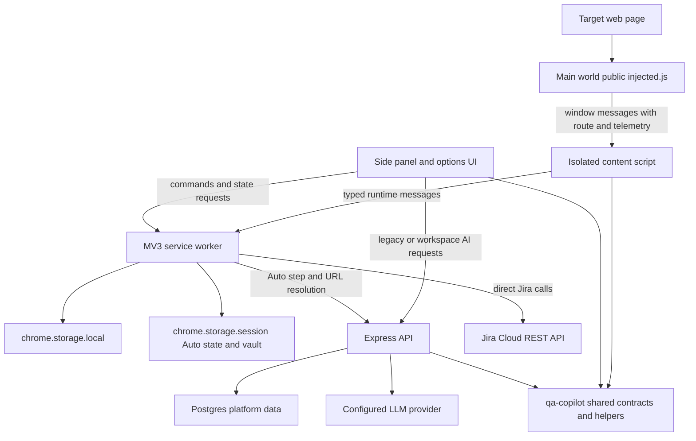
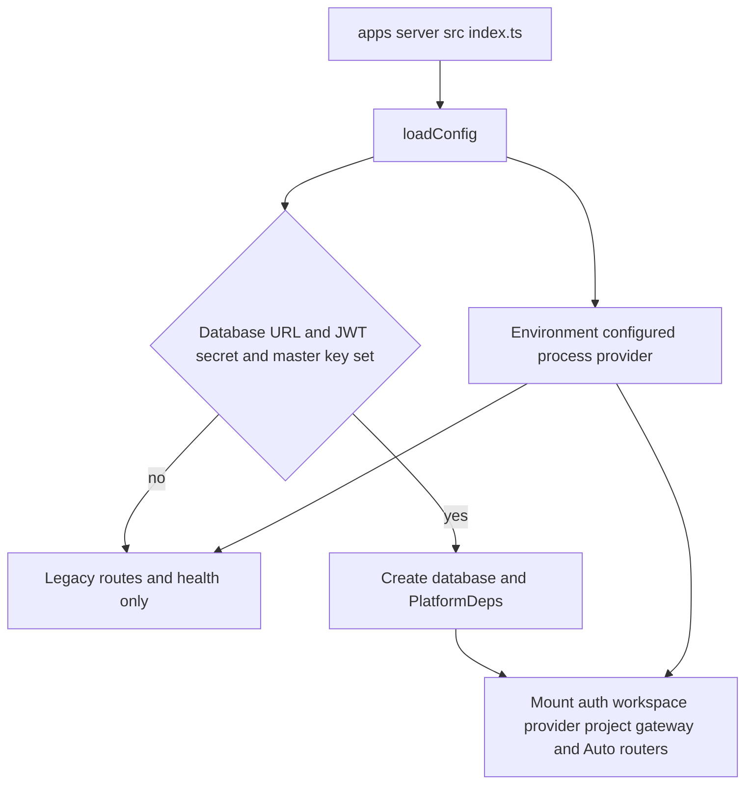

# System architecture and runtime modes

QA Copilot is a pnpm monorepo with three manifest-backed packages: the MV3 browser extension in `apps/extension`, the Express server in `apps/server`, and the framework-free contracts and deterministic helpers in `packages/shared`. The server is **not always stateless**: `apps/server/src/index.ts` enables a Postgres-backed multi-user platform when `DATABASE_URL`, `JWT_SECRET`, and `MASTER_ENCRYPTION_KEY` are all non-empty. Legacy generation routes remain available in either server mode.

## Component and trust boundaries

*The diagram shows the inspected runtime contexts, persistence owners, and external network boundaries.*

The browser has four materially different execution contexts:

- `apps/extension/public/injected.js` runs in the page's main world so it can observe console, network, and SPA history activity. It sends data through `window.postMessage`.
- `apps/extension/src/content/index.ts` runs in the isolated content-script world. It calls `scanPage`, owns the manual recorder and Auto `PageDriver`, redacts relayed telemetry, and talks to the service worker.
- `apps/extension/src/background/index.ts` is the MV3 service worker. It routes messages, serializes session/auth updates with `runExclusive`, tracks the active tab, captures screenshots, owns Jira credentials, and initializes Auto mode through `initAutoMode()`.
- `apps/extension/src/sidepanel` and `apps/extension/src/options` are extension pages. They render projected state and call the worker or server; they should not receive Jira API tokens or Auto vault values.

`packages/shared/src/index.ts` is consumed by both applications. Auto contracts are intentionally a separate `@qa-copilot/shared/auto` export from `packages/shared/src/auto/index.ts`; re-exporting them from the root would pull runtime Zod code into the content-script bundle and has previously broken CRXJS loading.

## Browser state ownership

| State | Owner and location | Lifetime and constraints |
| --- | --- | --- |
| Settings, allowlist, page model, current session, auth JWT/context, Jira configuration and tracker links | Helpers in `apps/extension/src/shared/storage.ts`, backed by `chrome.storage.local` | Survives service-worker/browser restarts. Jira configuration includes the token, but UI projection from `projectConfig()` omits it. |
| Active Auto run and credential vault | Auto wiring, backed by `chrome.storage.session` | Session-scoped. Vault values stay in the service worker and are substituted only immediately before `AUTO_EXECUTE`. |
| Side-panel view state and generated previews | React component memory | Not a durable artifact store. `GeneratedArtifact` is a contract; generated artifacts themselves are not generally persisted. |
| Platform users, workspaces, projects, environments, provider ciphertext, task/usage/audit records | Postgres via `apps/server/src/db` | Available only in platform-enabled server mode. |

The service worker exposes one global current page model and session rather than per-tab models. `refreshActiveTab()` therefore rescans an allowed active tab or clears the stale model for a disallowed tab. All read-modify-write session changes must go through `updateSession()` and `runExclusive()`; direct concurrent writes can lose browser events.

## Extension permission model

`apps/extension/manifest.config.ts` statically grants localhost and `127.0.0.1`, not `<all_urls>`. For another HTTP(S) origin, `addAllowlistOrigin()` requests `${origin}/*`, stores the origin, registers the declared content-script loader, and injects it into already-open matching tabs. `apps/extension/vite.config.ts` broadens only built web-accessible-resource matches so CRXJS's hashed loader chunk and `injected.js` can load after a grant; this does not itself grant host access.

A screenshot has an additional Chrome limitation: `chrome.tabs.captureVisibleTab()` can require `activeTab` or broad site access even after a per-origin host grant. `captureScreenshot()` reports that caveat rather than treating it as a successful evidence capture.

## Server operational modes

*The diagram shows the all-or-nothing platform dependency gate in `apps/server/src/index.ts`.*

`createApp()` in `apps/server/src/app.ts` always installs CORS, a 4 MB JSON body limit, request-ID middleware, `/health`, and five unauthenticated legacy families: page analysis, test-case generation, bug-report generation, Playwright generation, and chat. When `PlatformDeps` exists it additionally mounts, in specific-before-general order:

- `/api/auth`
- `/api/workspaces/:workspaceId/llm-providers`
- `/api/workspaces/:workspaceId/ai/tasks`
- `/api/workspaces/:workspaceId/auto`
- `/api/workspaces/:workspaceId/projects`
- `/api/workspaces/:workspaceId/resolve`
- `/api/workspaces`

The process-level provider from `apps/server/src/llm/index.ts` serves legacy routes. Workspace tasks resolve encrypted BYO OpenAI-compatible providers from Postgres. The extension's `analyzePageSmart`, `generateTestCasesSmart`, `generateBugReportSmart`, and `generatePlaywrightSmart` prefer the workspace gateway when signed in, but fall back to legacy only for HTTP 401 or machine code `no_provider`. `sendChatMessageSmart` deliberately falls back only on 401, not `no_provider`, to avoid silently changing the model in a conversation.

## Auto Test Mode relationship

`RunController` in `apps/extension/src/background/auto/run-controller.ts` owns the observe-decide-guard-execute loop. The server's workspace-scoped `/auto/step` chooses exactly one action using the schemas from `@qa-copilot/shared/auto`; the extension revalidates with `zAction`, applies origin/mode/destructive/credential guards, then asks the content script to execute against the observation epoch. A run is local browser state even though decisions and server task/usage records may be remote.

Critical invariants are:

1. Exactly one Auto run may be active per extension profile.
2. Every run-scoped message is gated by `runId`; an action also targets a specific observation `epoch`.
3. Navigation never proceeds outside `RunConfig.originAllowlist`; leaving it pauses the run.
4. A service-worker restart restores an active run as `paused`, never transparently resumes it.
5. Secret fields accept known `{{PLACEHOLDER}}` values only; real vault values do not enter prompts, trace, history, or persisted run state.
6. No free-form JavaScript action exists in `packages/shared/src/auto/action.ts`.

## Data and security caveats

- Redaction is layered but heuristic. `isSensitiveField()` prevents known sensitive field values from being captured and `redactText()` masks known patterns; arbitrary secrets in ordinary page prose are not guaranteed to be recognized.
- The generic runtime listener in `apps/extension/src/background/index.ts` dispatches by `message.type` and TypeScript casts. Manual message families do not perform comprehensive sender/origin/schema validation at that boundary. Auto actions and server HTTP bodies have stronger Zod/guard validation; do not assume that applies to every extension message.
- Jira is a direct browser integration. Credentials remain in extension local storage and Jira calls do not pass through `apps/server` or LLM prompts.
- `Settings.noDestructiveMode` is stored, but Auto's effective policy is `RunConfig.mode` plus `checkAction()`; do not describe the setting as an enforced Auto guard.
- Generated Playwright and LLM artifacts are drafts. `buildPlaywrightSpec()` is deterministic, but selectors and inferred assertions still require review.

## Change routing and narrow validation

| Change | Owning symbols | Minimum useful check |
| --- | --- | --- |
| Root domain shape or deterministic export | `packages/shared/src/types.ts`, `selector.ts`, `redaction.ts`, `playwright.ts`, `sessionMarkdown.ts` | `pnpm --filter @qa-copilot/shared test` and `typecheck` |
| Browser message/storage behavior | `apps/extension/src/shared/messages.ts`, `storage.ts`, `background/index.ts` | Relevant extension Vitest file, then `pnpm --filter @qa-copilot/extension typecheck` |
| Manifest, content script, main-world bridge, or service worker | `manifest.config.ts`, `vite.config.ts`, `src/content/index.ts`, `public/injected.js`, `src/background/index.ts` | Extension build, then focused Playwright E2E against `apps/extension/dist` |
| Server startup or route mounting | `apps/server/src/index.ts`, `apps/server/src/app.ts`, `apps/server/src/config.ts` | `pnpm --filter @qa-copilot/server exec vitest run src/app.test.ts src/config.test.ts` |
| Platform persistence | `apps/server/src/db/schema.ts`, `apps/server/drizzle`, affected module | Focused PGlite integration suite and migration on disposable Postgres |
| Auto lifecycle or safety | `RunController`, `checkAction`, content Auto runtime, shared Auto schemas, server Auto route | Focused controller/guard/executor/server tests plus `auto-m2.spec.ts` or `auto-m4.spec.ts` |

See [Core contracts](../shared/core-contracts.md), [Testing strategy](../testing/strategy.md), [Operations](../operations.md), and [End-to-end workflows](../workflows/end-to-end.md) for the corresponding boundaries and checks.
