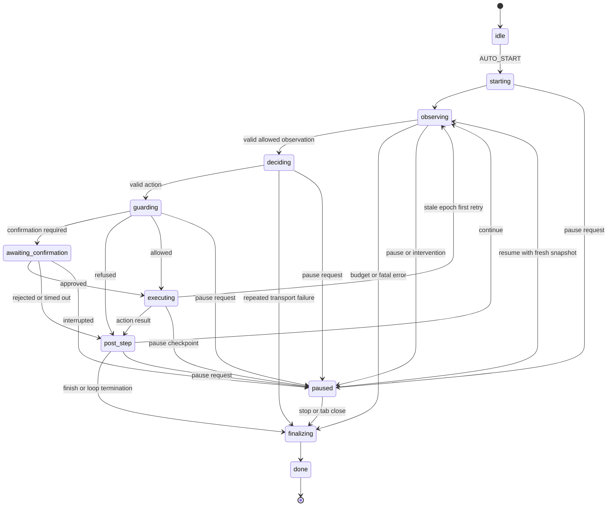
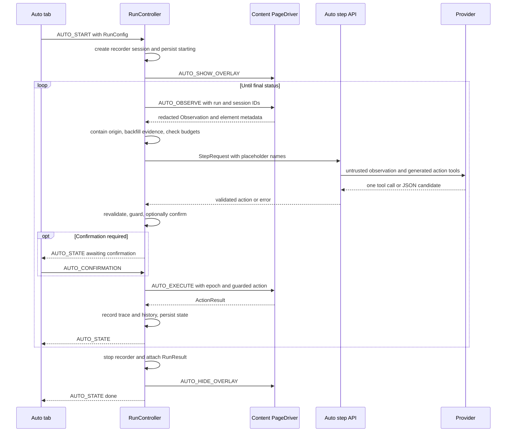

# Auto Test Mode architecture and lifecycle

Auto Test Mode is an observe-decide-guard-execute loop whose authoritative run state lives in the extension service worker. The content script owns fresh DOM indexes and execution, the side panel supplies configuration and human control, and the server is a stateless decision gateway. Shared request/action/run contracts keep those contexts aligned; see [Auto Test Mode public contracts](../shared/auto-contracts.md).

## Components and ownership

| Component | Key symbols | Ownership |
| --- | --- | --- |
| Auto tab | `AutoTab`, `startBlocker`, `buildRunConfig`, result helpers | Goal/mode/origins/budget setup, autonomous acknowledgement, status/confirmation UI, result and defect handoff. |
| Service-worker wiring | `initAutoMode`, `handleAutoMessage`, `createController` | Chrome messaging, target tab, session/vault/storage APIs, navigation and tab-close watchers. |
| Service-worker controller | `RunController` | Single-profile run, exact phase machine, budgets, retries, guards, confirmations, trace/history, finalization. |
| Content runtime | `handleAutoMessage`, `PageDriver` | One driver per run/document, observation and execution messages, stop/intervention overlay. |
| Observation/execution | `buildObservation`, `executeAction`, `settle`, `createStepCapture` | Redacted indexed snapshot, live element map/epoch, action gates, page settling and step evidence. |
| Decision client | `decide` | Stub override or authenticated workspace endpoint, 120-second client timeout, 422 translation. |
| Server route | `autoRouter` | Auth/RBAC, provider resolution and secret use, prompts, provider call, validation, usage/task records. |
| Shared Auto package | `zAction`, `zStepRequest`, run types | Cross-process protocol and provider tool generation. |

The run starts a fresh normal recorder session. Auto actions are explicitly mirrored as `source: 'auto'`; an execution dispatch bracket suppresses duplicate synthetic recorder events. Human input is captured as intervention by the overlay and pauses the run.

## Message protocol

Every run-scoped message carries `runId`. The controller drops and logs stale IDs. `AUTO_START` has none because it mints a run ID, and `AUTO_GET_STATE` asks for the current in-memory or persisted run.

| Direction | Message | Payload / response |
| --- | --- | --- |
| Panel → worker | `AUTO_START` | `config`, optional `tabId`; returns `{ok, runId}`. |
| Panel → worker | `AUTO_PAUSE`, `AUTO_RESUME`, `AUTO_STOP` | `runId`. |
| Panel → worker | `AUTO_CONFIRMATION` | `runId`, `approved`, optional note. |
| Panel → worker | `AUTO_GET_STATE` | No run ID; returns current/persisted state or null. |
| Worker → panel | `AUTO_STATE` | Run ID, public status, internal phase, trace, budgets, optional detail/confirmation/outcome/reason; pushed after every transition. |
| Worker → content | `AUTO_OBSERVE` | Run ID and recorder session ID; returns observation plus guard-only element metadata. |
| Worker → content | `AUTO_EXECUTE` | Run ID, observation epoch, one action; returns `ActionResult`. |
| Worker → content | `AUTO_SHOW_OVERLAY`, `AUTO_HIDE_OVERLAY` | Run ID. |
| Content → worker | `AUTO_USER_STOP` | Run ID; finalizes as user-stopped. |
| Content → worker | `AUTO_USER_INTERVENED` | Run ID; pauses rather than terminating. |

## Exact phase and status lifecycle

Internal `RunPhase` is:

`idle`, `starting`, `observing`, `deciding`, `guarding`, `awaiting_confirmation`, `executing`, `post_step`, `paused`, `finalizing`, `done`.

The panel-facing status is derived: `idle` only in the idle phase, `paused` in paused, `awaiting_confirmation` in that phase, and otherwise `running` until a final status is assigned. Final statuses are `finished`, `stopped_by_user`, `stopped_by_budget`, and `error`. A final status is assigned *before* persisting the `finalizing` transition so service-worker suspension cannot leave a resumable running record.



The diagram shows the controller phases; pause is logically reachable at async control points from every active phase, and resume never reuses a pre-pause decision.

## Start and setup ordering

The Auto tab refuses Start without a nonblank goal or an allowed origin. Autonomous mode additionally requires an “I understand” acknowledgement. Origins are parsed one per line into unique URL origins. Normal UI configuration uses the ten-minute wall clock default and `maxLlmCalls = maxSteps + 10`.

`RunController.start()` then:

1. rejects a second active run (one run per browser profile);
2. mints `run_<time-base36>_<counter>`;
3. creates a fresh recorder session and starts manual recording on the target tab;
4. clamps steps to the 60 hard cap and fills zero-valued budget fields from defaults;
5. fixes the goal independently from later page content;
6. transitions to `starting`, persists, and broadcasts;
7. attempts to show the in-page stop overlay; and
8. launches the asynchronous loop.

## One loop iteration, in order

1. **Control point.** Honor pending stop or pause. Pause transitions, hides the overlay, waits, then resumes via a fresh observation.
2. **Observe.** Send `AUTO_OBSERVE`. If the content script does not answer, inject the declared content script and retry with 200/400/800/1600/1600 ms backoff for up to five seconds. Persistent failure finalizes `error`.
3. **Contain origin.** Refuse to drive an observation outside `originAllowlist`; queue a pause with `left_allowed_origin`.
4. **Restore overlay and drain evidence.** A navigation destroys the page overlay. The new observation restores it and backfills the previous trace/history entry with console/network signals captured during that previous step.
5. **Check budgets.** In order: used steps, elapsed wall clock, then LLM calls. Exhaustion finalizes `stopped_by_budget` while retaining partial evidence.
6. **Read vault once.** Credential names enter the decision request; values remain in the worker.
7. **Decide.** Build the stateless `StepRequest` from the fixed goal, mode, compressed history, current full observation, remaining steps, and placeholder names.
8. **Validate/correct.** Server and worker both validate `zAction`. A server 422 or worker-side invalid action can cause at most two correction turns for the same request. Corrections consume LLM calls, not steps. Exhaustion records one failed `model_output_invalid` step.
9. **Guard.** Apply origin, mode, destructive, then credential checks. Refusal records a step and returns to observation.
10. **Confirm if required.** Publish pending action/reason/target text and race panel approval against 120 seconds. Rejection/timeout records a step; pause/stop abandons it without consuming a step.
11. **Execute.** Substitute vault values only in the outbound `AUTO_EXECUTE` action, preserving tokenized prompt/history/trace. Content verifies epoch and target safety before dispatch.
12. **Handle staleness/navigation.** One `stale_epoch` result triggers a fresh observe and re-decide without consuming a step; a second is recorded failed. If hard navigation tears down the message channel, a changed tab URL is treated as navigated success.
13. **Post step and record.** Increment the step counter, capture URLs/timing/selector/result, append compact history, update loop state, persist, and broadcast.
14. **Finish or continue.** A `finish` action sets outcome/reason and finalizes. Other actions re-enter at observation; navigations first wait up to ten seconds for tab completion.



This sequence shows the normal cross-context ordering; correction, refusal, pause, and navigation branches all return through a fresh observation before another decision.

## Observation and execution details

A `PageDriver` is created lazily on the first observation for a run. Every observation increments its epoch, drains main-world console/network buffers, rebuilds the flattened page tree, and replaces the live index-to-`Element` map. The model sees only the redacted serialization; service-worker guards receive redacted metadata; live nodes never cross the content boundary.

The builder expands the viewport by 400 pixels. If more than 150 interactive elements are found, it rebuilds viewport-only and adds a truncation note. Text nodes are capped at 120 characters, secret values are replaced, and element metadata uses an attribute allowlist. Console errors and failed requests are capped at ten each; console entries are capped at 300 characters.

Before element dispatch, execution checks, in exact order: epoch, index existence, connectedness, visibility after scroll-into-view, and center-point hit testing. Durable selector data is recorded before dispatch because clicking can destroy the node. `assert`, `report_defect`, and `finish` return success without touching the page. Settling requires 400 ms with no relevant DOM mutation, no tracked in-flight requests, and `document.readyState === 'complete'`; five seconds yields `settled: false`, not a step error. Hard `pagehide` wins the race and reports navigation.

## Decision gateway

Without `deciderBaseUrl`, the worker requires a signed-in workspace and POSTs to `/api/workspaces/:workspaceId/auto/step` with bearer auth and optional current project/environment IDs. With an override, it POSTs unauthenticated to `{base}/auto/step`; this supports the hermetic stub decider. The client timeout is 120 seconds. The server provider timeout is 60 seconds.

The platform route requires an AI-task-capable workspace role, resolves project-default then workspace-default provider configuration, rechecks provider URL safety, and decrypts the API key server-side. It creates an `aiTaskRuns` record, tries required tool calling first, and falls back to JSON mode only when the provider rejects tools with a 4xx-like response or returns no usable call. Multiple tool calls are warned and only the first is used. All candidates converge on `zAction`.

A valid provider round records task completion and usage before action validation. Invalid output returns 422; provider failure returns 502; timeout returns 504. Info logs contain metadata such as action type, path, lengths, and duration—not prompt/observation/model bodies. `AUTO_STEP_DEBUG=1` may include raw model output in 422 responses.

## Retries, loops, and bounded context

- One transient decider failure is retried after two seconds. A second failure finalizes `error`. Both calls count against `maxLlmCalls`.
- Up to two validation correction turns are allowed per step; they resend the same observation/history plus a capped correction note.
- One stale-epoch retry re-observes and re-decides without consuming a step.
- Three identical action hashes generate a deterministic nudge; five finalize `stopped_by_budget` with reason `action loop`.
- Three consecutive failed actions generate a different nudge. Action hash includes URL after, type, index where present, and a salient value.
- History stays verbatim through 20 entries; thereafter the latest 12 remain and older entries are summarized in chunks of five.

## Persistence, restart, pause, and finalization

Every transition writes `PersistedAutoRun` to `chrome.storage.session` and pushes `AUTO_STATE`. Persisted state includes configuration, tab/session IDs, phase/status/detail, trace, compact history, budgets, loop counters, and final outcome/reason. Vault values also live in session storage, separately under `autoVault`; recorder sessions and final results live in local extension storage.

On service-worker wake:

- a final persisted record is cleared;
- a non-final record is restored as `paused` with its trace and counters;
- a previously paused record keeps its detail; otherwise detail becomes `service_worker_restarted`;
- v1 never auto-resumes—Resume starts a new loop at observation.

Pause/stop during confirmation interrupts the wait. Pause abandons the undecided/unexecuted step and does not consume the step counter. Closing the run tab finalizes `error: tab closed`, including while restored/paused or awaiting confirmation.

Finalization ordering is significant:

1. assign final status;
2. persist/broadcast `finalizing`;
3. stop the recorder session;
4. build and attach `RunResult` to the matching recorder session;
5. hide/dispose the page driver and overlay;
6. persist/broadcast `done`.

Only accepted `ok` or `confirmed_by_user` `report_defect` and `assert` steps are collected into result arrays. Partial traces and metrics survive budget stops and errors. Defect cards can prefill the existing bug-report generator with summary/expected/actual plus the last eight trace lines, while the recorder session feeds deterministic Playwright generation.

## Focused verification

```bash
pnpm --filter @qa-copilot/extension exec vitest run src/background/auto/run-controller.test.ts
pnpm --filter @qa-copilot/extension exec vitest run src/background/auto/decide.test.ts src/background/auto/history.test.ts
pnpm --filter @qa-copilot/extension exec vitest run src/content/auto/executor.test.ts src/content/auto/settle.test.ts src/content/auto/redact-node.test.ts
pnpm --filter @qa-copilot/server exec vitest run src/modules/auto/auto-step.test.ts src/modules/auto/auto-step-loop.test.ts
pnpm --filter @qa-copilot/extension exec playwright test e2e/auto-m2.spec.ts e2e/auto-m4.spec.ts e2e/auto-m5.spec.ts
```

The Playwright command assumes the extension E2E harness/build and configured web servers used by its project. Use `pnpm --filter @qa-copilot/extension test:e2e` for the package-owned complete setup.

## Evidence-backed limitations

- There is only one active auto run per browser profile, not per tab or window.
- The decision endpoint is stateless, but each step still creates platform task/usage database records; Auto run/trace state itself is extension-owned.
- Service-worker restart pauses rather than transparently resuming. A decision in flight is not recovered.
- Pause/stop are observed at control points. A hung network request is bounded by the decide timeout; it is not synchronously canceled by the control message.
- Post-step console/network evidence arrives on the next observation. The final action has no later observation to drain, so its last buffers are not backfilled before finalization.
- Observation falls back to viewport-only above 150 interactive elements; offscreen controls require scrolling and fresh indexes.
- Hard-navigation channel failure is inferred as success only when the tab URL changed; same-URL reload/channel teardown can still become an execute error.
- The UI has a decider override used by tests/dev; it bypasses workspace authentication by design and should not be treated as the normal production gateway path.
