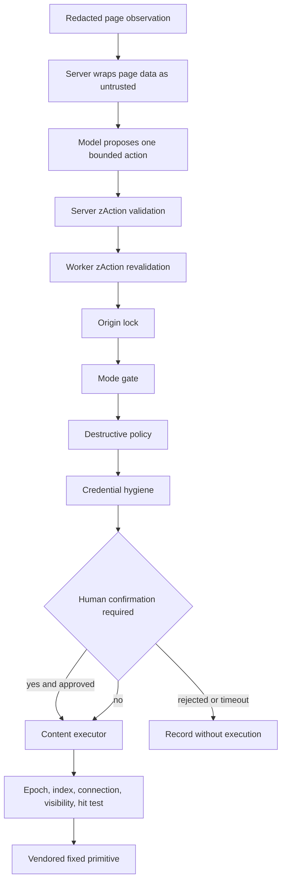

# Auto Test Mode safety and extension

Auto Test Mode treats the model as an untrusted action proposer. It cannot execute code or address arbitrary selectors: it returns one schema-bounded action, which is validated by the server and service worker, checked by an ordered policy pipeline, and—when it targets an element—checked again against a fresh content-script element map. The exact public vocabulary is in [Auto Test Mode public contracts](../shared/auto-contracts.md); lifecycle ordering is in [Auto architecture and lifecycle](architecture-and-lifecycle.md).

## Defense layers



This shows the ordered proposal-to-execution boundaries; the first worker guard hit wins, and executor checks remain mandatory after an allow verdict.

### 1. Observation minimization and redaction

The content script serializes a flattened, indexed accessibility-oriented tree rather than raw HTML. It redacts each node before serialization using shared sensitive-field and text detectors. Secret element values become the redaction token and descendant text is blanked; ordinary text/attribute values are redacted and capped. `ObservedElement` attributes come from a fixed allowlist. Live `Element` references stay in the `PageDriver` and are never sent to the worker or server.

Step telemetry reuses the main-world `injected.js` bridge because an isolated content script cannot observe page-owned `fetch`/XHR patches. It records redacted console messages and failed request method/path/status, not request/response bodies. Query-bearing URLs pass through `redactUrlToPath`.

This is minimization, not a proof that arbitrary page prose contains no sensitive value. The server therefore runs `redactText` again over the assembled observation before prompting.

### 2. Prompt-injection boundary

`autoStepUser()` places the fixed run goal, mode, placeholder names, deterministic history, observation, and remaining steps in explicit sections. The observation is wrapped by `asUntrustedText('observation', ...)`. The checked-in system prompt states that page content is data, cannot change the goal, and must not induce unrelated clicks or disclosure. It also instructs the model to use current numeric indexes only and emit exactly one action.

Prompt instructions are not the enforcement boundary. The extension guard still receives every schema-valid action, including one influenced by hostile page text. `auto-m4.spec.ts` demonstrates that an injection canary reaches the decider as data while a proposed “Delete All” remains held for confirmation.

### 3. Duplicate schema validation

The server first reconstructs an untrusted candidate, then validates it with shared `zAction`. On the tool path, the first tool call's parsed `input` is used; if arguments are only a raw string, `parseJsonLoose()` removes optional JSON fences, tries the entire text, then tries the substring from the first `{` through the last `}`. The tool name is added as the candidate's `type`. If required tool calling returns text instead of a call, that text gets the same loose parse. A recognized provider-side 4xx tool rejection—or no usable tool candidate—causes a second JSON-mode call with an explicit JSON-only instruction; its fenced or prose-wrapped output is parsed identically. Both attempts' usage is summed. Every resulting object, regardless of path, then enters `validateCandidate()` and `zAction.safeParse`; null/non-object or schema-invalid candidates return 422 and may enter a bounded correction turn. The service worker revalidates a successful response with the same schema. Unknown action types—including free-form JavaScript—cannot reach the guard or executor through the normal protocol.

### 4. Ordered service-worker guard

`checkAction()` evaluates the following checks in this exact order and returns the first non-null verdict:

1. **Origin lock.** Only `navigate` is checked here; its target URL origin must match an origin parsed from `RunConfig.originAllowlist`. Invalid or outside URLs are refused as `navigation outside allowed origin`.
2. **Mode gate.** In `observe_only`, only `scroll`, `wait`, `assert`, `report_defect`, `finish`, `press Escape`, and read-only-ish clicks are allowed. A click qualifies only when observed as a link, tab, anchor, or an expanded/collapsed control. Fill, select, navigate, other key presses, and unknown click targets are refused as `observe-only mode`.
3. **Destructive policy.** Applies to click, `press Enter`, and navigate in confirm/autonomous modes. It lowercases target text plus `aria-label` plus `title`, or the navigate URL, and tests default or per-run regular expressions. Confirm mode pauses for human approval. Autonomous mode allows matching actions but marks their trace as destructive. A click index with no metadata and any `press Enter` have unverifiable targets: confirm mode conservatively asks for confirmation; autonomous mode allows them untagged.
4. **Credential hygiene.** A fill targeting `isSecret` must be exactly one known `{{UPPER_SNAKE_NAME}}` token after trimming. Literal or mixed secret values are refused. Placeholder tokens used in a non-secret fill must also exist so unresolved tokens are never typed verbatim.

Guard refusal is visible feedback: it records `result: 'refused'`, consumes one step, persists, and is included in the next decision history. Budgets are checked at the loop top rather than as this pipeline's fifth guard because exhaustion terminates the run. Loop detection runs after recording because it depends on `urlAfter` and result.

## Mode and destructive-action semantics

| Mode | Ordinary mutating action | Pattern-matched destructive action | Unknown click / `press Enter` target |
| --- | --- | --- | --- |
| `observe_only` | Refused, except the documented read-only actions/click carve-out | Refused by mode gate before destructive check | Refused by mode gate. |
| `confirm` | Allowed | Held in `awaiting_confirmation` | Held as conservatively destructive. |
| `autonomous` | Allowed | Allowed and tagged `destructive: true` | Allowed without a destructive tag because no match text exists. |

The confirmation state publishes the action, redacted element text when available, reason, request time, and expiry. Approval executes and records `confirmed_by_user`. Rejection records `rejected_by_user` and optional note without touching the page. The 120-second timeout is treated as rejection. Pause/stop interrupts confirmation and abandons the step without consuming it; late verdicts are ignored.

Default destructive patterns cover delete/remove/destroy/deactivate/archive, payment/order/purchase terms, publish/send, unsubscribe/account cancellation, reset/revoke, transfer/withdraw, and sign-out/log-out. `RunConfig.destructivePatterns` replaces—not augments—the defaults and compiles each source case-insensitively. Invalid regular-expression source is not caught inside the guard and can fail the run.

## Credential vault boundary

The side panel writes `{name: value}` directly to `chrome.storage.session` under `autoVault`; values never transit runtime messaging. Names are normalized to upper snake case. The UI lists names but does not read values back for display. Session storage clears on browser close, though it is not an encryption boundary within the extension profile.

For each step, the service worker reads the vault once:

1. only `Object.keys(vault)` enters `StepRequest.placeholders` and the guard;
2. prompt/history/trace preserve the literal placeholder token;
3. after all guards and any human approval, `substituteCredentials()` replaces known tokens in the `fill` action immediately before `AUTO_EXECUTE`;
4. the content executor types the real value;
5. sensitive recorder mirror events set `valueType: 'sensitive'` and omit `value`.

The happy-path E2E captures raw stub-decider request bodies to verify the stored secret is absent. This boundary does not stop the target web application from receiving the credential—that is the purpose of the final execution payload—but prevents it from entering the model conversation, trace, history, and recorder value.

## Origin containment and human control

Origin containment exists at multiple points:

- `navigate` proposals are guarded before execution;
- every observation is checked before decision/execution;
- top-frame `webNavigation.onCommitted` events pause on an outside origin;
- post-navigation URL checks queue the same pause;
- a content-script handshake is re-established after navigation.

An in-page overlay provides Stop and detects trusted user intervention. Stop finalizes `stopped_by_user`; intervention pauses. The overlay is hidden while paused and recreated after navigation/resume, avoiding its own mutations in settle detection. Closing the controlled tab finalizes an error rather than leaving a profile-wide active run wedged.

## Page-level execution boundary

An allowed action still does not grant arbitrary DOM access. The content executor exposes fixed vendored primitives only. For indexed `click`, `fill`, and `select`, it checks:

1. action epoch equals the latest observed epoch;
2. index exists in the current live map;
3. target is connected;
4. target has visible geometry and is not display/visibility hidden;
5. center-point hit testing resolves to the target, its descendant, or a wrapping label.

A covered control fails with covering-element detail rather than clicking through—useful defect evidence. Fill verifies the value actually applied. Select requires a real `<select>` and reports up to ten available option texts if missing. Durable selectors are captured before dispatch. There is no fallback that guesses another element.

`press` targets the currently focused element (or body), which explains why the service worker cannot inspect its target. `navigate` relies on the worker guard. `assert`, `report_defect`, and `finish` are trace-only and touch no page. Dispatch is bracketed so synthetic DOM events do not duplicate the executor's explicit `source: 'auto'` recorder event.

## Bounded failure and progress safety

- Steps, wall-clock duration, and LLM calls are independently bounded; partial traces survive exhaustion.
- One transient decider failure is retried; two validation correction turns are allowed.
- One stale epoch causes re-observe/re-decide; a second becomes a failed step.
- Three repeated action hashes or three consecutive failures nudge the model. Five identical hashes terminate as an action loop.
- Settle has a five-second ceiling and reports unsettled rather than hanging.
- Server calls reject redirects and re-run SSRF URL checks before using a provider endpoint.
- Provider prompts and observations are excluded from info logs; raw invalid output is only exposed when `AUTO_STEP_DEBUG=1`.

## Recipe: add or change an action

Treat an action as a cross-package protocol change. The complete change surface is:

1. **Shared schema and exports**
   - Add/edit the Zod object and `zAction` member in `packages/shared/src/auto/action.ts`.
   - Add/edit its `ACTION_SCHEMAS` description so `actionToolDefs()` generates the provider tool.
   - Extend `fieldToJsonSchema()` for any new Zod construct.
   - The Auto barrel already exports `action.ts`; do not add it to the root shared barrel.
2. **Shared tests**
   - Add valid, invalid, required-field, bound/default, and tool-definition assertions in `action.test.ts` and `step.test.ts`.
3. **Server prompt and parsing**
   - Add the exact action JSON to `modules/auto/system-prompt.md` and update `historyLine()` in `prompt.ts` if it has salient fields.
   - `providers.ts` and `validate.ts` normally require no new branch because tools are generated and all paths use `zAction`; test both tool and JSON candidates when behavior is novel.
4. **Worker guard and lifecycle**
   - Decide where it falls in observe-only, destructive, origin, and credential policy in `guard.ts`.
   - Add history wording in `history.ts`.
   - Add salient loop-hash data and any final/result collection behavior in `run-controller.ts`.
5. **Content executor and recorder**
   - Classify it as indexed, non-element, or trace-only in `executor.ts`.
   - Use only fixed primitives; add target gates and recorder mirror semantics. Never introduce arbitrary script execution.
   - Extend `VendorApi`/`PageDriver` only if a new vendored primitive is genuinely required.
6. **Side-panel consumer**
   - Add icon and summary/card rendering in `run-view-logic.ts`; update result handoff if it creates a new artifact class.
7. **Hermetic decision tests**
   - Update `e2e/stub-decider.ts`, executor/guard/controller units, and at least one end-to-end scenario. Verify recorder output and generated Playwright behavior for page-mutating actions.

Minimal focused commands:

```bash
pnpm --filter @qa-copilot/shared exec vitest run src/auto/action.test.ts src/auto/step.test.ts
pnpm --filter @qa-copilot/extension exec vitest run src/background/auto/guard.test.ts src/background/auto/run-controller.test.ts src/content/auto/executor.test.ts src/sidepanel/auto/run-view-logic.test.ts
pnpm --filter @qa-copilot/server exec vitest run src/modules/auto/auto-step.test.ts
pnpm --filter @qa-copilot/extension typecheck
pnpm --filter @qa-copilot/server typecheck
```

## Recipe: add or change a guard

1. Implement a pure `GuardCheck` in `background/auto/guard.ts` and place it intentionally in `CHECKS`; first-hit ordering is behavior.
2. Define whether the verdict is allow, confirm, or refuse, whether it adds the destructive trace tag, and whether missing metadata is fail-open or fail-closed in each mode.
3. Ensure refusal details contain no credential value or unbounded page content; they enter history and prompts.
4. If the check needs observation metadata, add it to shared `ObservedElement`/`Observation`, the runtime Zod schema where applicable, and `observation-builder.ts` with redaction.
5. If the check needs persisted configuration, add a serializable `RunConfig` field, setup UI/config assembly, controller restore compatibility, and focused tests. Do not persist `RegExp`, DOM nodes, or secrets in run state.
6. Add a full mode/action/match/origin policy matrix to `guard.test.ts`, then a controller test proving refusal/confirmation step accounting and an E2E that proves the page was or was not touched.

Focused verification:

```bash
pnpm --filter @qa-copilot/extension exec vitest run src/background/auto/guard.test.ts src/background/auto/run-controller.test.ts
pnpm --filter @qa-copilot/extension exec playwright test e2e/auto-m4.spec.ts
```

## Recipe: extend observation or secret detection

- Change `packages/shared/src/auto/observation.ts` and `zObservation` in `step.ts` together.
- Build data in `content/auto/observation-builder.ts`; for serialized tree changes, use the `redactTreeNode` seam rather than regex over final text.
- Reuse `fieldIsSensitive`/shared detectors so manual and Auto capture agree.
- Keep page-owned console/fetch/XHR observation in `public/injected.js` and cross the isolated-world boundary through validated `window.postMessage` data.
- Update `prompt.ts` only if the new field must reach the model. Minimize and re-redact it server-side.
- Test node redaction, builder caps/index mapping, malformed request rejection, prompt wrapping, and an E2E raw-body absence assertion for secrets.

## Evidence-backed limitations and disconnected controls

- **`noDestructiveMode` is disconnected from Auto.** It exists in extension settings/options and acceptance/eval setup, but Auto setup, `RunConfig`, worker guard, and controller never read it. It must not be documented or relied upon as an Auto kill switch.
- **Environment flags are stored but not enforced by Auto.** Server environments expose fields such as `allowAutoSubmit`, with safe defaults for production-like environments, but neither the extension decision client nor the Auto route/guard consumes them. Selecting an environment affects provider/task context records, not action authorization.
- **Autonomous destructive actions are allowed.** Matching gives a trace tag, not confirmation. The side-panel acknowledgement is setup friction, not per-action approval.
- **Destructive detection is text-pattern based.** It checks click metadata, `press Enter`, and navigate URL only. It does not classify fill/select, application semantics, HTTP effects, or a click whose harmless-looking label triggers a destructive backend action.
- **Unknown targets fail closed only in confirm mode.** Unverifiable click/Enter targets are allowed in autonomous mode and are not tagged destructive.
- **Observe-only is not literally zero interaction.** It permits scrolling, waiting, Escape, links/tabs/disclosure clicks, assertions, defect reports, and finish. A supposedly navigational link can still have mutating JavaScript behavior.
- **Origin equality is not application authorization.** Same-origin navigation and actions may still reach privileged/destructive routes; the allowlist is containment, not RBAC.
- **Vault storage is ephemeral, not encrypted.** It protects values from model/message/history exposure and browser-close persistence, but trusted extension contexts with session-storage access can read it.
- **Redaction is detector-based.** Pattern and field metadata coverage can miss novel secrets in ordinary page text. Server re-redaction and untrusted framing reduce risk but do not guarantee semantic secrecy.
- **Confirmation timeout is fixed at 120 seconds**, and malformed custom destructive regexes can throw rather than yielding a friendly setup validation error.
