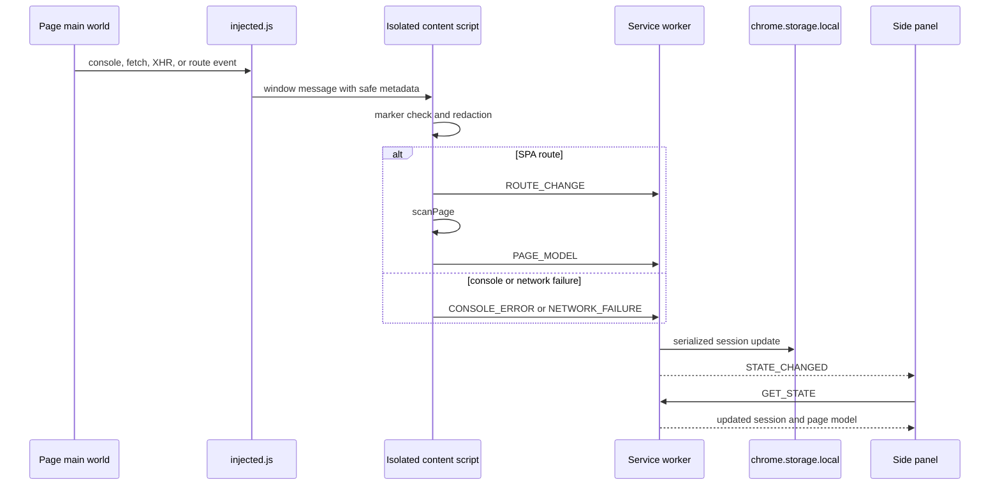

# Extension capture and recording

The capture pipeline turns a live page into two related products: a current `PageModel` snapshot and an ordered `TestSession` timeline with evidence and telemetry. The isolated content entry `apps/extension/src/content/index.ts` composes `scanPage()`, `createRecorder()`, the main-world bridge `public/injected.js`, and Auto's page runtime. The service worker persists their outputs as described in [Extension MV3 runtime](runtime.md).

## Page scanning

`scanPage(doc, loc)` in `src/content/scanner.ts` is deliberately unit-testable under jsdom. It does not serialize raw HTML and does not read field values. It creates:

- `PageModel.summary`: full URL, pathname plus hash route, title, up to 30 unique `h1`–`h3` headings, forms, button/link labels, tables, modal names, and up to 25 visible validation messages.
- `PageModel.elements`: visible matches for anchors, native controls, and selected ARIA roles, converted by `toElementInfo()`.
- `capturedAt`: current ISO timestamp.

Visibility filtering checks `hidden`, computed `display: none`, and `visibility: hidden`; it is not a complete layout/occlusion test. Link labels are capped to 50 unique values, but most other page-summary collections are not globally capped. `summary.consoleErrors` and `summary.networkFailures` are initialized empty: runtime telemetry is stored on `TestSession`, not merged back into the page snapshot.

Forms include generated IDs, field type, required state, label/placeholder metadata, and `sensitive: true` where detected. Tables include headers and a row count based on `tbody tr, tr`. DOM `querySelectorAll` deduplicates nodes that match both selector branches, so body rows are counted once; header rows are also included in the count. Scanner element IDs are snapshot-local (`el_0`, `el_1`, …), not durable DOM identities.

## Element semantics and selectors

`src/content/element-extract.ts` centralizes the semantics shared by scanning, manual recording, and Auto selector recording:

- `accessibleName()` uses `aria-label`, `aria-labelledby`, associated `<label>`, an unambiguous nearby field label, then non-editable text, placeholder, or title. Editable content is excluded from the text-name fallback to avoid treating user data as a label.
- `getRole()` combines explicit roles with simplified implicit roles.
- `selectorInputFor()` supplies test IDs, role/name, ARIA label, label text, short visible text, CSS path, and XPath to shared `rankSelectors()` and `selectorStrings()`.
- `fieldIsSensitive()` delegates to shared `isSensitiveField()` using type/name/id/autocomplete/ARIA/label/placeholder metadata.
- `clickActionTarget()` prefers semantic ancestors, then walks up four levels for click-intent signals such as `onclick`, usable `tabindex`, popup attributes, button/icon classes, or pointer cursor.

CSS paths are capped at five ancestor levels and XPath is positional; they are fallbacks and may be fragile. Selector candidates are observations, not proof of uniqueness. Shared selector ranking and redaction contracts belong to [Core contracts](../shared/core-contracts.md).

## Manual recorder semantics

`createRecorder(sessionId, emit, doc)` attaches capture-phase `click`, `change`, `submit`, and `focusout` listeners only while recording. `start()` and `stop()` are idempotent. It emits `ActionEvent` objects with timestamp, target label, ranked selector strings, and action-specific values.

- Semantic and heuristically clickable controls become `click`; emission is delayed 250 ms so a short visible validation message can become `resultSummary`.
- Native selects emit raw value plus visible option text. Checkboxes and radios emit their selected values.
- Text inputs and textareas emit on `change`; contenteditable emits committed text on `focusout`.
- Sensitive fields emit `valueType: 'sensitive'` and omit `value`.
- Submit is delayed 250 ms for validation capture.
- SPA route messages become separate `navigation` events in the service worker only when session status is `recording`.

Custom widgets receive focused handling. ARIA option/menu selections are attributed to an owning control through `aria-controls`, `aria-owns`, active descendant, expanded trigger, or focused control. Native/custom duplicate selections with the same raw and visible values collapse within 600 ms. Date cells resolve an owning field by ARIA or nearby DOM structure and snapshot it after 150 ms. Autocomplete and body-appended extended-search modals snapshot their owning input after asynchronous updates; a pending lookup expires after five minutes. These heuristics target common React/MUI/Radix/Angular UI shapes but are not a general widget model.

`shouldSkipRecorderEvent()` suppresses synthetic events while Auto dispatch is in progress. Auto's executor emits one explicit `source: 'auto'` mirror event with durable selectors instead. `auto-m1.spec.ts` verifies that running the manual recorder simultaneously does not double-record Auto actions.

## Main-world telemetry bridge

The content script injects `public/injected.js` through a web-accessible URL. The script is idempotent via `window.__qaCopilotInjected` and patches page-owned APIs:

- wraps `console.error` and `console.warn`, while preserving the original call;
- listens for uncaught errors and unhandled rejections;
- wraps `fetch` and XHR to report failed responses, transport errors, duration, method, and URL pathname;
- emits `request-start` and `request-end` for Auto settle tracking;
- wraps `history.pushState` and `replaceState`, and listens for `popstate`/`hashchange`, to report SPA routes.

It intentionally omits request bodies, response bodies, headers, query strings, and URL origins. `pathOf()` uses `URL.pathname` or strips a query on parse failure. Console object serialization is capped at 300 characters in the page world. The content script then applies shared `redactText()` and `redactUrlToPath()`, caps console messages to 500 characters, stamps timestamps, and relays only messages carrying `__qaCopilot: 'qa-copilot-page'`.

> **Trust caveat:** the ordinary relay checks a marker but not `e.source === window`; Auto's `createStepCapture()` does check `e.source`. Any page script can post the same marker, so ordinary console/network/session telemetry is best-effort evidence, not authenticated provenance. The content relay re-redacts text, but sender validation should be strengthened before using these events for security decisions.

The worker applies different acceptance gates by message kind. `ACTION_EVENT` is appended only when the **currently loaded** session has `status === 'recording'`; it does not compare `msg.event.sessionId` with the current session ID, so the status check—not session-ID correlation—is the implemented stale-event boundary. `ROUTE_CHANGE` always updates `currentUrl` but appends a navigation event only while recording. Console and network entries append regardless of recording status and retain only the newest 100 values. This means passive telemetry can accumulate in an idle session. Injection can be blocked or impaired by page policy and failures are swallowed, so absence of telemetry does not prove absence of errors.



*Page-owned telemetry crosses the main-world boundary as reduced metadata, is redacted again, and is stored in the current local session.*

## Screenshots and evidence

The Session UI asks the worker to run `captureVisibleTab`; the resulting PNG data URL is appended to `session.evidence` as a screenshot. Screenshots are not DOM-redacted and can contain anything visible in the viewport, including secrets rendered by the site. They remain local unless a user includes them in exports or Jira attachments. Capture permission and allowlist caveats are detailed in [Extension MV3 runtime](runtime.md).

Auto has additional per-step capture in `src/content/auto/step-capture.ts`: at most ten non-warning console errors of 300 characters and ten failed requests per drain. It reuses the same main-world bridge and tracks in-flight requests for settle. Auto observation construction uses vendored DOM extraction, a redaction seam, a 150-element fallback, and epoch-scoped maps; see [Vendored page-agent boundary](../maintenance/vendored-page-agent.md) and [Auto architecture and lifecycle](../auto/architecture-and-lifecycle.md).

## Invariants and caveats

- Raw DOM and ordinary field values must not enter `PageModel`; sensitive values must not enter `ActionEvent`.
- Main-world network capture must never add bodies, headers, query strings, or response content.
- The service-worker session mutex must serialize every event append.
- Manual and Auto dispatch must produce exactly one recorder event per Auto element action.
- Selector capture must happen before an action can detach its target.
- Screenshot evidence is an explicit exception to text redaction: pixels are not sanitized.
- Redaction is pattern- and metadata-based. Arbitrary prose or a mislabelled custom secret field may evade it; `auto-m1.spec.ts` explicitly notes that visible credential hint prose is not masked unless it matches a recognized PII shape.
- The scanner and recorder operate in the top frame only (`all_frames: false`); cross-origin iframes are outside this pipeline.

## Extension recipes

For a new manual event type, update shared `ActionType`/contracts, recorder emission, service-worker handling if needed, deterministic export consumers, and recorder/scanner E2E assertions. For a new widget, keep ownership/value extraction in `element-extract.ts`, add unit cases around ambiguity and sensitive values, and preserve the dedupe window behavior. For new telemetry, reduce it in `injected.js`, redact again in the isolated script, cap storage growth, and avoid request/response content.

## Focused verification

```bash
pnpm --filter @qa-copilot/extension test -- src/content/scanner.test.ts src/content/element-extract.test.ts src/content/recorder.test.ts
pnpm --filter @qa-copilot/extension test -- src/content/auto/redact-node.test.ts src/content/auto/executor.test.ts
pnpm --filter @qa-copilot/extension build
pnpm --filter @qa-copilot/extension test:e2e -- e2e/extension.spec.ts e2e/auto-m1.spec.ts e2e/vendor-smoke.spec.ts
```

The unit suites own extraction, sensitive-field behavior, widget semantics, dedupe, and executor gates. `extension.spec.ts` proves no typed password reaches the built page model/session and covers SPA recording. `auto-m1.spec.ts` proves Auto/manual dedupe and secret omission. `vendor-smoke.spec.ts` supplies real-layout coverage unavailable in jsdom.

There is currently **no focused concurrent session-mutation test**: no extension test races the `runExclusive` queue or overlapping background storage read-modify-write operations. Serialization is an implementation invariant in `background/mutex.ts` and `updateSession()`, motivated by the source comment that concurrent content and Auto recorder events previously overwrote one another. A change to this boundary should add a worker-level test that overlaps two deferred mutations and proves both survive in the stored session.

## Scope boundaries

This page covers manual scan/record/telemetry and their Auto seams. Storage, grants, and active-tab coordination are in [Extension MV3 runtime](runtime.md); generation and presentation are in [Side panel and options](side-panel-and-options.md); Jira attachment export is in [Jira](jira.md); deterministic selector/redaction algorithms are owned by [Core contracts](../shared/core-contracts.md).
rministic selector/redaction algorithms are owned by [Core contracts](../shared/core-contracts.md).
