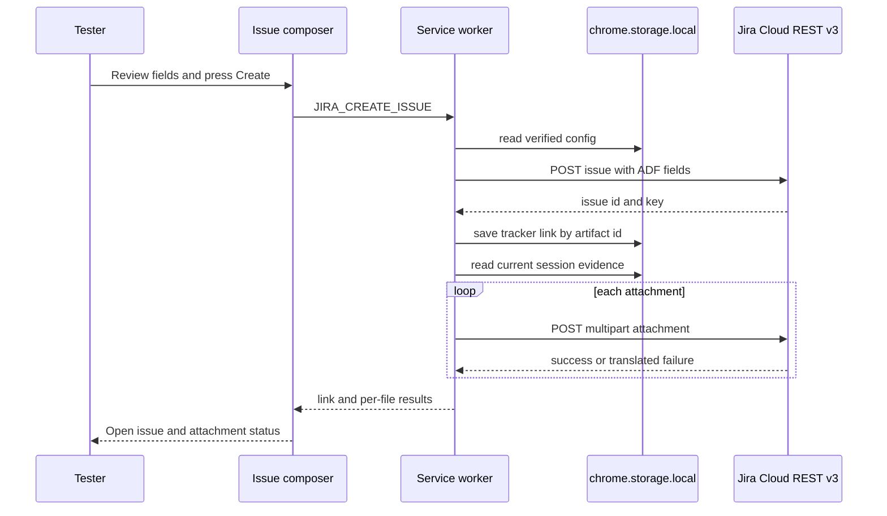

# Jira Cloud integration

The extension integrates directly with Jira Cloud REST v3. It does not proxy through `apps/server`: the service worker owns credentials and calls the user-granted Jira origin, while the options page and side panel communicate through `JIRA_*` messages. This keeps the Atlassian API token out of QA Copilot backend requests and LLM prompts.

## Trust and credential boundary

`src/integrations/jira/auth.ts` implements `AuthStrategy` and the current `BasicTokenAuth`. `normalizeSiteUrl()` adds HTTPS when absent, reduces input to one origin, and rejects single-label hosts. `BasicTokenAuth` UTF-8 encodes `email:apiToken` and supplies `Authorization: Basic ...` plus `Accept: application/json`.

`requestJiraOrigin()` must run in the options-page click gesture. It asks only for `${normalizedOrigin}/*`; the broad optional HTTP(S) patterns in `manifest.config.ts` make that narrow runtime grant possible. The service worker only calls `chrome.permissions.contains`, because requesting there fails Chrome's user-gesture requirement.

The full `JiraConfig` is stored under `jiraConfig` in `chrome.storage.local`, explicitly not `storage.sync`. `JIRA_GET_CONFIG` returns `JiraConfigProjection` with `hasToken`, never the token. A blank token during re-save preserves the stored token. A config is persisted with `verified: true` only after `/rest/api/3/myself` succeeds.

Structural lint rules prohibit Jira imports from `src/sidepanel/backend.ts` and server prompt modules. This helps prevent accidental prompt/gateway serialization, but local storage is not encryption: any code with extension storage access can read the token. OAuth 3LO is an intended `AuthStrategy` extension point, not implemented behavior.

## Message API

`src/integrations/jira/messages.ts` defines:

- `JIRA_GET_CONFIG`
- `JIRA_SAVE_CONFIG`
- `JIRA_TEST_CONNECTION`
- `JIRA_GET_CREATE_META`
- `JIRA_GET_LINKS`
- `JIRA_CREATE_ISSUE`

All resolve to `JiraResponse<T>` rather than throwing across the worker router. Failure codes include the client taxonomy plus `invalid_request` and `not_configured`, with renderable `message` and per-field `fieldErrors`. Small message/config shapes are hand-validated. Blobs are not sent over `chrome.runtime.sendMessage`; the panel specifies attachment choices and the worker rebuilds files from the stored session.

## REST client and failure taxonomy

`JiraClient` in `client.ts` exposes `myself()`, `getCreateMeta()`, `createIssue()`, and `addAttachments()`. The exact non-success mapping is `HTTP 400` → `validation`, `HTTP 401` → `unauthorized`, `HTTP 403` → `forbidden`, `HTTP 404` → `not_found`, `HTTP 413` → `too_large`, `HTTP 429` → `rate_limited`, `HTTP 500` and every higher status → `server`, and every other HTTP status → `unknown`. A rejected `fetch` becomes `network` with synthetic status `0`. Parsed `errorMessages[0]`, then the first per-field `errors` value, overrides the default guidance; the full field-error map is retained for the composer.

Every 429 receives at most one automatic retry. `Retry-After` accepts seconds or an HTTP date, defaults to one second, and is capped at 60 seconds. A second 429 becomes `rate_limited`. Other HTTP errors are not retried automatically. Network rejection becomes status 0 and includes the configured base URL in guidance.

`getCreateMeta(projectKey, issueTypeId)` calls the issue-type-specific createmeta route and normalizes IDs, required flags, schema types, and allowed values. `IssueComposer` filters required fields not already mapped and renders a select for allowed values or a text input otherwise. Arrays become selected option objects or comma-separated strings; numeric fields become `Number(raw)`. This is useful but not a complete renderer for every Jira custom schema.

## Report mapping and ADF

`mapReportToIssue()` in `mapping.ts` recovers a summary from the first H1, a `Title:` line, or first content, strips common inline Markdown, collapses whitespace, and enforces Jira's 255-character summary limit. It extracts `critical`, `high`, `medium`, or `low` from a severity line/table row and applies the configured priority-name map. Every issue defaults to label `openqa`; composer overrides are applied after derived values.

`markdownToAdf()` in `adf.ts` converts headings, paragraphs, emphasis, links, lists/checklists, code blocks, blockquotes, rules, and tables to ADF version 1. Inline images degrade to links because Jira media nodes need a separate upload. Unknown/raw constructs degrade to plain paragraphs, and lexer failure falls back to a plain-text document. Conversion is designed never to throw, but semantic fidelity for unsupported Markdown is intentionally lossy.

The composer is the human review boundary. It pre-fills summary, labels, priority, and required custom fields; users can edit them and choose session/spec attachments. Nothing is written until the user presses Create. Screenshots are always assembled when present despite the label “session export” being optional.

## Issue and attachment flow



*The issue and tracker link are committed before best-effort attachment uploads, preserving partial success.*

`buildAttachments()` includes every decodable screenshot, optional `session-${session.id}.json`, and an optional generated Playwright file. Screenshot conversion uses `dataUrlToBlob()` rather than `fetch`, which MV3 workers restrict: it parses MIME type and optional `;base64`, percent-decodes non-base64 payloads, or runs `atob` and copies character codes into a `Uint8Array`; malformed base64 or a non-data URL returns `null`, and that screenshot is skipped. Files are named `screenshot-1.png`, `screenshot-2.png`, and so on. `JiraClient.addAttachments()` uploads one file per request with `X-Atlassian-Token: no-check` and lets `fetch` set the multipart boundary. Files over the default 10 MiB client-side limit are skipped; a Jira site may impose a lower limit. Attachment errors are returned per file and never erase the already-created issue/link.

Tracker links persist under `jiraLinks` keyed by artifact ID. `JiraAction` then shows “Open ISSUE” and hides normal creation behind “Create another issue.” This is a UI affordance, not server-side idempotency.

> **Duplicate/retry caveat:** `handleJiraMessage()` always creates a new issue before attachment upload and does not inspect an existing tracker link. The result view defines a “Retry attachments” button that calls `create()` again with the same full request, so if that view is retained/reached it creates another issue rather than attaching to the existing one. In the current parent flow, `onCreated()` immediately closes the composer even when some attachments failed, so the detailed partial-failure/retry view may not remain visible at all. Concurrent submissions or a worker failure after Jira creates the issue but before `saveTrackerLink()` can also duplicate issues. The E2E description calls links idempotent per artifact, but the tested behavior is link persistence, not a create guard. Treat retries as duplicate-prone until a separate attach-existing operation or idempotency check exists.

## Invariants and caveats

- Jira tokens remain in the browser profile and never appear in config projections, backend adapters, or prompts.
- Permission requests occur only during an extension-page user gesture and target one normalized origin.
- Issue creation requires non-empty artifact ID and summary before the REST call.
- The tracker link is saved immediately after issue creation and before attachments.
- Attachment failure is partial success, not issue failure.
- `JIRA_TEST_CONNECTION` tests without persisting; the current options button uses `JIRA_SAVE_CONFIG`, so its “Test connection” action tests and saves in one step.
- Basic auth and dotted-host normalization target Jira Cloud-like sites. Single-label Jira Data Center hosts are rejected, and OAuth is absent.
- Generated Markdown may not follow the expected heading/severity format; mapping degrades instead of blocking, so users must review fields.
- Screenshots and session JSON may contain visible/user data not removed by text redaction. Attachment choices are a disclosure decision.

## Extension points

To add OAuth 3LO, implement `AuthStrategy` with the cloud-ID base URL and bearer headers, extend local credential lifecycle and permission flow, and keep `JiraClient` transport-neutral. To support a new issue field schema, extend `JiraFieldMeta`, `shapeFieldValue()`, and composer rendering with mapping tests. To fix attachment retry, add an explicit worker message that accepts an existing issue key/link and uploads only selected files; do not reuse `JIRA_CREATE_ISSUE`.

## Focused verification

```bash
pnpm --filter @qa-copilot/extension test -- src/integrations/jira/adf.test.ts src/integrations/jira/mapping.test.ts
pnpm --filter @qa-copilot/extension test -- src/integrations/jira/client.test.ts src/integrations/jira/messages.test.ts
pnpm --filter @qa-copilot/extension build
pnpm --filter @qa-copilot/extension test:e2e -- e2e/jira-export.spec.ts
```

The client suite owns URL normalization, auth, error mapping, 429 behavior, metadata, size checks, and partial attachments. Message tests own projection, gesture split, config persistence, attachment assembly, and link semantics. `jira-export.spec.ts` runs the built extension against the mock Jira server and verifies Basic auth, ADF, JSON create payloads, multipart boundaries, three attachment types, custom fields, and no link on failed create.

## Scope boundaries

This page covers direct Jira transport, mapping, composer, and local credentials. The general options and artifact UI are in [Side panel and options](side-panel-and-options.md); session/screenshot production is in [Capture and recording](capture-and-recording.md); manifest grants and storage routing are in [Extension MV3 runtime](runtime.md). Jira is not part of the server API or provider vault.
