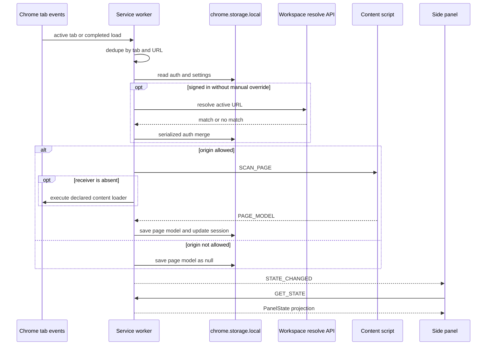

# Extension MV3 runtime

`@qa-copilot/extension` is an MV3 Chrome extension whose central coordinator is the module service worker in `apps/extension/src/background/index.ts`. It connects four execution contexts: the side panel and options extension pages, the isolated content script, the page-main-world bridge `public/injected.js`, and the service worker. For capture internals see [Capture and recording](capture-and-recording.md); for user-facing state see [Side panel and options](side-panel-and-options.md).

## Composition and responsibilities

| Context | Entry point | Responsibilities |
|---|---|---|
| Service worker | `src/background/index.ts` | Routes manual, Jira, and Auto messages; owns durable extension state; tracks the active tab; requests scans; manages allowlist registration; captures screenshots; resolves project/environment context. |
| Isolated content script | `src/content/index.ts` | Scans the DOM, records manual actions, relays main-world telemetry, and hosts Auto page execution. It initializes at most once per document via `window.__qaCopilotContentLoaded`. |
| Main world | `public/injected.js` | Patches console, `fetch`, XHR, and History APIs because isolated-world patches cannot observe page-owned calls. |
| Side panel | `src/sidepanel/main.tsx`, `App.tsx` | Reads `PanelState`, issues commands, renders capture/generation/Auto/Jira workflows. |
| Options page | `src/options/main.tsx`, `Options.tsx` | Manages account, provider, Jira, backend, environment, safety setting, and origin grants. |

`chrome.runtime.onInstalled` configures the toolbar action to open the side panel. `initAutoMode()` adds the separate Auto lifecycle, persistence restore, and `webNavigation` containment behavior documented in [Auto architecture and lifecycle](../auto/architecture-and-lifecycle.md).

## Manual message contract

`src/shared/messages.ts` is the canonical manual contract.

- Panel/options to worker: `GET_STATE`, `GET_SETTINGS`, `SAVE_SETTINGS`, `SCAN_ACTIVE_TAB`, `START_RECORDING`, `STOP_RECORDING`, `CLEAR_SESSION`, `CAPTURE_SCREENSHOT`, `OPEN_EXTENSION_SETTINGS`, `ADD_ALLOWLIST_ORIGIN`, `RESOLVE_ACTIVE_TAB`, `SET_CONTEXT`, and `CLEAR_CONTEXT_OVERRIDE`.
- Content to worker: `PAGE_MODEL`, `ACTION_EVENT`, `ROUTE_CHANGE`, `CONSOLE_ERROR`, and `NETWORK_FAILURE`.
- Worker to content: `SCAN_PAGE`, `START_RECORDING`, and `STOP_RECORDING`.
- `STATE_CHANGED` is the `qa-copilot:state-changed` broadcast consumed by `App` to re-read state.
- Jira extends `PanelToBackground` with the six `JIRA_*` messages in `src/integrations/jira/messages.ts`. Auto owns `AUTO_*` via `isAutoMessage` and `handleAutoMessage`.

`src/sidepanel/chrome-client.ts` is the typed UI adapter over `chrome.runtime.sendMessage`; it does not own state.

> **Boundary caveat:** the top-level `onMessage` listener casts arbitrary input to the union and routes primarily by `msg.type`. It does not validate `sender`, verify the sending extension context, or fully validate manual payload shapes. Jira performs selected hand validation and Auto has its own protocol handling, but TypeScript types are not runtime validation. Treat additions to this boundary as untrusted input and add shape and sender checks when widening exposure.

## Storage ownership and serialization

All ordinary durable extension state is in `chrome.storage.local`, through `src/shared/storage.ts`:

| Key | Value and owner |
|---|---|
| `settings` | `Settings`: `backendUrl`, environment label, allowlist, and `noDestructiveMode`; defaults come from `DEFAULT_SETTINGS`. |
| `session` | Current `TestSession`; created by `newSession()`. |
| `pageModel` | One global current `PageModel`, or `null`. |
| `auth` | `AuthState`, including JWT and current workspace/project/environment context. `buildState()` exposes only `AuthProjection`, never the token. |
| `jiraConfig` | Local Jira connection including API token; never `storage.sync`. |
| `jiraLinks` | Artifact ID to persistent `TrackerLink`. |

The side panel additionally holds generated artifacts, analysis results, chat history, composer drafts, and other view state in React memory; these do not survive panel teardown. Auto persistence has its own keys and lifecycle.

Every session read-modify-write must pass through `runExclusive()` in `src/background/mutex.ts`. It chains each operation after the preceding promise and resets the chain even after rejection. `updateSession`, recording start/clear, and Auto wiring share this mutex; bypassing it can reintroduce the race that dropped concurrent recorder events. Auth context updates are also serialized. Direct whole-value writes such as `savePageModel()` do not require a session mutation lock.

## Active-tab refresh and context resolution

`refreshActiveTab()` runs after active-tab changes, focused-window changes, and completed loads in the active tab. It ignores browser-internal schemes, deduplicates by `tabId|url` in service-worker memory, and then:

1. Starts `maybeResolveContext()` for any readable URL, independently of the local capture allowlist.
2. If the origin is allowed, sends `SCAN_PAGE`; if no content receiver exists, calls `injectContentScript()`.
3. If not allowed, clears the global `pageModel` and broadcasts, preventing the panel from displaying a previous tab's URL.

`maybeResolveContext()` requires a token and workspace. It calls `resolveUrl()` and applies the pure merge rule in `applyResolveMatch()` from `src/shared/context.ts`: a manual override always wins, a match sets `contextSource: 'auto'`, and no match clears only automatic context. The worker re-reads auth under the mutex before applying the result, closing the race where a user sets a manual override while resolution is in flight. Network and authentication failures intentionally leave existing context unchanged. See [Platform and RBAC](../server/platform-and-rbac.md) for server-side resolution semantics.



*Active-tab refresh keeps the single stored page model and projected context aligned with the current readable tab.*

## Origin grant, registration, and injection

Localhost and `127.0.0.1` are statically allowed by `manifest.config.ts`. Other HTTP(S) origins follow an explicit lifecycle in `addAllowlistOrigin()`:

1. Build the exact pattern `${origin}/*` and call `chrome.permissions.request`.
2. On grant, append the origin to `settings.allowlist`.
3. Read the built content loader names from `chrome.runtime.getManifest().content_scripts[0].js`.
4. Register a `document_idle` dynamic content script for future loads. Registration errors are swallowed because the ID may already exist.
5. Query all already-open matching tabs and inject the declared loader immediately.
6. Clear `lastRefreshKey` so the active page can be reconsidered.

The stored allowlist and Chrome permission grant are separate facts. There is no remove/revoke flow in the current UI, and the worker does not reconcile stale dynamic registrations at startup. Callers must supply a normalized origin; unlike Jira's `normalizeSiteUrl`, `ADD_ALLOWLIST_ORIGIN` does not itself parse or constrain the string before pattern construction.

## Screenshots

`captureScreenshot()` refuses non-allowlisted origins, then calls `chrome.tabs.captureVisibleTab(tab.windowId, { format: 'png' })`. On success it appends a data URL `EvidenceItem` under the session mutex. The explicit window ID matters because a side-panel/service-worker context has no reliable current window. A Chrome error mentioning `<all_urls>` or `activeTab` is augmented with guidance to set site access to “On all sites”; the per-origin host grant may not be sufficient for `captureVisibleTab`. Capture is visible-viewport evidence, not a full-page screenshot.

## Manifest and packaging boundary

`manifest.config.ts` declares MV3, module service worker, side panel, options page, one top-frame localhost content script, `activeTab`, `scripting`, `sidePanel`, `storage`, `tabs`, capture permissions, and `webNavigation`. Optional host patterns are broad only so the user can grant an individual HTTP(S) origin at runtime.

CRXJS emits the content script as a loader that imports a hashed chunk. `broadenWarMatches()` in `vite.config.ts` rewrites only built `web_accessible_resources[*].matches` to HTTP(S), sets `use_dynamic_url`, and leaves executable resources and content-script matches unchanged. This is required for the loader chunk and `injected.js` to load on a granted non-localhost origin; it does not itself inject code there.

The checked-in `apps/extension/dist/manifest.json` is stale relative to source: it reports version `0.1.6` while `manifest.config.ts` reports `0.1.8`, and it lacks source's `webNavigation` permission. Do not infer current behavior from `dist`; run a build before loading or testing the extension.

## Invariants and extension points

- The panel renders one global page model; active-tab listeners must clear or refresh it on tab changes.
- Session read-modify-write operations must use `runExclusive()`.
- Manual context must never be overwritten by automatic URL resolution.
- Content initialization must remain idempotent because immediate injection and registered injection can overlap.
- Optional origins require both a Chrome grant and an allowlist entry.
- Auth JWTs remain in local storage and are omitted from `PanelState`.

To add a manual command, update the appropriate union in `src/shared/messages.ts`, add a wrapper in `chrome-client.ts` when UI-facing, implement the worker/content handler, broadcast after durable state changes, and test both response and state mutation. For a new persisted value, add a storage accessor rather than issuing ad hoc `chrome.storage` calls. For permission or content-loader changes, update `manifest.config.ts`, preserve the WAR transform assumptions, rebuild, and exercise a real unpacked extension.

## Focused verification

```bash
pnpm --filter @qa-copilot/extension test -- src/shared/context.test.ts
pnpm --filter @qa-copilot/extension typecheck
pnpm --filter @qa-copilot/extension build
pnpm --filter @qa-copilot/extension test:e2e -- e2e/extension.spec.ts
```

`context.test.ts` owns auto/manual merge invariants. `extension.spec.ts` proves built-extension scanning, secret omission, recording/SPA navigation, and manual context survival. Always build before Playwright; the E2E configuration loads `apps/extension/dist`. Broader commands and fixture topology are in [Operations and verification](../operations.md).

## Scope boundaries

This page owns MV3 coordination, ordinary messages/storage, permissions, active-tab behavior, and packaging. DOM extraction belongs to [Capture and recording](capture-and-recording.md), UI/backend fallback to [Side panel and options](side-panel-and-options.md), direct Jira behavior to [Jira](jira.md), and Auto lifecycle/safety to [Auto architecture and lifecycle](../auto/architecture-and-lifecycle.md) and [Auto safety and extension](../auto/safety-and-extension.md).
