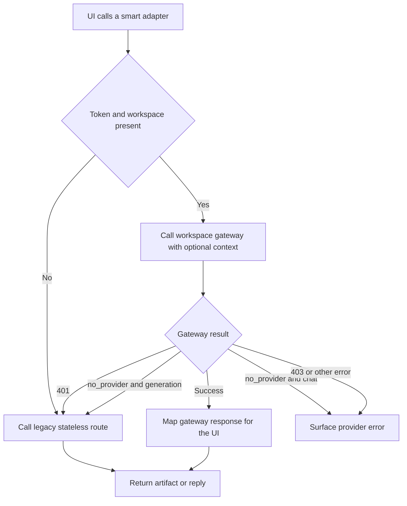

# Extension side panel and options

`apps/extension/src/sidepanel/App.tsx` is the primary tester workspace; `src/options/Options.tsx` is the account and integration configuration surface. Both use `src/sidepanel/chrome-client.ts` for extension messages and `src/sidepanel/backend.ts` for HTTP. They are clients of the service-worker state model documented in [Extension MV3 runtime](runtime.md), not independent stores.

## Side-panel surfaces

`App` initially requests `GET_STATE` and `GET_SETTINGS`, then re-reads `PanelState` on each `STATE_CHANGED` broadcast. Its header shows the scanned page and recording status. If the active origin is not allowed, `AllowlistBanner` sends `ADD_ALLOWLIST_ORIGIN` from a user gesture.

| Tab or surface | Source responsibility |
|---|---|
| Context bar | Signed-in users see auto/manual project and environment. It lists projects/environments, sends `SET_CONTEXT`, clears a manual override, or triggers `RESOLVE_ACTIVE_TAB`. |
| Page | Requests a scan, displays model counts/headings/validation/raw JSON, and calls `analyzePageSmart()` for test suggestions. |
| Session | Starts/stops/clears recording, captures screenshots, shows action/console/network counts and timeline, exports JSON, copies `buildSessionMarkdown()`, and renders screenshot thumbnails. |
| Generate | Calls smart adapters for test cases, bug reports, and Playwright; previews or downloads artifacts; shows selector warnings; exposes Jira only on a generated bug report. |
| Chat | Runs non-streaming multi-turn chat with stop/new/copy controls and sanitized Markdown replies. |
| Auto | Rendered only when `AUTO_TEST_MODE` from `src/shared/flags.ts` is true. Suggested cases can derive from recent analysis/test-case output; defects hand off to Generate with a prefilled note. |

Generated artifacts display `DRAFT — review before use`. `previewMarkdown()` and `renderMarkdownInline()` use `marked` followed by DOMPurify. `buildPreviewHtml()` separately escapes the document title; tests cover script tags, inline handlers, and `javascript:` URLs. Downloads in `exports.ts` use Blob URLs for JSON, Markdown, or TypeScript and revoke them after triggering the browser download.

## State lifetime

Durable values come from `chrome.storage.local`: settings, session, page model, auth, Jira config/link map, and Auto persistence. The following are React memory and vanish when the panel/options page is torn down:

- current tab selection;
- page analysis result and generated test-case Markdown used to suggest Auto cases;
- generated test-case, bug-report, and Playwright artifacts;
- generator note and busy/error state;
- chat history, pending draft, copy indicator, and abort controller;
- context-selector lists and local selection;
- Jira composer edits before submission.

Chat is explicitly ephemeral and non-streaming. On Stop, `AbortController` cancels the fetch, removes the pending user turn from history, and restores it to the composer. New chat aborts and clears all memory. Generated artifacts are also not persisted; only Jira tracker links keyed by artifact ID survive a worker restart.

## Smart backend adapter

The generic `api()` helper trims one trailing slash, sends JSON, adds a bearer token when supplied, parses successful JSON, and throws `ApiClientError(status, message, code)` on non-OK responses. Smart functions prefer workspace-scoped gateway routes only when both `AuthState.token` and `currentWorkspaceId` exist. Project/environment IDs are omitted rather than sent as `null`.

| Operation | Gateway route | Legacy route | Fallback |
|---|---|---|---|
| `analyzePageSmart` | `.../ai/tasks/analyze-page` | `/api/page/analyze` | Signed out, `code: no_provider`, or HTTP 401. |
| `generateTestCasesSmart` | `.../ai/tasks/generate-test-cases` | `/api/generate/test-cases` | Same; legacy forces `format: 'manual_markdown'`. |
| `generateBugReportSmart` | `.../ai/tasks/generate-bug-report` | `/api/generate/bug-report` | Same. |
| `generatePlaywrightSmart` | `.../ai/tasks/enrich-playwright` | `/api/generate/playwright` | Same. |
| `sendChatMessageSmart` | `.../ai/tasks/chat` | `/api/chat` | Signed out or HTTP 401 only. `no_provider` is surfaced. |

Non-fallback errors—including 403 and 5xx—are rethrown. Chat intentionally does not silently switch a signed-in user with no provider to the server's environment-configured model because that would change model identity mid-conversation. Generation uses the more permissive compatibility fallback.

`explainError()` makes `no_provider` role-aware: owners/admins receive a Settings action; other roles are told to ask an admin. HTTP 403 is presented as inability to run AI tasks. The configure shortcut is shown only for managing roles and `no_provider`.



*The adapter preserves legacy behavior for one-shot generation while keeping chat provider identity explicit.*

For route and provider internals see [Server API reference](../server/api-reference.md) and [AI generation](../server/ai-generation.md).

## Options page

`Options` renders four practical areas:

1. **Account:** register or log in, then persist `AuthState` directly through `saveAuth()`. Login lists workspaces and selects the first returned workspace; registration uses the optional workspace returned by registration. Logout calls `clearAuth()`.
2. **AI Provider:** all roles can list public provider metadata. Owners/admins (`MANAGE_ROLES`) can create an OpenAI-compatible provider, validate it, and make it workspace default. API keys are entered once and are never returned by the server. The UI does not expose provider patch, key rotation, enable/disable, project-scoped assignment, or provider deletion despite corresponding management concepts elsewhere in the platform.
3. **Jira:** requests a single origin permission during the click gesture, tests `/myself`, saves verified local config, and never reads the token back. Details are in [Jira](jira.md).
4. **General settings:** backend URL, session environment label, `noDestructiveMode`, and additive capture origins.

The allowlist UI can add/grant origins but cannot remove an entry or revoke a Chrome host permission. General field edits remain local until “Save settings,” except adding an origin immediately updates worker storage. The displayed `noDestructiveMode` setting is persisted, but current Auto guard wiring does not consume it; do not describe the checkbox as enforced protection. Auto safety caveats belong to [Auto safety and extension](../auto/safety-and-extension.md).

Project/workspace management is intentionally incomplete in the extension UI: there is no workspace switcher or create/invite/member management, no project/environment create/edit surface, and login simply adopts the first workspace. The context bar only selects among existing projects and environments.

## UI invariants and caveats

- `AuthProjection` shown in the panel must never include the JWT; call sites that need it read `getAuth()` at execution time.
- Markdown is sanitized before `dangerouslySetInnerHTML` or full-document preview.
- Artifact output remains visibly marked as draft and requires review.
- Bug report and Playwright buttons require recorded events; test-case generation requires a page model.
- Jira creation remains a separate human-confirmed composer step.
- Smart fallback is narrow: only 401 and `no_provider` for generation, only 401 for signed-in chat.
- UI state is not a durable job store. Closing the panel loses generated content and chat even though source session data remains.
- There are no component-level tests for most `App` and `Options` interactions. Unit tests strongly cover adapters and pure Auto/UI helpers; M5 supplies one built-extension UI path. Role-aware error text, account/provider forms, context picker behavior, export download clicks, and chat component cancellation are not directly exercised as rendered components.

## Extension points

When adding a gateway task, define exact response interfaces in `backend.ts`, decide and test fallback policy explicitly, include project/environment only when accepted by the server schema, expose a UI busy/error state, and preserve role-aware handling. When adding persisted UI state, route it through worker/storage ownership rather than silently storing a second React-local source of truth. When rendering model output, use the existing sanitized Markdown functions or plain React text, never raw HTML.

## Focused verification

```bash
pnpm --filter @qa-copilot/extension test -- src/sidepanel/backend.test.ts src/sidepanel/preview.test.ts
pnpm --filter @qa-copilot/extension test -- src/sidepanel/auto/setup-logic.test.ts src/sidepanel/auto/result-logic.test.ts src/sidepanel/auto/run-view-logic.test.ts src/sidepanel/auto/vault.test.ts
pnpm --filter @qa-copilot/extension typecheck
pnpm --filter @qa-copilot/extension build
pnpm --filter @qa-copilot/extension test:e2e -- e2e/auto-m5.spec.ts
```

`backend.test.ts` is the canonical fallback/context/response-shape suite. `preview.test.ts` owns output sanitization. `auto-m5.spec.ts` drives the real Auto tab through setup/result, checks defect-to-generator prefill and session badges, and replays the deterministic Playwright artifact; it is hermetic with a stub decider.

## Scope boundaries

This page owns UI surfaces, UI state lifetime, exports/previews, and HTTP adaptation. Worker state/permissions are in [Extension MV3 runtime](runtime.md), capture semantics in [Capture and recording](capture-and-recording.md), direct Jira behavior in [Jira](jira.md), and full server route/RBAC behavior in [Server API reference](../server/api-reference.md) and [Platform and RBAC](../server/platform-and-rbac.md).
