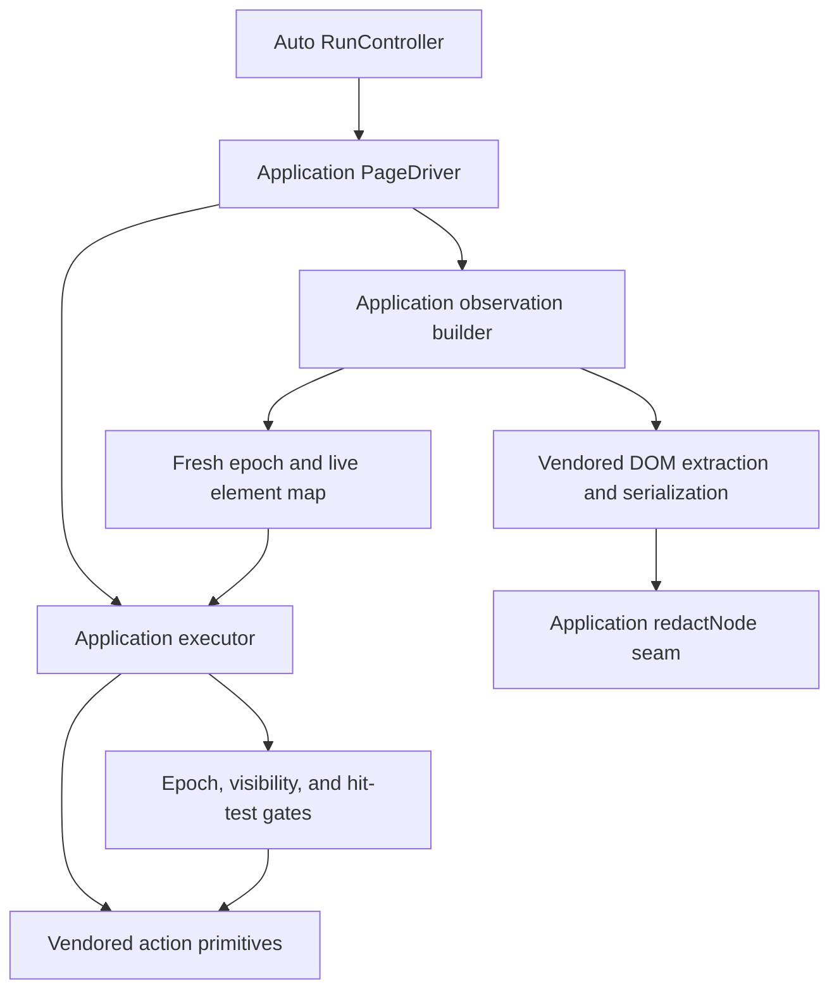

# Vendored page-agent boundary

`apps/extension/src/vendor/page-agent/` is a deliberately narrow vendored DOM/runtime dependency used by Auto Test Mode. It is not an npm package and is not the product's orchestration layer. Application-owned `PageDriver`, observation, executor, redaction, settle, and recorder code wrap selected upstream DOM extraction and action primitives.

## Provenance and licensing

The canonical ledger is `src/vendor/page-agent/VENDORED.md`:

- upstream: `alibaba/page-agent`, pinned at commit `da1db959558dcd49a6c489e76a23accfbda7b156`;
- package at that commit: `@page-agent/page-controller` v1.12.2;
- `dom_tree.js` was in turn ported upstream from `browser-use/browser-use` 0.5.9 at `d51b6e73daff7165fdd3e44debd667e7f5f7fdc5`;
- licenses are preserved as `LICENSE-page-agent` and `LICENSE-browser-use` in the vendor directory, both MIT.

Vendoring is required because consumed APIs are private, `flatTreeToString()` is prompt-load-bearing, application redaction needs an in-serializer seam, and upstream `PageController.executeJavascript` uses dynamic evaluation that must not ship.

## Vendored surface

| File | Relied-upon capability |
|---|---|
| `dom_tree.js` and `dom_tree.d.ts` | Real-layout interactivity, visibility/top-element checks, viewport expansion, flat tree, and live references. |
| `dom.ts` | `getFlatTree()`, `getSelectorMap()`, and `flatTreeToString()`. |
| `get-page-info.ts` | Scroll, viewport, and document metrics. |
| `actions.ts` | `clickElement()`, `inputTextElement()`, `selectOptionElement()`, `scrollIntoViewIfNeeded()`, and `scrollVertically()`. |
| `utils.ts` | Native value setters, event simulation, pass-through controls, guards, and waiting. |
| `patches/react.ts` | Marks React root containers as non-interactive to avoid whole-page false positives. |

Not vendored: upstream `PageController.ts`, its `executeJavascript` pathway, mask/UI dependencies, empty Ant Design patch, and unrelated core/LLM/extension packages.

Every intentional fork is marked `// @openqa-edit`. Important changes add `data-openqa-ignore`, default debug highlights off, flatten imports, add `flatTreeToString(..., opts.redactNode)`, satisfy strict index access, and remove the unused `PageController` argument from `patchReact()`.

## Application-owned wrapper

Only `src/content/auto/page-driver.ts` may import this directory. Root `eslint.config.js` enforces that restriction with `no-restricted-imports`; vendor files themselves are excluded from normal lint because they retain upstream style.

`createPageDriver()` builds a local `VendorApi`, then owns:

- the current index-to-live-`Element` map;
- a monotonically increasing observation epoch;
- per-step console/network buffers;
- Auto recorder mirror IDs;
- stop overlay lifecycle;
- observation/execution/disposal coordination.

`buildObservation()` is application code. It calls the React patch, blacklists `[data-openqa-ignore]` and `[data-page-agent-not-interactive]`, extracts with 400 px viewport expansion, and falls back to viewport-only if more than 150 interactive elements are found. It serializes through `redactTreeNode`, creates allowed/redacted `ObservedElement` metadata, adds page metrics/dialog/evidence, and builds the epoch-scoped live reference map.

`executeAction()` is also application code. Before any vendored element primitive it checks epoch, index, connectedness, visibility, and center-point hit test; records selectors before dispatch; suppresses duplicate manual recorder events; emits one Auto mirror; and settles or accepts hard navigation. Trace-only actions do not invoke vendor code. Origin, destructive-action, and credential guards happen upstream in the service worker, not in the vendored library.



*The application wrapper owns safety, redaction, and lifecycle; vendored code supplies DOM and low-level action mechanics only.*

## React patch and observation implications

`patchReact()` marks root containers with `data-page-agent-not-interactive`; their descendants remain discoverable. `buildObservation()` passes marked roots into the interactive blacklist. `vendor-smoke.spec.ts` verifies that a control inside the React root is indexed while the root itself is not. `data-openqa-ignore` similarly excludes the product's own overlays/subtrees.

Interactive indices are snapshot-local. Every `observe()` increments the epoch and replaces the map; `execute()` rejects a stale epoch rather than guessing. Serialization format and indices are model-facing protocol, so upstream changes to interactivity or `flatTreeToString()` can alter decisions even if TypeScript still compiles.

## Dynamic-evaluation security gate

Upstream's dynamic execution pathway is intentionally absent. CI runs a pre-install static gate over JavaScript and TypeScript under `src/vendor/page-agent`, failing on `eval(` or `new Function(`. This is in `.github/workflows/ci.yml` and requires no dependencies.

The gate is necessary but narrow: it does not detect every possible dynamic-code construction, generated build output, indirect aliases, or unsafe DOM behavior. The stronger invariant is to keep `PageController.ts` unvendored, review every update, preserve the import boundary, and run real-browser smoke tests. Do not “fix” the gate by obfuscating a match.

## Safe update procedure

1. Review upstream diff from the pinned commit for only `actions.ts`, DOM, utils, and patches. The canonical command is recorded in `VENDORED.md`.
2. Cherry-pick relevant hunks manually. Preserve provenance headers, both license files, every `@openqa-edit` marker, the redaction seam, the React signature change, flattened imports, and relied-upon exports.
3. Confirm no `PageController`, JavaScript execution helper, mask/UI dependency, or unrelated upstream package entered the tree.
4. Update the pinned commit and package version in `VENDORED.md`; update secondary provenance if `dom_tree.js` changes base.
5. Review serialization output and action event sequences as behavioral API changes, not just compile changes.
6. Run the static dynamic-evaluation gate, focused unit tests, harness build, vendor smoke, full extension E2E, typecheck, and lint.
7. Inspect the built extension and real fixture behavior. jsdom cannot prove layout, occlusion, scroll, or hit testing.

Useful checks:

```bash
! rg -n '\beval\s*\(|new Function\s*\(' apps/extension/src/vendor/page-agent
pnpm --filter @qa-copilot/extension test -- src/content/auto/executor.test.ts src/content/auto/redact-node.test.ts
pnpm --filter @qa-copilot/extension build:harness
pnpm --filter @qa-copilot/extension test:e2e -- e2e/vendor-smoke.spec.ts
pnpm --filter @qa-copilot/extension typecheck
pnpm --filter @qa-copilot/extension lint
```

The `rg` command is a local equivalent of the CI intent; CI currently uses recursive `grep`. `test:e2e` builds the harness automatically, so the explicit harness build is optional when running that script.

## What the smoke suite proves

`e2e/vendor-smoke.spec.ts` executes against real Chromium layout and verifies:

- expected native, dialog, contenteditable, and React-descendant controls are indexed;
- serialized indices agree with the selector map and repeat consistently within one snapshot;
- ignored, ARIA-hidden, and offscreen controls are excluded;
- React roots are not themselves interactive;
- `PageDriver.observe()` produces header/footer metrics, dialog context, redacted email text, secret metadata without secret values, and a fresh epoch.

`e2e/auto-m1.spec.ts` additionally verifies observe/execute primitives can drive a login flow, stale epochs are rejected, selectors are captured, manual/Auto events are deduplicated, and sensitive values are omitted. Unit executor tests cover application safety gates; they do not validate vendor layout algorithms.

## Invariants and extension points

- No module except `page-driver.ts` imports vendored internals.
- No dynamic evaluation pathway is present.
- `flatTreeToString()` retains the `redactNode` seam and observations invoke it.
- React/OpenQA UI roots remain excluded without excluding their valid descendants.
- Indices never survive an observation epoch.
- Vendor code remains provenance-marked and licensed.

If a new primitive is needed, first decide whether it belongs in application code. If genuinely vendor-derived, add it to `VendorApi` in `src/content/auto/types.ts`, import it only in `page-driver.ts`, inject it into the consumer, mark local edits, and extend browser smoke coverage. Do not let observation/executor modules import vendor files directly.

## Scope boundaries

This page owns provenance, the wrapper boundary, update safety, and vendor-specific verification. The full Auto run lifecycle is in [Auto architecture and lifecycle](../auto/architecture-and-lifecycle.md), guard policy in [Auto safety and extension](../auto/safety-and-extension.md), ordinary manual scanning in [Capture and recording](../extension/capture-and-recording.md), and broad commands in [Operations and verification](../operations.md).
