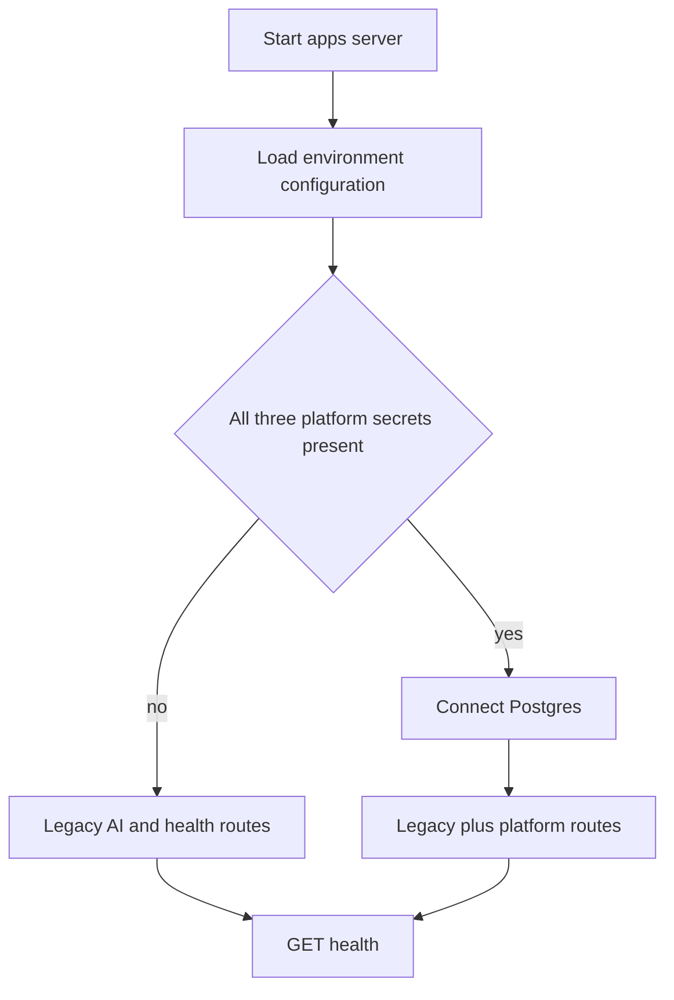

# Development, deployment, and operations

This page maps current source-backed operational modes. `docs/runbook.md` remains the detailed human runbook; `docs/dogfood.md` and `docs/chrome-web-store-jira-release.md` cover product exercise and store/Jira release work. Never copy real `.env` values, API tokens, JWT secrets, master keys, or Auto vault contents into logs, documentation, fixtures, or commits.

## Prerequisites and installation

- Node 20 or newer (`package.json`); CI uses Node 22.
- pnpm 11.4.0 through the root `packageManager` field.
- Chrome or Chromium for the unpacked extension and Playwright.
- Docker with Compose only when running local Postgres.
- A process-level LLM key or local compatible endpoint only for live legacy generation. Unit/integration tests do not require one.

```bash
corepack enable
pnpm install
cp apps/server/.env.example apps/server/.env
```

Edit the ignored `apps/server/.env`; do not commit it. `apps/server/.env.example` is the canonical non-secret inventory.

## Server modes



*The diagram shows the startup gate implemented by `apps/server/src/index.ts`.*

Start the server with:

```bash
pnpm --filter @qa-copilot/server dev
# or, without watch mode
pnpm --filter @qa-copilot/server start
curl http://localhost:8787/health
```

### Legacy-only mode

Leave at least one of `DATABASE_URL`, `JWT_SECRET`, or `MASTER_ENCRYPTION_KEY` empty. The server logs `server.platform_disabled`; `/health`, `/api/page/analyze`, `/api/generate/test-cases`, `/api/generate/bug-report`, `/api/generate/playwright`, and `/api/chat` remain mounted. Generation still needs the configured process provider (`LLM_PROVIDER`: `anthropic`, `openai`, `openrouter`, or `local`) to work.

### Platform-enabled mode

Set all three platform values. `MASTER_ENCRYPTION_KEY` must be a base64-encoded 32-byte key for the AES-256-GCM provider vault. Platform routes use Postgres and workspace auth/RBAC while legacy routes stay available. Keep `ALLOW_PRIVATE_LLM_HOSTS=false` on hosted or multi-tenant deployments; setting it true permits BYO provider URLs resolving to private/reserved hosts and is intended only for trusted local/single-tenant use.

`express.json({ limit: '4mb' })` caps request bodies. Request-ID middleware from `apps/server/src/http/request-id.ts` supplies correlation for structured Pino logs. `LOG_LEVEL=debug` may log full **redacted** prompt/response bodies; because redaction is heuristic, use debug only in a controlled environment and never assume it makes arbitrary content safe.

### Process providers

- Anthropic: `ANTHROPIC_API_KEY`, optional `ANTHROPIC_MODEL`.
- OpenAI: `OPENAI_API_KEY`, optional `OPENAI_MODEL`.
- OpenRouter: `OPENROUTER_API_KEY` and required vendor/model `OPENROUTER_MODEL`.
- Local OpenAI-compatible: `LOCAL_BASE_URL` including `/v1`, `LOCAL_MODEL`, optional key, timeout and output cap.

For local models, `LOCAL_MAX_TOKENS` controls output only; it does not increase the backend's served context window. Ollama, LM Studio, vLLM, llama.cpp, or another server must be configured separately. `LOCAL_ENABLE_THINKING` defaults false to avoid reasoning tokens exhausting the output budget.

## Postgres and migrations

Root `docker-compose.yml` runs `postgres:16-alpine`, database `qa_copilot`, development role/password `qa/qa`, persistent volume `qa_copilot_pg`, and host port **5433** mapped to container 5432.

```bash
docker compose up -d
pnpm --filter @qa-copilot/server db:migrate
```

`db:migrate` executes `apps/server/src/db/migrate.ts`, which applies pending SQL from `apps/server/drizzle`. The repository currently carries migrations `0000` through `0004`; treat migration filenames as ordered history and never edit an already-deployed migration to represent a new schema change.

Schema change workflow:

```bash
# edit apps/server/src/db/schema.ts
pnpm --filter @qa-copilot/server db:generate
pnpm --filter @qa-copilot/server exec vitest run src/modules/<affected>/<affected>.test.ts
pnpm --filter @qa-copilot/server db:migrate
```

Generate a new migration, inspect its SQL, run the affected PGlite suite, then apply it to disposable Postgres before production. The application startup does not automatically run migrations. A destructive local reset is:

```bash
docker compose down -v
docker compose up -d
pnpm --filter @qa-copilot/server db:migrate
```

Reset deletes all local platform data. A connection accidentally using port 5432 may target another installation; verify `docker compose ps` and the 5433 URL if migration permissions look unexpected.

## Extension build and loading

```bash
pnpm --filter @qa-copilot/extension build
```

Load `apps/extension/dist` from `chrome://extensions` with Developer mode enabled. `apps/extension/src/shared/messages.ts` defaults the backend to `http://localhost:8787`. Localhost and `127.0.0.1` are statically allowed; other origins require an explicit Options-page grant.

`pnpm --filter @qa-copilot/extension dev` gives Vite HMR for side-panel/options UI. It is not a complete MV3 reload loop. Changes to `src/content`, `src/background`, `manifest.config.ts`, `vite.config.ts`, or `public/injected.js` require a rebuild and Reload on the extension card. Treat `dist` as generated evidence, not source: never conclude a source fix works because an older checked-in/built artifact works, and never run unpacked E2E against a stale `dist`.

After manifest/packaging changes, inspect `apps/extension/dist/manifest.json` and verify:

- declared content-script loader exists
- background is an MV3 module service worker
- broad web-accessible-resource matches did not become broad execution permissions
- optional origin grant and immediate injection still work

Screenshot capture may still require Chrome Site access set to On all sites; per-origin host permission alone can be insufficient for `captureVisibleTab`.

## Common development loops

Two terminals are clearest:

```bash
pnpm --filter @qa-copilot/server dev
pnpm --filter @qa-copilot/extension build
```

The root `pnpm dev` backgrounds the server and starts extension Vite together. It is convenient but less explicit for process shutdown and does not remove the MV3 rebuild/reload caveat.

When changing server-only code, use package filters rather than rebuilding the browser. When changing shared contracts, typecheck all consumers because workspace packages import shared source directly.

## Test and E2E operations

Focused validation should precede broad validation:

```bash
pnpm --filter @qa-copilot/shared exec vitest run src/redaction.test.ts
pnpm --filter @qa-copilot/extension exec vitest run src/background/auto/guard.test.ts
pnpm --filter @qa-copilot/server exec vitest run src/modules/providers/ssrf.test.ts

pnpm --filter @qa-copilot/shared typecheck
pnpm --filter @qa-copilot/extension typecheck
pnpm --filter @qa-copilot/server typecheck
```

For real browser behavior:

```bash
pnpm --filter @qa-copilot/extension build
pnpm --filter @qa-copilot/extension exec playwright install chromium
pnpm --filter @qa-copilot/extension exec playwright test e2e/extension.spec.ts
# broad extension E2E
pnpm --filter @qa-copilot/extension test:e2e
```

Playwright starts fixture, Jira mock, and stub decider services on 5555, 5556, and 5557. It runs serially with one worker. It loads a persistent, headed Chromium profile, so a suitable display environment is required. See [Testing strategy](testing/strategy.md) for suite ownership.

## CI and release gates

Before dependency installation, `.github/workflows/ci.yml` scans `apps/extension/src/vendor/page-agent` and fails if JavaScript/TypeScript contains `eval(` or `new Function(`. It then runs `pnpm install --frozen-lockfile`, making checked-in `pnpm-lock.yaml` authoritative and failing instead of resolving or rewriting dependency versions. Typecheck runs before lint, tests, and build so broken workspace contracts or merge resolution fail at the cheapest, clearest stage; the workflow comment records a prior PR that escaped this check. Recursive lint, tests, and builds follow. Playwright is not part of this workflow.

A broad local pre-PR gate is:

```bash
pnpm -r typecheck && pnpm -r lint && pnpm -r test && pnpm -r build
```

Add focused E2E whenever content/background/manifest/main-world/Jira/Auto behavior changed. Redaction conformance failures are release blockers. Follow `docs/chrome-web-store-jira-release.md` for store-specific packaging/release details rather than inferring release readiness from `pnpm -r build` alone.

The separate `.github/workflows/openwiki-update.yml` is a scheduled or manually dispatched documentation workflow. It installs the OpenWiki CLI, runs `openwiki --update --print`, and opens a pull request limited to `openwiki`. It is not a product validation or release gate, and its configured inference/tracing credentials must remain GitHub secrets.

Real-provider Auto validation is also deliberately outside CI. `apps/extension/e2e/acceptance/m3-observe-only.ts` measures correction-turn rate over repeated observe-only runs; `apps/extension/e2e/eval/run-eval.ts` scores autonomous reports against the seeded-bug manifest and writes prompt-versioned results under `eval/results`. Both require a current extension build and headed Chromium; real-provider mode additionally creates platform workspace/provider records and consumes provider credits. See [Testing strategy](testing/strategy.md) for evidence and limitations.

## Operational invariants and failure map

| Symptom | Inspect | Operational caveat |
| --- | --- | --- |
| `/health` refused | Server process, `HOST`, `PORT` | Extension default is 8787. |
| Health works but generation fails | Provider environment and server logs | Missing API key does not prevent startup. |
| Platform routes absent | Startup warning and all three platform values | The gate is all-or-nothing; a database URL alone does not mount routes. |
| Migration error or wrong schema | `DATABASE_URL`, host port 5433, `apps/server/drizzle` | Startup does not migrate. Tests use PGlite, not the local container. |
| Side panel shows stale or no page | `refreshActiveTab()`, allowlist, content injection | Internal browser URLs cannot be scanned; stale disallowed models are intentionally cleared. |
| Content/background edit has no effect | `apps/extension/dist`, extension Reload | Vite HMR does not cover those contexts reliably. |
| Recorded events disappear under load | `updateSession()` and `runExclusive()` | Direct local-storage read-modify-write races. |
| Auto resumes paused after worker wake | `RunController.restore()` | Expected: restart forces `paused` with explicit resume. |
| Local model truncates or returns empty | Served context, output cap, thinking setting | `LOCAL_MAX_TOKENS` cannot enlarge server context. |
| Jira issue exists but attachments failed | `JIRA_CREATE_ISSUE` result and tracker link | Creation precedes attachments; attachment failure is partial success. |

## Security modes and caveats

- Hosted platform: keep private LLM hosts disabled, protect TLS/database/JWT/master-key lifecycle outside this repository, and avoid debug prompt logging.
- Trusted local platform: private LLM hosts may be enabled deliberately, but that relaxes SSRF containment for every permitted BYO provider request in that process.
- Legacy signed-out use: unauthenticated legacy routes use the process provider and do not create workspace task/usage/audit records.
- Jira credentials and Auto vault values are browser-local secrets with different stores and lifetimes. Neither belongs in server configuration.
- `noDestructiveMode` in extension settings is not the Auto policy switch. Auto enforcement is `RunConfig.mode` plus `apps/extension/src/background/auto/guard.ts`.
