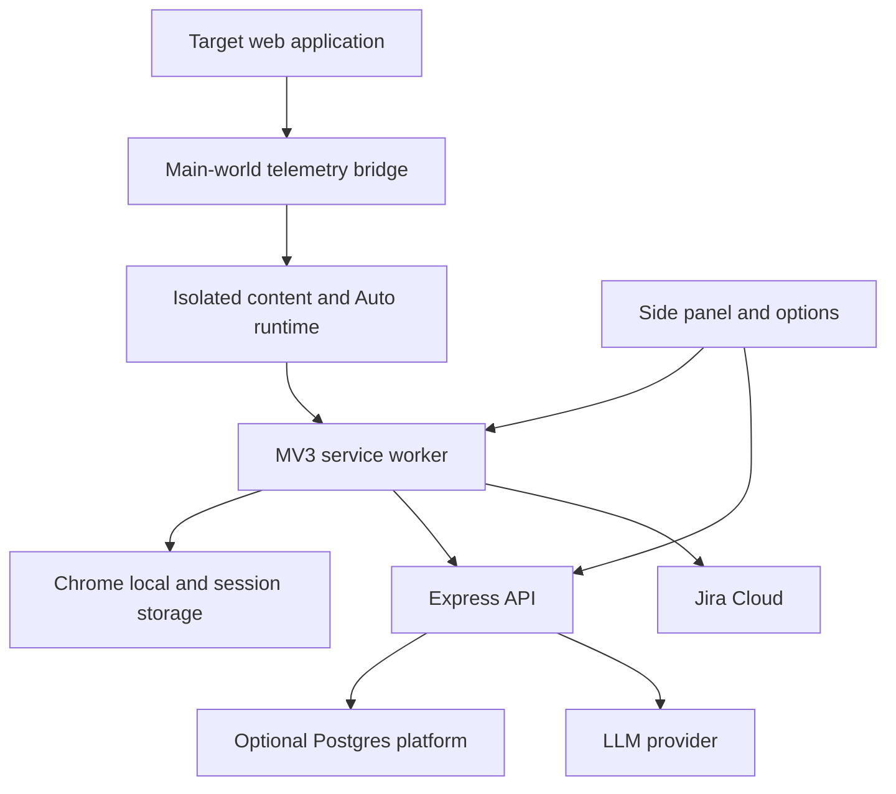

# QA Copilot repository quickstart

QA Copilot is a pnpm monorepo for an AI-assisted manual QA Chrome extension. It scans and records browser activity, generates reviewable test artifacts, can run a guarded autonomous testing loop, and exports bug reports directly to Jira Cloud. The repository has three workspaces:

| Package | Responsibility | Start here |
| --- | --- | --- |
| `apps/extension` | MV3 service worker, isolated content script, main-world telemetry bridge, React side panel/options, Auto execution, Jira integration, and browser-local state | [Extension runtime](extension/runtime.md) |
| `apps/server` | Express legacy generation API plus an optional Postgres-backed, authenticated workspace platform and BYO LLM gateway | [Server API reference](server/api-reference.md) |
| `packages/shared` | Page/session types, selector and redaction helpers, deterministic exports, and runtime-validated Auto protocol | [Core contracts](shared/core-contracts.md) |

The most important architectural correction to older repository prose is that the server is **not universally stateless**. Legacy AI routes always exist and use a process-configured provider. When `DATABASE_URL`, `JWT_SECRET`, and `MASTER_ENCRYPTION_KEY` are all configured, the server additionally mounts the Postgres-backed auth, workspace, project, provider, gateway-task, and Auto APIs. See [System architecture](architecture/overview.md) and [Operations](operations.md).

## High-level runtime map



*The extension owns page capture, local sessions, Auto run control, and Jira credentials; the server owns LLM calls and optional workspace persistence.*

## Wiki map

### Architecture and browser extension

- [System architecture and runtime modes](architecture/overview.md) explains package boundaries, browser execution worlds, state ownership, server modes, and principal trust boundaries.
- [Extension MV3 runtime](extension/runtime.md) covers the manifest, build transform, message router, active-tab refresh, grants, storage, screenshots, and service-worker composition.
- [Capture and recording](extension/capture-and-recording.md) covers DOM scanning, accessible names, selectors, custom widgets, SPA/console/network capture, redaction, session ordering, and evidence.
- [Side panel and options](extension/side-panel-and-options.md) covers the Page, Session, Generate, Chat, and Auto tabs, account/provider/Jira settings, backend selection, local exports, and context controls.
- [Jira Cloud integration](extension/jira.md) covers direct-browser credentials, permissions, ADF mapping, issue creation, error taxonomy, attachments, partial success, and duplicate/retry caveats.
- [Vendored page-agent boundary](maintenance/vendored-page-agent.md) explains provenance, application-owned wrappers, the no-dynamic-code gate, and safe vendor updates.

### Auto Test Mode

- [Auto architecture and lifecycle](auto/architecture-and-lifecycle.md) is the canonical state-machine and sequence reference for `RunController`, observation, decisions, corrections, confirmation, execution, persistence, restart recovery, budgets, loops, and final results.
- [Auto safety and extension](auto/safety-and-extension.md) explains the ordered guard pipeline, credential vault, origin containment, executor gates, and complete recipes for adding actions, guards, or observation fields.
- [Auto public contracts](shared/auto-contracts.md) documents `@qa-copilot/shared/auto`: all ten actions, Zod schemas, observations, step requests/responses, run configuration, traces, results, and destructive patterns.

### Server and persistence

- [Server API reference](server/api-reference.md) is the route inventory for health, all five legacy AI endpoints, auth, workspaces and invitations, providers, projects/environments/resolution, five gateway tasks, and Auto decisions. It includes auth/RBAC, schemas, response shapes, errors, and persistence.
- [AI generation and provider runtime](server/ai-generation.md) explains process providers, workspace provider resolution, prompts, redaction, logging, usage/audit lifecycle, safe gateway errors, and extension fallback behavior.
- [Platform and RBAC](server/platform-and-rbac.md) covers registration/login, membership lifecycle, tenant concealment, roles, projects, environments, and URL-derived context.
- [Data model and migrations](server/data-model.md) documents all ten Drizzle tables, hard and soft references, migration ownership, IDs, and service-enforced invariants.
- [Provider and secret security](server/provider-security.md) covers AES-256-GCM storage, public projections, validation/rotation, project-to-workspace resolution, SSRF checks, and local-provider exceptions.

### Shared code, workflows, and validation

- [Core contracts](shared/core-contracts.md) is the canonical home for page/session/artifact/Jira types, selector ranking, redaction behavior, session Markdown, and deterministic Playwright generation.
- [End-to-end workflows](workflows/end-to-end.md) traces allowlisting and scanning, manual recording, smart generation, Auto execution and defect handoff, Jira export, and platform context setup.
- [Testing strategy](testing/strategy.md) maps Vitest, jsdom, PGlite, built-extension Playwright, M3 acceptance, model evaluation, CI, and narrow validation to their owning behavior.
- [Development and operations](operations.md) covers prerequisites, server modes, Postgres and migrations, extension packaging/loading, CI, release checks, and troubleshooting.

## Core concepts and invariants

1. **The browser has separate trust contexts.** `public/injected.js` observes page-owned APIs, the isolated content script reduces and redacts data, and the service worker owns durable coordination. Do not move credentials or live DOM references across these boundaries.
2. **Session mutations are serialized.** `runExclusive()` protects storage read-modify-write from overlapping content and Auto events. `ACTION_EVENT` acceptance is based on the current session being `recording`; there is no event/session-ID correlation check.
3. **Redaction is layered but heuristic.** Sensitive field values are omitted at capture, text and URLs are redacted again, and server prompt builders wrap page data as untrusted. Screenshots and arbitrary prose remain disclosure risks.
4. **Auto is worker-owned and schema-bounded.** A model proposes one of ten actions. Server and worker validate `zAction`; origin, mode, destructive, and credential guards run before epoch/index/visibility/hit-test execution checks. No free-form JavaScript action exists.
5. **Platform tenancy is service-enforced.** JWT authentication populates the user, `requireMember()` hides absent/disabled membership with 404, and services must scope resource IDs by workspace. Many logical references are soft pointers rather than database foreign keys.
6. **Provider secrets remain server-side.** BYO keys are encrypted separately from provider metadata, omitted from responses/audits, decrypted only for use, and protected by repeated URL/SSRF checks and no-redirect requests.
7. **Legacy and gateway AI are different surfaces.** Gateway tasks add auth, tenant provider selection, task/usage/audit records, and safe correlation errors. Legacy routes are unauthenticated and do not write platform records.
8. **Jira is direct from the extension.** Its token stays in browser local storage and is never sent to `apps/server` or prompts. Issue creation precedes attachments, so upload failure is partial success; retrying the current create operation can duplicate issues.
9. **Generated artifacts are drafts.** Deterministic Playwright generation provides a stable fallback and selector warnings, not a guarantee that arbitrary sessions produce production-ready tests.

## Task routing

Run commands from the repository root.

| Engineering intent | Canonical wiki page | Owning entrypoints and symbols | Focused tests | Minimal validation |
| --- | --- | --- | --- | --- |
| Change MV3 permissions, content registration, active-tab behavior, or storage routing | [Extension runtime](extension/runtime.md) | `apps/extension/manifest.config.ts`, `vite.config.ts`, `src/background/index.ts`, `src/shared/messages.ts`, `src/shared/storage.ts` | `src/shared/context.test.ts`, `e2e/extension.spec.ts` | `pnpm --filter @qa-copilot/extension typecheck && pnpm --filter @qa-copilot/extension build` |
| Change scanner, labels, selectors, manual recording, widgets, or telemetry | [Capture and recording](extension/capture-and-recording.md) | `scanPage`, `accessibleName`, `resolveOwningControl`, `createRecorder`, `handleContentMessage`, `public/injected.js` | `scanner.test.ts`, `element-extract.test.ts`, `recorder.test.ts`, `e2e/extension.spec.ts` | `pnpm --filter @qa-copilot/extension exec vitest run src/content/scanner.test.ts src/content/element-extract.test.ts src/content/recorder.test.ts` |
| Change a side-panel tab, backend selection, context, or download | [Side panel and options](extension/side-panel-and-options.md) | `App`, `ChatTab`, `AutoTab`, `api`, smart generation functions, `downloadText` | `sidepanel/backend.test.ts`, relevant side-panel logic tests, `e2e/auto-m5.spec.ts` | `pnpm --filter @qa-copilot/extension test && pnpm --filter @qa-copilot/extension typecheck` |
| Add or change an Auto action | [Auto safety and extension](auto/safety-and-extension.md) | `zAction`, `actionToolDefs`, `decideCandidate`, `validateCandidate`, `checkAction`, `RunController`, `executeAction` | shared `auto/*.test.ts`, `auto-step.test.ts`, controller/guard/executor tests, `auto-step-loop.test.ts` | Run the focused command block in the guide, then M2/M4 E2E |
| Change Auto lifecycle, budgets, retries, pause/restart, or finalization | [Auto lifecycle](auto/architecture-and-lifecycle.md) | `RunController`, `compressHistory`, `initAutoMode`, `decide`, `PageDriver` | `run-controller.test.ts`, `auto-m2.spec.ts`, `auto-m4.spec.ts`, `auto-m5.spec.ts` | `pnpm --filter @qa-copilot/extension exec vitest run src/background/auto/run-controller.test.ts` |
| Change Auto guard, credential, origin, or executor safety | [Auto safety](auto/safety-and-extension.md) | `CHECKS`, `checkAction`, `substituteCredentials`, `executeElementAction`, `settle` | `guard.test.ts`, `executor.test.ts`, `settle.test.ts`, `auto-m4.spec.ts` | Run guard and executor Vitest files before browser E2E |
| Add or alter a server endpoint | [API reference](server/api-reference.md) | `createApp`, owning router, `http/schemas.ts`, `authMiddleware`, `requireMember` | Owning Supertest/PGlite suite | `pnpm --filter @qa-copilot/server exec vitest run <focused-file> && pnpm --filter @qa-copilot/server typecheck` |
| Change an AI prompt/task or gateway fallback | [AI generation](server/ai-generation.md) | `runAiTask`, `resolveProviderConfig`, `prompts/index.ts`, LLM adapters, `sidepanel/backend.ts` | `app.test.ts`, `ai-tasks.test.ts`, `gateway-tasks.test.ts`, `backend.test.ts` | Focused server and extension adapter tests |
| Change auth, membership, role policy, project, environment, or URL resolution | [Platform and RBAC](server/platform-and-rbac.md) | `authMiddleware`, `requireMember`, `ROLE_SETS`, workspace/project services, `resolveUrlToEnvironment`, `applyResolveMatch` | `auth.test.ts`, `workspaces.test.ts`, `projects.test.ts`, `context.test.ts` | Run the owning PGlite test and server typecheck |
| Change a database table or logical relationship | [Data model](server/data-model.md) | `apps/server/src/db/schema.ts`, `apps/server/drizzle`, affected service | Affected PGlite integration suite | `pnpm --filter @qa-copilot/server db:generate`, inspect SQL, focused test, disposable `db:migrate` |
| Change BYO provider URLs, keys, validation, rotation, or resolution | [Provider security](server/provider-security.md) | provider routes/service, secret service/encryption, `assertSafeProviderUrl`, `resolveProviderConfig` | `providers.test.ts`, `ssrf.test.ts`, `secrets.test.ts` | Run all three focused suites and server typecheck |
| Change shared page/session types, selectors, redaction, Markdown, or Playwright | [Core contracts](shared/core-contracts.md) | `types.ts`, `rankSelectors`, `redactText`, `buildSessionMarkdown`, `buildPlaywrightSpec`, barrels | corresponding shared test plus consumer test | `pnpm --filter @qa-copilot/shared test && pnpm -r typecheck` |
| Change Jira setup, mapping, transport, attachments, or composer | [Jira](extension/jira.md) | `requestJiraOrigin`, `mapReportToIssue`, `markdownToAdf`, `handleJiraMessage`, `JiraClient` | Jira unit files and `e2e/jira-export.spec.ts` | Focused Jira Vitest, extension build, focused E2E |
| Update vendored page-agent code | [Vendored boundary](maintenance/vendored-page-agent.md) | `src/vendor/page-agent`, `PageDriver`, observation builder, executor | executor/redaction tests and `vendor-smoke.spec.ts` | Run no-dynamic-code scan, extension build, vendor smoke |
| Diagnose CI, build, E2E, migrations, or model evaluation | [Testing](testing/strategy.md), [Operations](operations.md) | package scripts, CI workflow, Playwright config, PGlite/migrate, acceptance/eval harnesses | N/A | Start focused; use `pnpm -r typecheck && pnpm -r lint && pnpm -r test && pnpm -r build` as the broad gate |

## Common setup

```bash
corepack enable
pnpm install
cp apps/server/.env.example apps/server/.env

# Start the legacy-capable API
pnpm --filter @qa-copilot/server dev

# Build the unpacked extension
pnpm --filter @qa-copilot/extension build
```

Load `apps/extension/dist` in `chrome://extensions` with Developer mode. For platform mode, start the Postgres service, configure all three platform values, and apply migrations:

```bash
docker compose up -d
pnpm --filter @qa-copilot/server db:migrate
```

Do not commit `.env` files or copy real API keys, Jira tokens, JWT secrets, master encryption keys, or Auto vault contents into documentation, fixtures, or logs.

## Backlog and evidence-limited areas

These are documented limitations, not omitted subsystems:

- `apps/extension/src/background/mutex.ts`: there is no focused worker test that races concurrent session mutations. The wiki documents the invariant and recommends adding one when this boundary changes.
- `apps/extension/src/background/index.ts`: runtime message routing is primarily discriminant/cast based rather than comprehensive sender and shape validation; hardening requires a product/source change.
- `apps/extension/src/shared/messages.ts` and `Options.tsx`: `noDestructiveMode` is stored but not connected to Auto policy. Do not rely on it until source wiring exists.
- `apps/server/src/db/schema.ts` environment policy fields are persisted but not enforced by current AI/Auto routes. They are context metadata, not authorization.
- `apps/extension/src/sidepanel/IssueComposer.tsx`: attachment retry reuses issue creation and can duplicate issues; no attach-existing operation exists.
- Built-extension Playwright, real-provider M3 acceptance, and model-quality evaluation are intentionally outside default CI because they require a headed browser, extra services, or provider credentials/credits. Their operation and cleanup are documented in [Testing strategy](testing/strategy.md).
