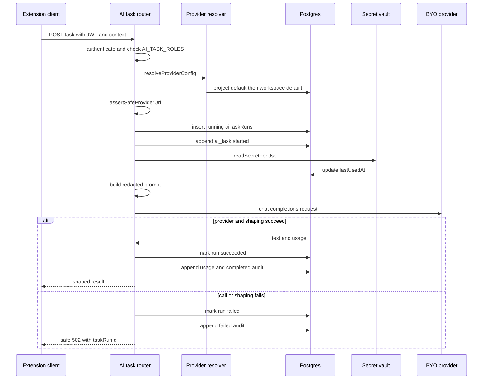

# AI generation gateway and task lifecycle

QA Copilot has two server-side generation planes. The always-on legacy plane uses one environment-configured `LLMProvider` and has no database accounting. The optional workspace gateway resolves an encrypted BYO provider configuration, persists task/usage/audit records, and returns safer correlated errors. Their complete HTTP contracts are in [API reference](api-reference.md); key and URL controls are in [Provider security](provider-security.md).

## Provider abstractions

`apps/server/src/llm/types.ts` defines `LLMProvider` around `complete`, `chat`, and optional `chatWithTools`. `createProvider` in `apps/server/src/llm/index.ts` selects the process provider:

- `AnthropicProvider` for `LLM_PROVIDER=anthropic`;
- `OpenAIProvider` for `openai`;
- `OpenRouterProvider` for `openrouter`;
- `LocalProvider` for local OpenAI-compatible servers.

OpenAI, OpenRouter, and local transport converge on `apps/server/src/llm/openai-compatible.ts`. It posts to `${baseUrl}/chat/completions`, conditionally sends `Authorization: Bearer`, maps system/user completion into chat messages, parses provider usage, strips `<think>...</think>`, and treats empty completion content as `LLMError`. Timeouts use `AbortController`. Tool mode registers one function per Auto action and forces `tool_choice:"required"`.

The workspace gateway does **not** reuse the process provider. `providerFor` in `modules/ai-tasks/orchestrator.ts` creates an OpenAI-compatible provider from the resolved DB config and wraps it in `LoggingProvider`. Consequently all BYO configs currently require an API key and `providerType:"openai_compatible"`, regardless of the process-wide `LLM_PROVIDER`.

## Prompt and redaction boundary

Task prompt builders live in `apps/server/src/prompts/index.ts`:

- `analyzeSystem` / `analyzeUser` require a compact JSON analysis;
- `testCasesSystem` / `testCasesUser` request structured Markdown test cases;
- `bugReportSystem` / `bugReportUser` request a Jira-ready report and distinguish observations from assumptions;
- `playwrightEnrichSystem` / `playwrightEnrichUser` prohibit selector changes;
- `chatSystem` is a generic assistant persona, not the QA untrusted-page prompt.

`asUntrustedData` in `apps/server/src/redaction/guard.ts` serializes a value through `sanitizeContext`, which runs shared `redactText` over the complete JSON string, and then wraps it with a warning that captured content is data rather than instructions. Page models, sessions, and Auto defect prefill take this path. Gateway tests assert that an email becomes `[EMAIL]` before `fetch` receives the prompt.

Important boundaries:

- This is pattern-based defense in depth, not a guarantee that arbitrary secrets or PII are recognized.
- `question`, `focus`, and `userNote` are interpolated outside `asUntrustedData`; only page/session/defect objects are wrapped. Chat history is sent directly under the server’s own system message and does not pass through `asUntrustedData`.
- `playwrightEnrichUser` sends deterministic spec text directly. It originates from recorded data already transformed by `buildPlaywrightSpec`, but the function does not call `sanitizeContext`.
- `LoggingProvider` writes full prompt and response bodies at debug. Its contract assumes inputs are already redacted; debug logs therefore remain sensitive operational data even though API keys/headers are unavailable to the decorator.

## Workspace task sequence



*The sequence shows `runAiTask`; resolution and SSRF failures happen before a task run exists.*

## `runAiTask` lifecycle and invariants

`runAiTask<I,R>` centralizes the gateway behavior around an `AiTaskSpec` (`taskType`, `build`, `shape`):

1. `resolveProviderConfig` uses project default first, then workspace default. A missing or disabled project default falls through. Disabled workspace defaults are skipped. No candidate yields `409 no_provider`.
2. `assertSafeProviderUrl` re-checks the stored URL on every use.
3. A running `ai_task_runs` row and `ai_task.started` audit event are written.
4. `readSecretForUse` updates `secrets.last_used_at`, decrypts the API key, and returns plaintext only in process memory.
5. The spec builds the prompt. A spec-provided `maxTokens` wins; otherwise `llm_provider_configs.max_output_tokens` is used.
6. `LoggingProvider` calls OpenAI-compatible transport and captures reported token usage (nullable if omitted).
7. `shape` converts text to the product response. Shape failures are task failures too.
8. Success marks the run, inserts append-only usage, writes `ai_task.completed`, and returns. Failure marks the run, writes `ai_task.failed`, and throws `ApiError(502, ..., "ai_task_failed", {taskRunId})`.

These writes are ordered but are not enclosed in a transaction. A process/DB failure can therefore leave a running row, a succeeded row without usage/audit, or an externally completed provider call whose final DB updates failed. There is no background reconciler, cancellation endpoint, retry record, or idempotency key.

`temperature` is stored on a provider config but `providerFor` never puts it in the OpenAI-compatible body. `maxOutputTokens` applies only when a task spec/caller does not override it. `timeoutSeconds` is effective for gateway calls. Estimated cost fields exist but are never calculated here.

## Task-specific shaping

| Task symbol | Task type | Prompt budget | Output behavior |
|---|---|---:|---|
| `runAnalyzePage` | `analyze_page` | 2,048 | Parses loose JSON. JSON-looking malformed output returns a standard hint and empty arrays; prose becomes summary. Route discards `taskRunId` from its HTTP response. |
| `runGenerateTestCases` | `generate_test_cases` | 3,072 | Strips outer fences; emits Markdown artifact with generated `artifactId`. Route returns the artifact directly. |
| `runGenerateBugReport` | `generate_bug_report` | Provider config default | Strips fences; returns `{taskRunId,bugReport,usage}`. |
| `runChat` | `chat` | Request `maxTokens`, else config | Prepends `chatSystem`, preserves fenced output, returns task ID and usage. |
| `runEnrichPlaywright` | `enrich_playwright` | 2,048 | Strips fences. The route catches failure and returns deterministic content despite the recorded failed run. |

The deterministic Playwright path is a deliberate exception to the “reasoning requires a real model” rule: `buildPlaywrightSpec` runs first. If `enrich` is absent/false, no model or task record is used. If requested and the provider fails, the base draft remains available. Analysis, test cases, bug reports, and chat have no deterministic semantic fallback.

## Auto decision path

`modules/auto/routes.ts` follows the same provider resolution, SSRF, and vault controls but does not invoke `runAiTask`:

- `StepRequest` is stateless and includes goal, mode, compressed history, current observation, remaining budget, and placeholder names.
- `autoStepSystem` and `autoStepUser` build the decision prompt. `decideCandidate` can consume tool calls or recovery text; `validateCandidate` enforces shared `zAction`.
- Timeout is fixed by `AUTO_STEP_TIMEOUT_MS=60_000`; the token budget is `Math.max(config.maxOutputTokens, AUTO_STEP_MIN_TOKENS)` where the floor is 4,096.
- Private/local URL detection enables `localModelExtraBody` to suppress reasoning-mode token consumption where supported.
- Provider failure records a failed run and returns 502/504. A provider response records **success and usage before action validation**; invalid action therefore returns 422 while its task run says succeeded.
- The path writes no audit event and does not store session ID. Metadata-only info logs include action type, history length, observation character count, remaining steps, correction flag, and duration. Invalid detail is debug-only; raw model output reaches the response only under `AUTO_STEP_DEBUG=1`.

## Extension fallback behavior

`apps/extension/src/sidepanel/backend.ts` decides which plane to call:

- `analyzePageSmart`, `generateTestCasesSmart`, `generateBugReportSmart`, and `generatePlaywrightSmart` prefer the gateway when token and workspace ID exist, but fall back to legacy for `no_provider` or HTTP 401. Signed-out use goes directly to legacy.
- `sendChatMessageSmart` intentionally does **not** fall back for `no_provider`, avoiding a silent switch to an unrelated process model; only stale-token 401 falls back.
- Other gateway errors, including 403 role denial and `ai_task_failed`, are surfaced.

This fallback means one-shot generation can bypass workspace accounting and provider choice under two expected conditions. It also means a 401 can produce a successful legacy response even though the user session is stale.

## Observability and error differences

`LoggingProvider` emits `llm.request` and `llm.response` metadata at info, with provider/model, size/count, latency, and status. Full prompts/responses are debug. `requestIdMiddleware` and AsyncLocalStorage correlate inbound request logs and LLM calls.

Legacy routes allow `LLMError` messages through `{error}` and unexpected errors through the generic 500 message. OpenAI-compatible `LLMError` can include up to 300 characters of raw provider response text. Gateway `runAiTask` catches these and exposes only the safe 502 plus `taskRunId`; provider validation similarly turns failures into a generic `status:"invalid"` result. However, `LoggingProvider.logFailure` includes the exception message in info metadata, so raw provider error snippets may enter server logs even when the client response is safe.

## Limitations and extension seams

- Workspace gateway transport supports only OpenAI-compatible chat completions; process-level Anthropic support does not imply BYO Anthropic-native support.
- Neither legacy nor gateway handlers stream output.
- There is no model capability discovery, quota enforcement, cost calculation, retry/backoff, response schema mode, or persisted generated artifact body.
- The gateway persists context IDs as supplied but does not consistently verify environment/session ownership. Project lookup in resolver is tenant-constrained, but an invalid project ID merely removes the project tier and may fall back to workspace default.
- AI environment policy flags are not consulted by the task route.

To add a product task, add its Zod body in `http/schemas.ts`, implement an `AiTaskSpec` and typed wrapper in `modules/ai-tasks/orchestrator.ts`, mount it behind `AI_TASK_ROLES` in `routes.ts`, wrap every captured page/session object with `asUntrustedData`, and add PGlite/Supertest assertions for redaction, provider resolution, success run/usage/audit, safe failure, viewer denial, and cross-workspace context. If the task needs a new provider feature, extend `LLMProvider`, all concrete providers, `LoggingProvider`, and focused transport tests together.

## Focused tests and commands

```bash
pnpm --filter @qa-copilot/server exec vitest run src/app.test.ts
pnpm --filter @qa-copilot/server exec vitest run src/modules/ai-tasks/ai-tasks.test.ts src/modules/ai-tasks/gateway-tasks.test.ts
pnpm --filter @qa-copilot/server exec vitest run src/modules/auto/auto-step.test.ts src/modules/auto/auto-step-loop.test.ts
pnpm --filter @qa-copilot/server exec vitest run src/llm/logging-provider.test.ts src/llm/tools.test.ts
pnpm --filter @qa-copilot/server exec vitest run src/llm/anthropic.test.ts src/llm/local.test.ts src/llm/openrouter.test.ts
pnpm --filter @qa-copilot/extension exec vitest run src/sidepanel/backend.test.ts
pnpm --filter @qa-copilot/server typecheck
```