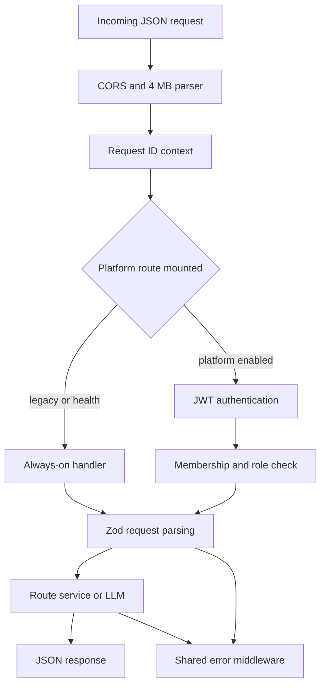

# Server API reference

The Express application is assembled by `createApp(provider, logger, platform?)` in `apps/server/src/app.ts`. `/health` and the five legacy AI routes are always mounted. The auth, workspace, provider, project, gateway-task, and Auto routes exist only when `apps/server/src/index.ts` can construct `PlatformDeps` from non-empty `DATABASE_URL`, `JWT_SECRET`, and `MASTER_ENCRYPTION_KEY`; in legacy-only mode those paths fall through to Express 404 behavior.

For the gateway lifecycle and provider behavior, see [AI generation](ai-generation.md). For authorization semantics, see [Platform and RBAC](platform-and-rbac.md); for persisted records, see [Data model](data-model.md); and for BYO URL/key controls, see [Provider security](provider-security.md).

## HTTP-wide behavior

- `cors()` is unrestricted by application configuration. JSON bodies are parsed with `express.json({ limit: '4mb' })`; an oversized body is rejected by the body parser before route validation.
- `requestIdMiddleware` honors inbound `x-request-id` or generates a UUID, echoes it in the `x-request-id` response header, and carries it through AsyncLocalStorage for logs. Request IDs are not normally in JSON bodies; failed gateway tasks separately expose `taskRunId`.
- Protected routes require `Authorization: Bearer <JWT>`. `authMiddleware` returns `401 {"error":"Authentication required"}` for a missing/non-Bearer header and `401 {"error":"Invalid or expired token"}` for verification failure.
- `requireMember` returns 404 for a non-member or disabled member, deliberately concealing workspace existence; an invited member gets 403 until acceptance. A role mismatch is 403.
- Zod failures are `400 {"error":"Invalid request","details":<flattened Zod error>}`. `ApiError` is `{error, code?, ...details}` at its declared status. `LLMError` is `{error}` at its provider-derived status. Other failures are logged and currently return `500 {"error":<exception message>}`; this means unexpected exception text is not normalized.
- No application-level 404 JSON handler, pagination, rate limiting, CSRF layer, idempotency keys, or API version prefix is implemented.

### Shared request shapes

These names below correspond exactly to exports in `apps/server/src/http/schemas.ts`.

- **`pageModelSchema`**: object with `summary: { url: string, ... }`, `elements: any[]`, and `capturedAt: string`; both the summary and root permit extra fields.
- **`sessionSchema`**: object with `id: string`, `status: string`, and `events: any[]`; extra fields are permitted.
- **`defectPrefillSchema`**: `summary`, `expected`, and `actual` strings of at most 300 characters, plus `traceExcerpt` of at most 4,000.
- **Task context**: optional `projectId`, `environmentId`, and `sessionId`, all strings. These are persisted as context but are not all relationally validated; see [Data model](data-model.md).
- **Public user**: `{id,email,displayName}`. **Public provider** is the `PublicProviderConfig` projection documented in [Provider security](provider-security.md), never `secretId` or an API key.

## Route flow



*The diagram shows middleware and authorization ordering in `createApp` and the mounted routers.*

## Health and legacy AI endpoints

Legacy routes are unauthenticated and stateless with respect to the platform database. They use the process-wide provider injected into `createApp`; they do not create `ai_task_runs`, `usage_logs`, or `audit_logs`.

| Endpoint | Auth / RBAC | Request schema | Success response | Significant errors and persistence |
|---|---|---|---|---|
| `GET /health` | None | No body | `200 {ok:true, provider:string}` where `provider` is `provider.name` | No DB writes. It proves app responsiveness, not provider connectivity. |
| `POST /api/page/analyze` | None | `analyzeSchema`: required `pageModel`; optional `question:string`, `environment:string`. `environment` is accepted but unused. | `200 {summary:string, risks:string[], suggestedTests:string[]}`. Malformed JSON-looking model output becomes a safe explanatory summary and empty arrays; non-JSON output becomes the summary. | 400 schema; provider `LLMError`; 500 unexpected. No DB writes. Fixed `maxTokens:2048`. |
| `POST /api/generate/test-cases` | None | `testCasesSchema`: required `pageModel`; optional `format:string`, `focus:string`. `format` is accepted but ignored. | `200 {artifactId,type:"test_cases",format:"markdown",content}`; outer code fences are stripped. | 400, provider error, 500. No DB writes. Fixed `maxTokens:3072`. |
| `POST /api/generate/bug-report` | None | `bugReportSchema`: required `session`; optional nullable `pageModel`; `userNote` defaults to `""`; optional booleans `includeConsoleErrors`, `includeNetworkFailures`; optional `defectPrefillSchema`. The include flags are accepted but unused by the prompt builder. | `200 {artifactId,type:"bug_report",format:"markdown",content}` with fences stripped. | 400, provider error, 500. No DB writes. Fixed `maxTokens:2048`. |
| `POST /api/generate/playwright` | None | `playwrightSchema`: required `session`, optional `enrich:boolean`. | `200 {artifactId,type:"playwright_test",format:"typescript",filename,content,selectorWarnings}`. `buildPlaywrightSpec` always builds the base draft; if enrichment fails, the same response returns the deterministic draft. | 400 or deterministic builder/500. An enrichment provider error is swallowed. No DB writes. |
| `POST /api/chat` | None | `chatSchema`: `messages` has 1–40 `{role:"user"|"assistant",content}` entries; content length 1–8,000. Optional positive integer `maxTokens` up to 8,192, default 2,048. Client `system` messages are invalid. | `200 {content:string}`; code fences are preserved. | 400, provider error, 500. No DB writes. |

## Authentication

All three routes are present only in platform mode. JWTs are returned in JSON, not cookies.

| Endpoint | Auth / RBAC | Request schema | Success response | Significant errors and persistence |
|---|---|---|---|---|
| `POST /api/auth/register` | Public | `registerSchema`: valid `email`; `password` minimum 8; optional trimmed non-empty `displayName`. | `201 {token,user,workspace:{id,name,role:"owner"}}`. | 409 `email_taken`; 400; 500. `registerUser` atomically inserts `users`, password `external_identities`, a personal `workspaces` row, owner `workspace_members`, and `workspace.created` audit. Email is lowercased; missing display name defaults to the local part. |
| `POST /api/auth/login` | Public | `loginSchema`: valid `email`, non-empty `password`. | `200 {token,user}`. | 401 `invalid_credentials` for absent/disabled user, missing password identity, or wrong password; 400. Updates `users.last_login_at`; no login audit event. |
| `GET /api/auth/me` | Bearer JWT | No body | `200 {user}`. | Common 401; additionally 401 if the token subject no longer resolves to a user. Read only. |

## Workspaces and membership

| Endpoint | Auth / RBAC | Request schema | Success response | Significant errors and persistence |
|---|---|---|---|---|
| `POST /api/workspaces` | JWT; no existing-workspace role required | `createWorkspaceSchema`: trimmed non-empty `name`. | `201 {id,name,role:"owner"}`. | 400/401/500. Transactionally inserts workspace + active owner membership + `workspace.created` audit. |
| `GET /api/workspaces` | JWT | No body | `200 {workspaces:[{id,name,role,status}]}` including invited memberships. | 401/500. Read only. |
| `GET /api/workspaces/:workspaceId` | Active member; any role | Path `workspaceId`. | `200 {id,name,slug,role}`. | 404 concealment, 403 pending invite, 401. Read only. |
| `POST /api/workspaces/:workspaceId/members/invite` | Active `owner` or `admin` | `inviteMemberSchema`: valid `email`; `role` in `owner|admin|qa_lead|tester|viewer`, default `tester`. Invitee must already be registered. | `201 {id,role,status:"invited"}`. | 404 if email has no user; 409 if any membership already exists; common auth/RBAC/400. Inserts membership then `member.invited` audit; these writes are not wrapped in one explicit transaction. |
| `POST /api/workspaces/:workspaceId/members/accept` | JWT; caller must own a pending membership. Deliberately not behind `requireMember`. | No body | `200 {id,role,status:"active"}`. | 404 concealed workspace if no membership; 409 if membership is not invited; 401. Updates membership then writes `member.accepted`. |
| `POST /api/workspaces/:workspaceId/members/decline` | JWT; caller must own a pending membership | No body | `204` with no body. | 404 if no membership; 409 if not invited; 401. Deletes membership then writes `member.declined`. |

There is no endpoint to list members, change roles, disable/remove members, transfer ownership, update/delete a workspace, reset passwords, refresh/revoke JWTs, or register an uncreated invitee.

## BYO LLM providers

The base path is `/api/workspaces/:workspaceId/llm-providers`. URL validation, encryption, public projections, and non-atomic lifecycle caveats are detailed in [Provider security](provider-security.md).

| Endpoint | Auth / RBAC | Request schema | Success response | Significant errors and persistence |
|---|---|---|---|---|
| `GET .../llm-providers` | Active member; any role | No body | `200 {providers:PublicProviderConfig[]}`. | Common 401/403/404. Read only; API key and `secretId` never returned. |
| `POST .../llm-providers` | `owner` or `admin` | `createLlmProviderSchema`: `scope` defaults `workspace` and accepts `workspace|project|user`; `providerType` only `openai_compatible`; required non-empty `displayName`, URL `baseUrl`, non-empty `modelName`, non-empty `apiKey`; optional positive integer `maxOutputTokens`, temperature 0–2, positive integer `timeoutSeconds`. | `201 PublicProviderConfig`, initially `validationStatus:"unknown"` and `isWorkspaceDefault:false`. | 400 `invalid_base_url`/`disallowed_base_url`; common errors. Creates encrypted `secrets`, `secret.created` audit, config, and `llm_provider.created` audit without one encompassing transaction. |
| `PATCH .../llm-providers/:providerId` | `owner` or `admin` | Any partial subset of non-empty `displayName`, URL `baseUrl`, non-empty `modelName`, positive `maxOutputTokens`, temperature 0–2, positive `timeoutSeconds`, `enabled:boolean`. | `200 PublicProviderConfig`. The route passes `null` as default ID, so `isWorkspaceDefault` is always false in this response even if it is default. | 404 scoped config; URL-related 400; common errors. Updates config + `llm_provider.updated` audit. Does not clear validation status after connection-field edits. |
| `POST .../llm-providers/:providerId/rotate-secret` | `owner` or `admin` | `{apiKey:string}` minimum length 1. | `200 {ok:true}`. | 404 scoped config/secret; 400; common errors. Re-encrypts in the existing secret row, sets `rotatedAt`, writes `secret.rotated`; no provider-specific audit event. |
| `POST .../llm-providers/:providerId/validate` | `owner` or `admin` | No body | Always-normal connectivity result: `200 {status:"valid"|"invalid",model,message}`. | 404 config/secret and URL-policy 400 occur before the provider-call catch. Provider/auth/model/connectivity failure becomes `200 status:"invalid"`, not 4xx/5xx, and raw body is suppressed. Updates validation fields, `lastValidatedAt`, secret `lastUsedAt`; writes `llm_provider.validated`. |
| `POST .../llm-providers/:providerId/set-default` | `owner` or `admin` | No body | `200 {ok:true}`. | 404 scoped config; common errors. Updates the workspace soft pointer and writes `workspace.default_provider_changed`. Disabled or unvalidated configs are not rejected here, though resolver later skips disabled configs. |

## Projects, environments, and URL resolution

`PROJECT_ADMIN_ROLES` is `owner`, `admin`, and `qa_lead`; all active roles may read.

| Endpoint | Auth / RBAC | Request schema | Success response | Significant errors and persistence |
|---|---|---|---|---|
| `POST /api/workspaces/:workspaceId/projects` | Project admin | `createProjectSchema`: non-empty `name`; `key` length 1–32 and `/^[A-Za-z0-9_-]+$/`; optional trimmed `description`, optional `defaultLlmProviderConfigId`. | `201 {id,key,name}`; key is normalized uppercase. | 409 `project_key_conflict`; 400 if default provider is outside workspace; common errors. Inserts project + `project.created` audit. |
| `GET /api/workspaces/:workspaceId/projects` | Active member; any role | No body | `200 {projects:[Project rows]}` with all schema columns serialized. | Common auth errors. Read only; no pagination/order contract. |
| `GET /api/workspaces/:workspaceId/projects/:projectId` | Active member; any role | Path IDs | `200 <Project row>`. | 404 if not in workspace; common errors. |
| `PATCH /api/workspaces/:workspaceId/projects/:projectId` | Project admin | Partial `updateProjectSchema`: non-empty `name`; trimmed `description`; `defaultEnvironmentId:string`; nullable `defaultLlmProviderConfigId`; nullable `redactionPolicyId`. | `200 <updated Project row>`. | 404 project; 400 if environment is not in project or provider not in workspace; common errors. Updates timestamp + `project.updated` audit listing field names. Empty patch is accepted and still audited. |
| `POST /api/workspaces/:workspaceId/projects/:projectId/environments` | Project admin | `createEnvironmentSchema`: `name` in `local|dev|staging|uat|production|custom`; optional non-empty `displayName`, URL `baseUrl`, and six optional booleans: `allowAiObserve`, `allowAiGenerate`, `allowAiExecute`, `allowAutoSubmit`, `requireConfirmationBeforeSubmit`, `requireConfirmationBeforeAttachmentUpload`. | `201 <EnvironmentProfile row>` with name-based defaults plus overrides. | 404 project; 400 schema; common errors. Inserts environment + `environment.created` audit. |
| `GET /api/workspaces/:workspaceId/projects/:projectId/environments` | Active member; any role | Path IDs | `200 {environments:[EnvironmentProfile rows]}`. | 404 project; common errors. Read only. |
| `GET /api/workspaces/:workspaceId/resolve?url=...` | Active member; any role | `resolveUrlQuerySchema`: required valid URL query string. | `200 {match:null|{project,environment}}`; longest matching configured `baseUrl` wins. | 400 invalid/missing query; common auth errors. No match is normal 200. Read only. |

## Authenticated AI gateway tasks

All five endpoints use JWT plus an active role in `AI_TASK_ROLES`: `owner`, `admin`, `qa_lead`, or `tester`; viewers get 403. They resolve project default then workspace default, reject absent provider with `409 code:"no_provider"`, re-check SSRF policy, and normally persist task lifecycle, usage, and audit. The schemas include optional task context unless noted.

| Endpoint | Request schema | Success response | Task persistence and endpoint-specific errors |
|---|---|---|---|
| `POST .../ai/tasks/analyze-page` | `aiAnalyzePageSchema`: required `pageModel`; optional `question`; optional task context. | `200 {summary,risks,suggestedTests}` directly, without `taskRunId`. | `taskType:"analyze_page"`; fixed 2,048 output tokens. Malformed JSON degrades safely. Gateway/provider failures become `502 {error,code:"ai_task_failed",taskRunId}`. |
| `POST .../ai/tasks/generate-test-cases` | Required `pageModel`; optional `focus`; optional task context. | `200 {artifactId,type:"test_cases",format:"markdown",content}` directly, without `taskRunId`. | `taskType:"generate_test_cases"`; fixed 3,072 tokens; same safe 502. |
| `POST .../ai/tasks/generate-bug-report` | Required `session`; optional nullable `pageModel`, default-empty `userNote`, optional `defect`, optional task context. | `200 {taskRunId,bugReport:{content,format:"markdown"},usage:{inputTokens,outputTokens}}`. | `taskType:"generate_bug_report"`; config token limit. Same safe 502. Input `sessionId` is used if context did not already supply one. |
| `POST .../ai/tasks/chat` | Same bounded `messages` and `maxTokens` as legacy chat plus optional task context. | `200 {taskRunId,content,usage}`; fences preserved. | `taskType:"chat"`; caller `maxTokens` overrides config up to schema maximum. Client system role is 400. Same safe 502. |
| `POST .../ai/tasks/enrich-playwright` | Required `session`; optional `enrich`; optional task context. | `200 {artifactId,type:"playwright_test",format:"typescript",filename,content,selectorWarnings}`. | Base spec is deterministic. If `enrich` is false/absent there is no run/usage/audit. If true, `taskType:"enrich_playwright"`; provider failure records failed run/audit but is swallowed and returns 200 with base draft. |

A successful `runAiTask` inserts a running `ai_task_runs`, writes `ai_task.started`, decrypts/marks the secret used, calls the provider, marks success, inserts `usage_logs`, and writes `ai_task.completed`. Failure after run creation marks it failed, writes `ai_task.failed`, and returns the safe 502 correlation ID. Provider resolution or SSRF failure occurs before run insertion. These writes are sequential, not one transaction.

## Auto decision endpoint

### `POST /api/workspaces/:workspaceId/auto/step`

- **Auth/RBAC:** JWT plus `AI_TASK_ROLES`; platform mode only.
- **Schema:** `autoStepSchema` is shared `zStepRequest` plus optional `projectId` and `environmentId`. Required fields are:
  - non-empty `goal`; `mode` in `observe_only|confirm|autonomous`; `stepsRemaining:integer`; `placeholders:string[]`; optional `language`; optional `correction` up to 500 characters;
  - `history` entries are either summaries `{kind:"summary",fromStep:int,toStep:int,line}` or `{step:int,action,result,urlAfter,newErrors,resultDetail?}`. Historical `action` accepts a valid action or any passthrough object with string `type` so prior invalid model output can be represented;
  - `observation` requires `url`, `title`, numeric page dimensions/scroll fields, nullable `activeDialog`, `serialized`, integer `elementCount`, `consoleErrors:string[]`, failed request `{method,url,status}` objects, `navigationOccurred`, numeric `timestamp`, and integer `epoch`.
- **Response:** `200 {action}` where action is exactly one of `click`, `fill`, `select`, `press`, `scroll`, `navigate`, `wait`, `assert`, `report_defect`, or `finish` and passes shared `zAction` validation.
- **Errors:** common 400/401/403/404; `409 no_provider`; URL-policy 400; `502 {error:"provider_error"}`; `504 {error:"provider_timeout"}`; `422 {error:"invalid_action",detail}`. The latter includes `modelRaw` only when `AUTO_STEP_DEBUG=1`.
- **Persistence:** inserts a running `ai_task_runs` with `taskType:"auto_step"`; provider failure marks it failed. A provider response marks the run succeeded and inserts `usage_logs` **before** action validation, so a 422 still has a succeeded run and usage row. Unlike `runAiTask`, this route writes no `ai_task.started/completed/failed` audit events. It uses a 60-second timeout and raises the output budget to at least `AUTO_STEP_MIN_TOKENS` (4,096).

## Invariants and limitations

1. Workspace IDs in paths are the tenant boundary enforced by `requireMember`; resource services must additionally constrain queries by workspace. New services must not query a caller-supplied resource ID alone.
2. API key plaintext must enter only request parsing and server-internal provider calls; no response contract exposes it.
3. Legacy and gateway generation are intentionally different trust/accounting surfaces. Adding a legacy route does not automatically gain auth, BYO resolution, usage, or audit.
4. Environment policy booleans are stored and returned but these server route handlers do not enforce them when running AI or Auto tasks.
5. `scope` accepts project/user values, but provider resolution currently uses only project and workspace default pointers; there are no session/user tiers.
6. Unknown routes, unsupported methods, and platform routes while disabled do not use the shared JSON error shape.

## Focused verification and extension seams

Run from repository root:

```bash
pnpm --filter @qa-copilot/server exec vitest run src/app.test.ts
pnpm --filter @qa-copilot/server exec vitest run src/modules/auth/auth.test.ts src/modules/workspaces/workspaces.test.ts
pnpm --filter @qa-copilot/server exec vitest run src/modules/projects/projects.test.ts
pnpm --filter @qa-copilot/server exec vitest run src/modules/providers/providers.test.ts src/modules/providers/ssrf.test.ts
pnpm --filter @qa-copilot/server exec vitest run src/modules/ai-tasks/ai-tasks.test.ts src/modules/ai-tasks/gateway-tasks.test.ts
pnpm --filter @qa-copilot/server exec vitest run src/modules/auto/auto-step.test.ts src/modules/auto/auto-step-loop.test.ts
pnpm --filter @qa-copilot/server typecheck
```

To add an endpoint, define a Zod schema in `apps/server/src/http/schemas.ts`, mount it in the narrow owning router (or `createApp` for a legacy route), compose `authMiddleware` and `requireMember` explicitly, keep tenant constraints in the service query, and add Supertest coverage for success, schema rejection, missing JWT, each relevant role boundary, and cross-workspace concealment. New AI product tasks should be an `AiTaskSpec` executed through `runAiTask`; new Auto protocol fields/actions must be changed in `packages/shared/src/auto/*` on both producer and consumer sides rather than locally widening the server route.