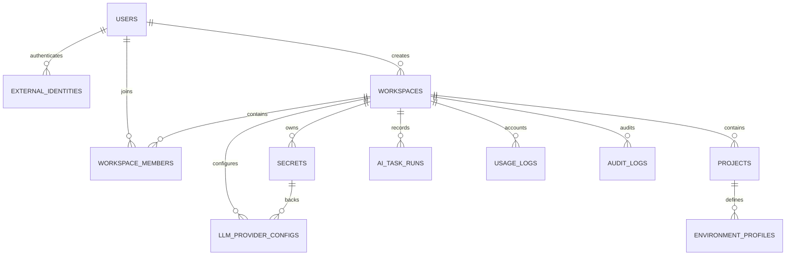

# Server data model and persistence

`apps/server/src/db/schema.ts` is the Drizzle source of truth for ten Postgres tables. Production uses `node-postgres` through `createDb`; integration tests use in-memory PGlite through `createTestDb` and apply the same generated migrations. The platform is optional; legacy AI routes never touch these tables. See [Platform and RBAC](platform-and-rbac.md), [AI generation](ai-generation.md), and [Provider security](provider-security.md) for service semantics.

## Entity relationships



*Solid relationships shown are conceptual ownership; several pointers and accounting tables intentionally lack database foreign keys, as detailed below.*

## Tables

### `users`

A sign-in principal: text `id` PK; unique required `email`; `email_verified` default false; nullable `display_name`; required `status` default `active`; created/updated timestamps; nullable `last_login_at`. Status values are comments (`active|disabled`), not a DB enum/check. Registration lowercases email before insertion.

### `external_identities`

Authentication methods: text `id` PK; required FK `user_id -> users.id`; required `provider`; nullable `provider_user_id`, `email`, and `password_hash`; timestamps. The current service inserts `provider:"password"` with a bcrypt hash. There is no unique constraint on `(user,provider)` or provider user ID; login simply selects the first identity for a user and expects a password hash.

### `workspaces`

Tenant root: text `id` PK; required `name`, `slug`, `plan` default `free`; required FK `created_by_user_id -> users.id`; nullable `default_llm_provider_config_id`; timestamps. The default-provider pointer is a **soft reference** with no FK, chosen to allow staged schema evolution. Slug is not unique.

### `workspace_members`

User-to-tenant association: text `id` PK; required FKs to workspace and user; required role and status strings; nullable `invited_by_user_id`; timestamps. A unique index `uniq_workspace_user` enforces one membership per user/workspace. Role (`owner|admin|qa_lead|tester|viewer`) and status (`invited|active|disabled`) are application-enforced strings. `invited_by_user_id` is not an FK.

### `secrets`

Encrypted vault row: text `id` PK; required FK `workspace_id`; nullable `owner_user_id`; required `name`, `type`, `encrypted_value`, `encryption_key_version` default 1, and `created_by_user_id`; created/updated timestamps; nullable `rotated_at`, `last_used_at`. Only workspace ownership is a hard FK. Owner/creator user IDs are soft. Ciphertext stores base64 `iv | authTag | ciphertext` for AES-256-GCM.

### `llm_provider_configs`

Non-secret provider metadata: text `id` PK; required FK `workspace_id`; nullable `owner_user_id`; required `scope` default `workspace`, `provider_type` default `openai_compatible`, display/base/model fields; required FK `secret_id -> secrets.id`; enabled flag; output/temperature/timeout settings; soft creator ID; timestamps; validation status/time/error. There is no DB constraint that `secret_id` belongs to the same workspace as the config. Service creation ensures it; internal misuse could violate it.

### `projects`

Tenant project: text `id` PK; required FK `workspace_id`; name/key; nullable description and three soft pointers (`default_environment_id`, `default_llm_provider_config_id`, `redaction_policy_id`); soft creator ID; timestamps. `uniq_project_workspace_key` enforces key uniqueness within a workspace. Services validate environment/provider pointers on writes. No redaction-policy table exists.

### `environment_profiles`

Project environment: text `id` PK; required FKs `workspace_id -> workspaces.id` and `project_id -> projects.id`; name/display name; nullable base URL; six required AI policy booleans; nullable soft `redaction_policy_id`; timestamps. The DB does not enforce that the referenced project’s workspace equals the row’s workspace; the creation service does. There is no unique environment name/base URL constraint.

### `ai_task_runs`

One AI execution: text `id` PK; required FK `workspace_id`; soft context IDs for project, environment, session, user, provider; task/model; status; nullable token/cost/duration/error fields; created and completed timestamps. Only workspace is a hard FK. Status (`queued|running|succeeded|failed|cancelled`) is not checked; current code creates `running` and finishes `succeeded`/`failed`. Prompt, captured page, response body, and secret are intentionally absent.

### `usage_logs`

Append-only accounting fact: text `id` PK; workspace/user/project/provider IDs, task/model, nullable input/output tokens and estimated cost, created timestamp. It has **no foreign keys**, enabling durable accounting semantics but allowing orphaned/invalid IDs if application code is wrong. Current code never populates estimated cost.

### `audit_logs`

Append-only security event: text `id` PK; nullable workspace/actor/resource fields; required action; nullable JSONB metadata; created timestamp. It has no FKs, allowing history to survive conceptual resource removal. `writeAudit` only inserts. There is no API to query audit logs in the current routers.

## Hard and soft references

| Reference | Enforcement |
|---|---|
| identity → user | FK |
| workspace creator → user | FK |
| membership → workspace/user | FKs plus unique pair |
| secret → workspace | FK |
| provider config → workspace/secret | FKs |
| project → workspace | FK plus unique `(workspace,key)` |
| environment → workspace/project | FKs, but cross-consistency is service-level |
| task run → workspace | FK only; all other context soft |
| workspace/project defaults | Soft, service-validated where assigned |
| usage/audit references | Entirely soft |
| creator/owner/inviter IDs on several rows | Soft |

Tenant isolation is not supplied by FKs alone. There is no Postgres row-level security. HTTP `requireMember` establishes access to the workspace, while each service must scope resource queries. Accounting context (`projectId`, `environmentId`, `sessionId`) is less strictly validated than managed project/provider resources.

## IDs and timestamps

`genId(prefix)` returns `${prefix}_${randomBytes(12).toString('hex')}`, providing 96 random bits in a URL-safe lowercase hex ID. Current prefixes include `user`, `idn`, `ws`, `mbr`, `sec`, `llm`, `proj`, `env`, `taskrun`, `usage`, and `audit`. Calling `genId('')` produces a leading underscore and is used internally while deriving workspace slug suffixes.

`createdAt` and `updatedAt` are timezone-aware `timestamp` columns defaulting to database `now()`. The database does not auto-update `updated_at`; services explicitly set it for project/provider/default changes, but membership acceptance, secret rotation/use, and login generally update their specific timestamp without always updating `updatedAt`. Consumers should not treat `updatedAt` as a universal last-change marker.

## Persistence flows

### Registration and workspace creation

Registration is one transaction covering user, identity, personal workspace, owner membership, and workspace audit. Explicit workspace creation transactionally covers workspace, membership, and audit.

### Provider creation and rotation

Provider creation sequentially inserts encrypted secret/audit, then config/audit. It is not one transaction, so config insertion failure can leave an unreferenced secret. Rotation updates the same secret row and audits. See [Provider security](provider-security.md).

### AI tasks

`runAiTask` inserts a running task row and started audit before decrypting/calling. On success it updates the run, inserts usage, then audits completion. On failure it updates and audits failure. These writes are sequential. Auto step has a separate lifecycle: it writes task/usage but no audit, and validates the action after marking provider execution successful.

Generated artifact bodies and input context are not persisted. `ai_task_runs` and `usage_logs` hold metadata and usage only. Legacy routes hold none of this metadata.

### Audit invariants

`writeAudit` is insert-only and warns against secret values in metadata. “Append-only” is a code convention, not a database privilege, trigger, or immutable-table constraint. The same applies to usage logs. No retention/partitioning, archival, query API, or deletion policy is implemented.

## Migrations and test database

The journal lists five ordered migrations under `apps/server/drizzle`:

1. `0000_steady_frightful_four`
2. `0001_slim_captain_universe`
3. `0002_powerful_kabuki`
4. `0003_absent_shiver_man`
5. `0004_stiff_hawkeye`

`apps/server/drizzle.config.ts` points Drizzle Kit at the schema. Production migration is `apps/server/src/db/migrate.ts`; package scripts expose `db:generate` and `db:migrate`. `createTestDb` starts PGlite, locates `../../drizzle` relative to the module, and runs all migrations, so integration suites exercise service code against migrated PostgreSQL semantics without Docker.

Schema and migrations are separate artifacts: editing `schema.ts` without generating/committing a migration leaves runtime/test databases behind. Conversely, manually changing SQL without reconciling the schema creates type/runtime drift.

## Limitations and consistency risks

- Most semantic domains use text comments rather than DB enums/check constraints.
- No cascade behavior is declared; deletes are mostly absent from APIs and FK defaults will restrict referenced-row deletion.
- Soft pointers can become stale. Resolver skips absent provider rows, but not every read has equivalent repair behavior.
- Provider creation, invitations, most audits, and task finalization are not atomic as a unit.
- `ai_task_runs` can remain `running` after process interruption; there is no recovery job.
- Usage/audit rows have no query endpoint or retention controls.
- Environment policy and redaction policy fields can be stored without being enforced.
- No schema table persists extension sessions, page models, generated artifacts, or Auto run state.

## Schema change seam

1. Edit exact Drizzle declarations in `apps/server/src/db/schema.ts`.
2. Preserve tenant ownership (`workspaceId`) and decide deliberately between hard FK and historical soft reference.
3. Generate SQL: `pnpm --filter @qa-copilot/server db:generate`.
4. Inspect the new SQL and metadata snapshot; do not edit old applied migrations to represent a new change.
5. Update services/public projections and audit behavior. Never add plaintext prompt/secret columns.
6. Add or extend a PGlite integration test that creates the migrated database and exercises constraints/tenant isolation.
7. Apply locally with `pnpm --filter @qa-copilot/server db:migrate` against a disposable Postgres database, then typecheck/tests.

## Focused commands

```bash
pnpm --filter @qa-copilot/server exec vitest run src/db/client.test.ts
pnpm --filter @qa-copilot/server exec vitest run src/modules/auth/auth.test.ts src/modules/workspaces/workspaces.test.ts
pnpm --filter @qa-copilot/server exec vitest run src/modules/projects/projects.test.ts
pnpm --filter @qa-copilot/server exec vitest run src/modules/secrets/secrets.test.ts src/modules/providers/providers.test.ts
pnpm --filter @qa-copilot/server exec vitest run src/modules/ai-tasks/ai-tasks.test.ts src/modules/ai-tasks/gateway-tasks.test.ts
pnpm --filter @qa-copilot/server typecheck
pnpm --filter @qa-copilot/server db:generate
pnpm --filter @qa-copilot/server db:migrate
```