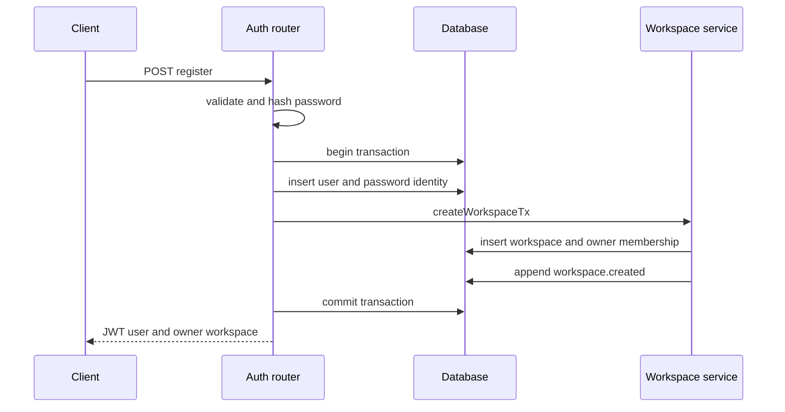

# Platform tenancy and RBAC

The optional platform adds users, JWT authentication, workspaces, memberships, projects, environments, encrypted BYO providers, and accounted AI tasks to the legacy server. `apps/server/src/index.ts` enables it only when `DATABASE_URL`, `JWT_SECRET`, and `MASTER_ENCRYPTION_KEY` are all non-empty. The complete route contracts are in [API reference](api-reference.md), persistence is in [Data model](data-model.md), and provider administration is in [Provider security](provider-security.md).

## Authentication lifecycle

`registerUser` in `apps/server/src/modules/auth/service.ts` normalizes email to lowercase, rejects an existing email with `409 email_taken`, hashes the password with the password helper, and chooses the trimmed display name or the email local part. One DB transaction inserts:

1. `users`;
2. a password `external_identities` row containing the bcrypt hash;
3. a personal workspace named `<displayName>'s Workspace`;
4. an active owner membership;
5. the `workspace.created` audit event through `createWorkspaceTx`.

The route signs `{sub:user.id,email:user.email}` through `signToken` and returns the JWT in JSON. Login deliberately uses one `401 invalid_credentials` response for unknown/disabled users, missing password identities, and wrong passwords, then updates `lastLoginAt`. There is no cookie session, refresh token, logout/revocation list, email verification flow, password reset, MFA, OAuth route, login audit, or account-management API even though `external_identities` anticipates future providers.



*Registration is the strongest atomic lifecycle in the platform: identity, tenant, membership, and audit commit together.*

## Authentication and membership middleware

`authMiddleware(jwtSecret)` accepts only a Bearer header, verifies the JWT, and populates `req.user`. It does not reload user status for each request; `/api/auth/me` loads the user but most protected routes trust the valid token subject. Disabling a user in the DB therefore does not itself invalidate an already-issued JWT.

`requireMember(db, ...allowedRoles)` loads membership by `workspaceId` and user ID:

- absent or `disabled` membership returns 404 to conceal tenant existence;
- `invited` returns 403 and requires acceptance;
- an active member outside the allowed role set returns 403;
- success populates `req.membership`.

This middleware is the route-level tenant gate, not database row-level security. Services must still constrain resources by workspace. `getProjectForWorkspace` and `getProviderConfig` do; any new service should follow those exact patterns.

One edge is `getWorkspaceForUser`: after `requireMember` it returns a membership role but does not itself reject invited/disabled status. Current route ordering makes it safe. Direct future callers must not assume the service enforces active status.

## Exact RBAC matrix

Roles are ordered for human interpretation in `WORKSPACE_ROLES`, but code does not compare ordinal rank. Every capability is an explicit allowlist.

| Capability | owner | admin | qa_lead | tester | viewer |
|---|:---:|:---:|:---:|:---:|:---:|
| Read workspace/project/environment | Yes | Yes | Yes | Yes | Yes |
| List provider metadata | Yes | Yes | Yes | Yes | Yes |
| Invite an existing user | Yes | Yes | No | No | No |
| Create/update/rotate/validate/default provider | Yes | Yes | No | No | No |
| Create/update project or create environment | Yes | Yes | Yes | No | No |
| Run gateway AI tasks or Auto step | Yes | Yes | Yes | Yes | No |
| Create a new workspace owned by self | Yes | Yes | Yes | Yes | Yes |
| Accept/decline own pending invite | Own invite | Own invite | Own invite | Own invite | Own invite |

The constants are `PROVIDER_ADMIN_ROLES`, `PROJECT_ADMIN_ROLES`, and `AI_TASK_ROLES` in `apps/server/src/modules/rbac.ts`. There is no role-mutation endpoint, ownership transfer, member listing/removal, or special prohibition against inviting another `owner`—the invite schema permits every role.

## Workspace and invitation lifecycle

`createWorkspace` transactionally creates a slugged workspace and active owner membership. `slugify` lowercases, replaces non-alphanumeric runs with hyphens, trims, caps the base at 40 characters, and appends six characters drawn from a generated ID; the slug has no DB uniqueness constraint, though the random suffix reduces collisions.

Invitation supports existing users only. Owner/admin lookup the normalized email, reject absent users and existing memberships, insert an `invited` membership, then append `member.invited`. Acceptance updates that row to active and appends `member.accepted`. Decline deletes it and appends `member.declined`, allowing a clean re-invite.

Except workspace creation/registration, mutation and audit writes are generally not grouped in a transaction. A failure between membership insertion/update/deletion and `writeAudit` can leave state without its corresponding event. The schema’s unique `(workspace_id,user_id)` index is the final duplicate guard, but a concurrent invite could surface as a generic DB/500 instead of the route’s intended 409.

## Projects

A project is tenant-owned and has a user-facing key. `createProject` trims and uppercases the key, performs a friendly duplicate query, and relies additionally on `uniq_project_workspace_key`. `defaultLlmProviderConfigId`, when supplied, must identify a provider in the same workspace. Project creation writes `project.created` with key/name metadata.

`updateProject` allows only name, description, default environment, default provider, and redaction policy pointer:

- `defaultEnvironmentId` must identify an environment under this exact project;
- a non-null default provider must belong to the workspace;
- `defaultLlmProviderConfigId:null` and `redactionPolicyId:null` clear those soft pointers;
- `defaultEnvironmentId` cannot be cleared through the current schema because it is a non-nullable string if present;
- `redactionPolicyId` is stored but there is no redaction-policy table or route.

An empty patch is valid, still updates `updatedAt`, and writes `project.updated` with an empty field list. There are no project/environment delete routes, no environment update route, and no endpoint to change a project key.

## Environment profiles and policy flags

`createEnvironment` first confirms the project belongs to the workspace, then merges request overrides over `flagsForEnv(name)` from `env-defaults.ts`. Defaults are:

| Environment | Observe | Generate | Execute | Auto submit | Confirm submit | Confirm attachment |
|---|:---:|:---:|:---:|:---:|:---:|:---:|
| `local` | Yes | Yes | Yes | Yes | No | No |
| `dev` | Yes | Yes | Yes | Yes | No | Yes |
| `staging` | Yes | Yes | Yes | Yes | Yes | Yes |
| `uat` | Yes | Yes | No | No | Yes | Yes |
| `production` | Yes | Yes | No | No | Yes | Yes |
| `custom` | Yes | Yes | No | No | Yes | Yes |

These are persisted policy declarations, not enforced gates in the current server AI/Auto route handlers. A caller can pass `environmentId` into a task, but `runAiTask` records it without loading its flags or confirming it belongs to the project/workspace. The extension has separate Auto safety logic, but storage here should not be described as server authorization.

There is also no uniqueness constraint on environment name or `baseUrl`, so a project may hold multiple production/custom entries or duplicate URLs.

## URL-to-context resolution

`resolveUrlToEnvironment` loads all workspace environments with non-null `baseUrl`, parses the tab URL and each base URL, and considers an entry a match when either:

- `baseUrl.origin === target.origin`, or
- `target.href.startsWith(baseUrl)`.

The longest base URL string wins. No match returns null with HTTP 200. This has important semantics: origin equality alone means a base URL such as `https://example.test/admin` also matches `https://example.test/unrelated`, even though the path is not a prefix. Conversely, raw string prefix can match path boundaries loosely. There are no wildcard/regex rules, normalized trailing-slash semantics, or ambiguity error.

The extension’s backend adapter calls this endpoint to derive `currentProjectId` and `currentEnvironmentId`. Those optional context values then influence provider precedence and persisted task metadata. They are hints, not security credentials; server services must continue to tenant-check IDs.

## Provider precedence

`resolveProviderConfig(db, workspaceId, projectId?)` checks a tenant-constrained project’s default provider, then the workspace default. Missing/disabled candidates are skipped. Session/user tiers and the config’s own `scope` value are not used. A caller-supplied unknown or foreign project ID does not return a project error; it simply contributes no project candidate and may use workspace default.

See [AI generation](ai-generation.md) for task lifecycle and [Provider security](provider-security.md) for vault/SSRF details.

## Persistence and audit inventory

Platform actions append these events:

- `workspace.created` during registration and explicit workspace creation;
- `member.invited`, `member.accepted`, `member.declined`;
- `project.created`, `project.updated`, `environment.created`;
- provider/secret/default events described in [Provider security](provider-security.md);
- `ai_task.started`, `ai_task.completed`, and `ai_task.failed` for `runAiTask` tasks.

Login, `/me`, reads, URL resolution, and Auto step do not write audit events. Audit metadata is application-disciplined rather than schema-redacted: `writeAudit` warns callers never to include secret values.

## Limitations and extension seams

- No DB row-level security or repository abstraction enforces tenancy universally; correctness rests on middleware and workspace predicates.
- JWT verification does not re-check user status and there is no revocation.
- Workspace list includes invited statuses, while workspace detail requires active membership.
- Existing-user-only invitations have no email/token workflow or expiry.
- No APIs manage roles, members, users, workspace metadata, environments after creation, or deletion.
- Environment controls and redaction policy pointers are currently inert in server execution.

When adding a workspace resource, include `workspaceId` as a persisted owner, put `requireMember` at the route, query by both resource ID and workspace ID, return 404 for cross-tenant IDs, declare a role constant rather than infer rank, and test every allowed/denied role plus disabled/invited/non-member states. If adding role changes, explicitly protect last-owner and ownership-transfer invariants; none exist today.

## Focused tests and commands

```bash
pnpm --filter @qa-copilot/server exec vitest run src/modules/auth/auth.test.ts
pnpm --filter @qa-copilot/server exec vitest run src/modules/workspaces/workspaces.test.ts
pnpm --filter @qa-copilot/server exec vitest run src/modules/projects/projects.test.ts
pnpm --filter @qa-copilot/server exec vitest run src/modules/ai-tasks/gateway-tasks.test.ts
pnpm --filter @qa-copilot/extension exec vitest run src/shared/context.test.ts src/sidepanel/backend.test.ts
pnpm --filter @qa-copilot/server typecheck
```