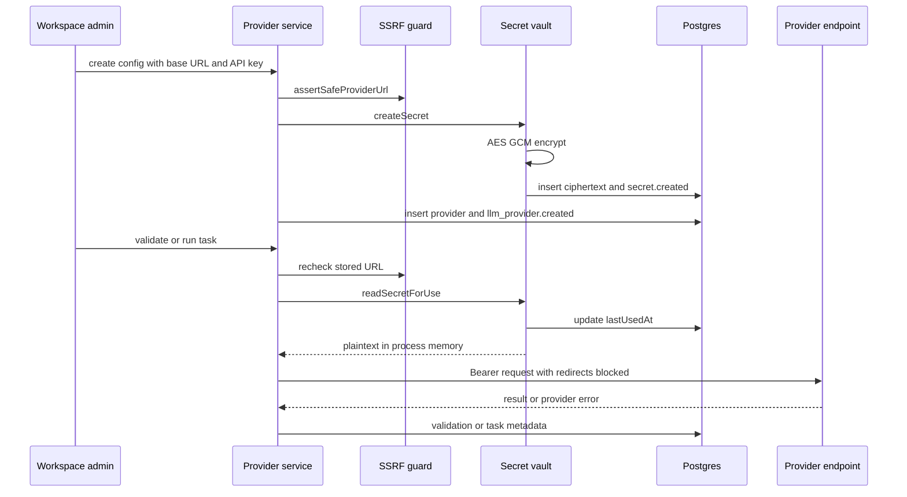

# BYO provider and secret security

Workspace BYO LLM support separates non-secret connection metadata in `llm_provider_configs` from API-key ciphertext in `secrets`. Only owners/admins mutate provider configuration; every active workspace role may list the public projection. Generation resolves a provider server-side, revalidates its URL, decrypts the key only for the outbound request, and never returns the key. HTTP contracts are in [API reference](api-reference.md), task behavior in [AI generation](ai-generation.md), and table constraints in [Data model](data-model.md).

## Public and secret surfaces

`toPublicConfig` returns exactly:

- `id`, `scope`, `providerType`, `displayName`, `baseUrl`, `modelName`;
- `enabled`, `maxOutputTokens`, `temperature`, `timeoutSeconds`;
- `validationStatus`, `lastValidatedAt`, `isWorkspaceDefault`.

It omits `workspaceId`, `ownerUserId`, `secretId`, creator IDs, `validationError`, and all secret values. Tests create a provider and assert neither the response nor the persisted ciphertext contains the submitted API key. Listing is safe for testers/viewers by this projection. The PATCH response computes the projection with a null default ID, so its `isWorkspaceDefault` field is false even if the config remains the default; a subsequent list gives the authoritative flag.

The provider API accepts only `providerType:"openai_compatible"`. `scope` accepts workspace/project/user but does not alter resolution. Project association is instead represented by `projects.defaultLlmProviderConfigId`; no user/session provider tier exists.

## Encryption format and key requirements

`apps/server/src/modules/secrets/encryption.ts` uses Node crypto AES-256-GCM:

- master key: `MASTER_ENCRYPTION_KEY`, decoded from base64 to exactly 32 bytes;
- random IV: 12 bytes for every encryption;
- authentication tag: 16 bytes;
- persisted `encryptedValue`: base64 of `IV | authTag | ciphertext`;
- persisted `encryptionKeyVersion`: `CURRENT_KEY_VERSION`, currently 1.

GCM provides confidentiality and tamper detection. Tests verify round-trip, tamper failure, wrong-key failure, and invalid key length. No associated authenticated data binds ciphertext cryptographically to workspace/secret IDs. Key version is stored but decryption does not branch on it, and there is no bulk master-key rotation/re-encryption workflow. Losing/changing the master key makes existing secrets unreadable.

`createSecret` encrypts before insert and audits only metadata. `readSecretForUse` updates `lastUsedAt`, decrypts, and returns plaintext to server-internal code. `rotateSecret` encrypts a replacement into the same row, sets `rotatedAt`, and audits without the value. There is no public secret CRUD router.

## Create, validate, use, and rotate sequence



*The key is plaintext only in request parsing, encryption/decryption memory, and the outbound Authorization header.*

## Provider lifecycle

### Creation

`createProviderConfig` first applies SSRF policy, then calls `createSecret` with type `llm_api_key`, then inserts metadata and writes `llm_provider.created`. Defaults are max output 2,048, temperature 0.2, timeout 60 seconds, enabled true, validation unknown. Creation does not test connectivity and does not automatically set the workspace default.

The operation is not transactionally atomic. A failure after secret creation can leave an orphan secret and its audit. Conversely, audit failure can make the API fail after state mutation. There is no cleanup job.

### Updates

`updateProviderConfig` tenant-scopes the config, rechecks a changed base URL, updates allowed fields, and writes `llm_provider.updated` with field names. It does not allow changing scope, provider type, or API key. It also does not reset `validationStatus`, `lastValidatedAt`, or `validationError` after base URL/model changes, so “valid” can become stale until explicit validation.

`temperature` is persisted and exposed but the gateway OpenAI-compatible request body does not send it. `maxOutputTokens` is effective only for tasks without fixed/caller budget; analysis/test case/enrichment and Auto can override or floor it. `timeoutSeconds` is effective for normal gateway tasks and validation, while Auto uses its fixed 60-second timeout.

### Rotation

`rotateProviderSecret` first tenant-scopes the provider, then replaces the referenced secret value. It writes `secret.rotated`, not `llm_provider.updated`, and does not reset provider validation status. There is no overlap/grace period, version history, rollback, or validation in the same transaction.

### Validation

`validateProviderConfig`:

1. tenant-scopes config;
2. applies SSRF policy again;
3. reads/decrypts the secret, updating `lastUsedAt`;
4. sends a 32-token prompt to `${baseUrl}/chat/completions` with the configured model, timeout, required key, and `redirect:"error"`;
5. records `valid` or `invalid`, timestamp, safe validation error, and `llm_provider.validated` audit.

Any provider-call error becomes HTTP 200 with a generic invalid result. Stored `validationError` is only `Provider error (status N)` or `Provider unreachable`; raw response is not returned. This validates one chat-completion call, not general model quality, tool support, context window, or Auto compatibility.

### Resolution and use

`resolveProviderConfig` checks a tenant-constrained project default before workspace default. Missing/disabled project config falls back; missing/disabled workspace config produces `409 no_provider`. Validation status is not required: unknown or invalid configurations can still be selected if enabled. Setting a default also does not require enabled/valid.

Before every task/Auto call, code re-runs `assertSafeProviderUrl` against the stored URL, then decrypts. OpenAI-compatible transport sends an Authorization bearer header and sets `redirect:"error"` for BYO paths. API keys and headers remain below `LoggingProvider`, preventing that decorator from logging them.

## SSRF policy

`assertSafeProviderUrl(rawUrl, {allowPrivate})` always rejects:

- malformed URLs;
- schemes other than HTTP/HTTPS;
- embedded username/password credentials.

With hosted posture (`ALLOW_PRIVATE_LLM_HOSTS` not exactly `true`):

- HTTPS is required;
- IP literals are classified directly;
- hostnames are resolved with `dns.promises.lookup(..., {all:true})`;
- no addresses or **any** private/reserved result rejects the URL.

The IPv4 blocked ranges cover unspecified, RFC1918, carrier-grade NAT, loopback, link-local/metadata, documentation, benchmarking, multicast, and reserved space. IPv6 blocks unspecified/loopback, link-local, unique-local, and IPv4-mapped blocked addresses. Tests cover cloud metadata, private ranges, localhost, credentialed URLs, malformed URLs, public IPs, and IPv6 cases.

With local posture (`ALLOW_PRIVATE_LLM_HOSTS=true`), HTTP and private/reserved destinations are allowed by design for Ollama, LM Studio, vLLM, and internal gateways. Scheme and embedded-credential checks remain. This flag is deployment-wide, not per workspace/provider.

Redirects are rejected in validation and task transport, closing a straightforward public-to-private redirect bypass. The process-configured legacy OpenAI-compatible path uses default fetch redirect behavior because its endpoint is deployer-configured rather than workspace-supplied.

## SSRF and tenancy limitations

- DNS is checked before the request, but `fetch` performs its own later resolution. There is no address pinning/custom lookup, so DNS rebinding or resolution changes remain a time-of-check/time-of-use risk.
- When private hosts are enabled, all workspace admins allowed to configure providers can direct the server to arbitrary HTTP(S) internal services. The protocol still sends a chat-completions JSON request and bearer key, but this is a broad trust grant.
- No egress proxy, port allowlist, hostname allowlist, certificate pinning, or response-size limit is implemented.
- The service checks provider workspace before rotation/validation. `readSecretForUse` itself accepts only a secret ID and does not tenant-scope the lookup; safety relies on obtaining that ID from a correctly scoped config. The schema likewise does not guarantee config and secret workspace equality.
- Provider creation’s secret/config writes are not one transaction.

## Logging and failure exposure

Provider configuration audits contain display/model names or changed field names, never API keys. Vault audit metadata contains secret name/type but not value. Task/audit storage holds model/provider IDs and usage, not prompt or response bodies.

`LoggingProvider` cannot see headers or API keys, but at debug it logs redacted prompt and full model response. At info, failures include `err.message`. `openAI-compatible.ts` constructs errors with up to 300 characters of raw provider error body; the gateway client response sanitizes this, but server info logs may contain that snippet. Provider validation’s client and stored error are safe, yet the raw error may still be observable where lower transport logging is added or exceptions are logged. Operational log access should therefore be restricted.

## Security invariants

1. Never add `secretId`, `encryptedValue`, `validationError`, or API key to `PublicProviderConfig`.
2. Re-run `assertSafeProviderUrl` at config write **and** immediately before every outbound use; stored validation alone is insufficient.
3. Use `redirect:"error"` for all user-controlled endpoints.
4. Keep plaintext out of logs, audit metadata, task records, and exceptions returned to clients.
5. Tenant-scope the provider before dereferencing its secret.
6. Do not interpret `validationStatus` as an authorization decision; it is connectivity metadata.
7. Preserve encrypted-at-rest tests and a negative assertion that serialized API responses/events do not contain submitted keys.

## Extension seams

For a new provider metadata field, update `createLlmProviderSchema`/`updateLlmProviderSchema`, Drizzle schema and migration, `PublicProviderConfig` only if non-sensitive, service create/update, actual transport use, and tests proving its effect. Do not add inert knobs without documenting them.

For a new provider protocol, do not overload `openai_compatible`. Add a provider type discriminator, protocol-specific transport, capability/validation path, resolver factory, safe error mapping, and SSRF/redirect behavior. Keep the secret vault protocol-agnostic.

For master-key rotation, implement version-aware decrypt, a transactional or restartable re-encryption process, dual-key deployment semantics, audit without values, and recovery testing before bumping `CURRENT_KEY_VERSION`.

## Focused tests and commands

```bash
pnpm --filter @qa-copilot/server exec vitest run src/modules/secrets/secrets.test.ts
pnpm --filter @qa-copilot/server exec vitest run src/modules/providers/providers.test.ts
pnpm --filter @qa-copilot/server exec vitest run src/modules/providers/ssrf.test.ts
pnpm --filter @qa-copilot/server exec vitest run src/modules/ai-tasks/ai-tasks.test.ts src/modules/ai-tasks/gateway-tasks.test.ts
pnpm --filter @qa-copilot/server exec vitest run src/llm/logging-provider.test.ts src/llm/local.test.ts src/llm/openrouter.test.ts
pnpm --filter @qa-copilot/server typecheck
```