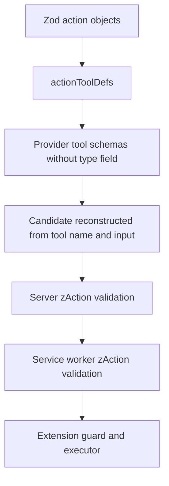

# Auto Test Mode public contracts

Auto Test Mode has a deliberately separate public entry point: `@qa-copilot/shared/auto` maps to `packages/shared/src/auto/index.ts`, while the root barrel does not re-export these symbols. This keeps the Zod-backed agent protocol out of ordinary capture/export consumers and lets the extension and server import one runtime contract without introducing browser, Express, or React dependencies.

The barrel exports five modules: `observation.ts`, `action.ts`, `step.ts`, `run.ts`, and `policy.ts`. The server uses their runtime schemas for request and provider-output validation; extension code generally imports their types, except where the service worker needs `zAction`, `RUN_DEFAULTS`, and the destructive-pattern defaults.

## Observation contract

`Observation` is the current, already-redacted snapshot sent to the decider. It contains:

- `url`, `title`, and `timestamp`;
- `pageInfo`: viewport/page dimensions, pixels above and below, and a `0..100` scroll percentage;
- `activeDialog`, or `null`;
- `serialized`, the only rendered page representation intended for the model;
- `elementCount`;
- up to ten console errors and ten failed/network-error requests as `{method, url, status}`;
- `navigationOccurred`; and
- monotonically increasing `epoch`, used to reject execution against stale element maps.

The extension also returns `ObservedElement[]` to its service worker for guarding, but this array is not part of `StepRequest`. Each item has a numeric `index`, tag, optional role, redacted text, allowlisted/redacted attributes, state flags, and `isSecret`. Valid states are `disabled`, `checked`, `expanded`, `collapsed`, `invalid`, `required`, `readonly`, and `new`. The index is the model's only target handle; live `Element` references remain inside the content-script `PageDriver`.

## Exact action vocabulary

`Action` is a Zod discriminated union. Exactly one of these ten actions may be returned per decision:

| Action | Required payload and limits | Meaning |
| --- | --- | --- |
| `click` | `index`: integer ≥ 0; `intent`: ≤ 200 chars | Click an indexed element. |
| `fill` | `index`; `value`: ≤ 2,000 chars; `intent`: ≤ 200 chars | Replace an input value; value may contain `{{PLACEHOLDER}}`. |
| `select` | `index`; visible `option`: ≤ 200 chars; `intent`: ≤ 200 chars | Select an option by visible text. |
| `press` | `key`: `Enter`, `Escape`, `Tab`, `ArrowDown`, or `ArrowUp`; `intent`: ≤ 200 chars | Dispatch the allowed key to the focused element. |
| `scroll` | `direction`: `down` or `up`; optional `amount`: `page` or `half` | Scroll vertically; omitted `amount` defaults to `page`. |
| `navigate` | absolute URL; `intent`: ≤ 200 chars | Request navigation; extension guards enforce the run origin allowlist. |
| `wait` | `seconds`: 1 through 8; `reason`: ≤ 200 chars | Wait and then settle/observe again. |
| `assert` | `expectation`: ≤ 300; `holds`: boolean; `evidence`: ≤ 300 | Record a model verdict without touching the page. |
| `report_defect` | severity `low`, `medium`, or `high`; `summary`, `expected`, `actual`: each ≤ 300 | Record a defect without touching the page. |
| `finish` | outcome `pass`, `fail`, or `blocked`; `reason`: ≤ 500 | Terminate the run normally. |

There is intentionally no JavaScript, selector, coordinate, hover, upload, or arbitrary-command action. `actionToolDefs()` derives one provider tool per action object. The tool name carries the discriminator, so `type` is omitted from its `inputSchema`; all other required fields, enum values, defaults, and numeric/string bounds are derived from Zod. `fieldToJsonSchema()` only understands the constructs currently used by these schemas—number/integer bounds, string bounds/URL, enum, boolean, default, and optional—so adding a different Zod construct requires extending this converter.



This shows the same action contract constraining provider tools, both validation boundaries, and execution.

## Step protocol

`StepRequest` is a complete stateless decision input:

```ts
interface StepRequest {
  goal: string;
  mode: 'observe_only' | 'confirm' | 'autonomous';
  history: HistoryItem[];
  observation: Observation;
  stepsRemaining: number;
  placeholders: string[];
  language?: string;
  correction?: string;
}
```

The goal is fixed at run start. `placeholders` contains names only, never credential values. `correction` is capped at 500 characters by `zStepRequest`. A successful `StepResponse` contains one schema-valid `action` and an optional debug-only `modelRaw` string.

A `HistoryEntry` records `step`, `action`, result, optional detail, `urlAfter`, and count of new errors. Results are exactly `ok`, `failed`, `refused`, `confirmed_by_user`, and `rejected_by_user`. History is intentionally more tolerant than a response: `zHistoryEntry.action` accepts either `zAction` or any passthrough object with a string `type`. That allows an invalid model candidate to remain visible as failed history for a correction turn; an action-less object is still rejected.

Older history may be represented as `HistorySummary {kind: 'summary', fromStep, toStep, line}`. The service worker—not the model—creates these summaries. At 20 entries or fewer, all entries remain verbatim. Above 20, the newest 12 remain verbatim and older entries become deterministic chunks of five, each capped to 240 characters.

The server extends `zStepRequest` only at its HTTP edge with optional `projectId` and `environmentId`; these select a provider context and are removed before prompt construction. The decision service itself remains stateless.

## Run configuration, state, trace, and result

`RunConfig` carries the fixed goal, mode, budgets, origin allowlist, and optional overrides:

- `maxSteps`: default 25 and clamped to a hard maximum of 60;
- `maxWallClockMs`: default ten minutes;
- `maxLlmCalls`: normally `maxSteps + 10` for retries/corrections;
- `originAllowlist`: first entry is the start origin by convention;
- optional serializable `destructivePatterns` sources;
- optional `deciderBaseUrl`, `debugHighlights`, and opaque `providerRef`.

`providerRef` is present because the shared package has no provider configuration type; current provider resolution is server-side. The controller does not currently use this field.

Public `RunStatus` values are `idle`, `running`, `awaiting_confirmation`, `paused`, `finished`, `stopped_by_user`, `stopped_by_budget`, and `error`. Internal phases are extension-owned rather than part of this shared union.

Each `TraceStep` includes the action/result, URLs before and after, timestamps, post-step console/network evidence, and optional intent, detail, durable selector, target text, and destructive tag. `RunResult` retains the trace, accepted defect/assertion actions with their step numbers, optional normal outcome/reason, metrics, and recorder `sessionId`. Metrics count steps, LLM calls, correction turns, refusals, confirmations, and wall-clock duration. Partial budget/error/user-stop results retain the evidence collected so far.

`DEFAULT_DESTRUCTIVE_PATTERNS` is also public. It recognizes words and phrases around deletion/removal, archive/deactivation, purchasing/payment, publishing/sending, cancellation/unsubscribe, reset/revoke, transfer/withdrawal, and sign-out/log-out. These regular expressions are policy inputs; enforcement and mode-dependent outcomes belong to the extension guard, described in [Auto safety and extension](../auto/safety-and-extension.md).

## Consumers and ownership

| Consumer | Shared surface used | Responsibility |
| --- | --- | --- |
| Content script | observation/action types | Build redacted observations and execute one indexed action. |
| Service worker | all run/step/action types plus `zAction`, defaults, policy patterns | Own lifecycle, revalidate decisions, guard, budget, persist, and trace. |
| Side panel | run/config/result types and defaults | Build configuration and render status/results. |
| Server HTTP schema | `zStepRequest` | Reject malformed decision requests. |
| Server provider adapter | `actionToolDefs()` | Expose the exact action set as tools. |
| Server validator | `zAction` | Reject invalid provider candidates with 422. |
| E2E stub decider | `zStepRequest`, `zAction` | Keep hermetic tests on the production protocol. |

See [Auto architecture and lifecycle](../auto/architecture-and-lifecycle.md) for the runtime ordering around these contracts.

## Complete change surface

When changing an existing action or adding an action:

1. Edit its object schema, add it to `zAction`, and add its description to `ACTION_SCHEMAS` in `packages/shared/src/auto/action.ts`.
2. Extend `fieldToJsonSchema()` if the schema introduces a new Zod construct.
3. Update `action.test.ts` and `step.test.ts` so validation and generated tool fields stay aligned.
4. Update extension execution in `content/auto/executor.ts`, including whether it is trace-only, element-targeted, mirrored to the recorder, and subject to stale/visibility/hit-test gates.
5. Update service-worker policy and bookkeeping switches in `background/auto/guard.ts`, `history.ts`, and `run-controller.ts` (`actionHash`, final/result collection, and any special lifecycle behavior).
6. Update server prompt rendering in `modules/auto/system-prompt.md` and `prompt.ts`; tool definitions themselves remain generated.
7. Update side-panel summary/icon/card behavior in `sidepanel/auto/run-view-logic.ts` and any result handoff.
8. Update the hermetic `e2e/stub-decider.ts` and action-specific unit/E2E cases. If the action changes recorder output, also verify deterministic Playwright generation.

For observation changes, edit both the TypeScript interface and `zObservation`, then change `observation-builder.ts`, prompt formatting if necessary, and shared/server/extension tests. For run or history changes, update persistence compatibility in `messages.ts` and `RunController.restore()`; optional fields are used for data written by older extension builds.

## Focused verification

From the repository root:

```bash
pnpm --filter @qa-copilot/shared exec vitest run src/auto/action.test.ts src/auto/step.test.ts
pnpm --filter @qa-copilot/shared typecheck
pnpm --filter @qa-copilot/extension exec vitest run src/background/auto/guard.test.ts src/content/auto/executor.test.ts
pnpm --filter @qa-copilot/server exec vitest run src/modules/auto/auto-step.test.ts
```

Broaden to `pnpm --filter @qa-copilot/shared test`, then extension/server tests and typechecks whenever a public shape changes.

## Evidence-backed limitations

- Runtime schemas do not impose caps on observation text, arrays, history length, `stepsRemaining`, or most numeric observation fields; builders and HTTP body limits provide the practical bounds.
- `scrollPositionPct` is documented as `0..100`, but `zObservation` validates only that it is a number.
- `RunConfig` is TypeScript-only: configuration clamping occurs in the extension controller rather than through a shared Zod schema.
- `DestructivePolicy.urlPatterns` is declared, but v1 enforcement uses `RunConfig.destructivePatterns` for navigate URL text and ships no separate URL-pattern defaults.
- `providerRef` and `debugHighlights` are in the contract, but normal side-panel config does not set them; `providerRef` is not consumed by the controller.
- History deliberately accepts an invalid `{type: string}` candidate, while live `StepResponse` does not. Treating the two schemas as interchangeable would weaken the execution boundary.
