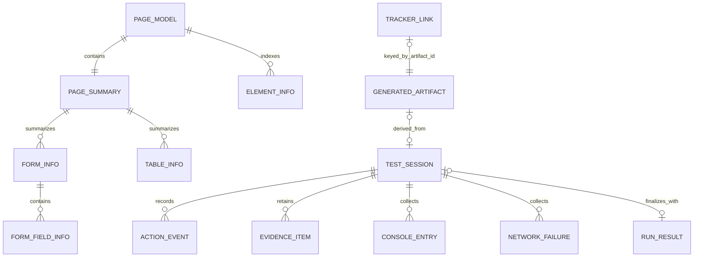
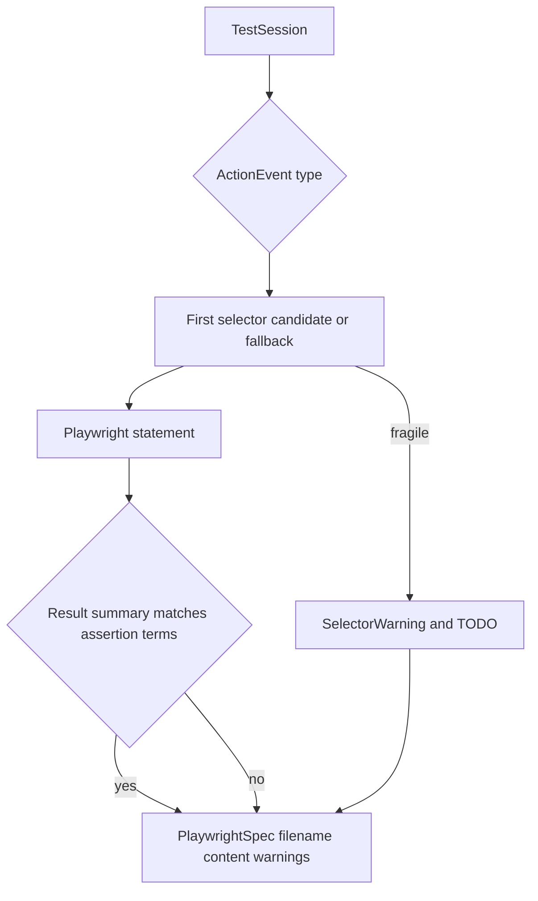

# Core domain contracts and deterministic helpers

`@qa-copilot/shared` is the cross-application contract package. Its root entry, `packages/shared/src/index.ts`, exports `types.ts`, `selector.ts`, `redaction.ts`, `playwright.ts`, and `sessionMarkdown.ts`. These modules have no browser API or server framework dependency. Auto Test Mode is intentionally excluded from this barrel and is exported separately as `@qa-copilot/shared/auto` because `packages/shared/src/auto/action.ts` imports Zod at runtime; adding it to the root barrel can change and break the MV3 content-script chunk graph.

## Domain relationships

*The diagram shows only relationships encoded by interfaces and extension storage behavior in the inspected source.*

## Page and session contracts

`packages/shared/src/types.ts` defines the following core layers:

- `PageSummary` is compact page context: URL, route, title, headings, forms, buttons, links, tables, modals, validation messages, console errors, and network failures.
- `ElementInfo` is a snapshot-local interactable with synthetic `id`, semantic type/state, optional accessible text/name/role, ordered `selectorCandidates`, and a `sensitive` marker.
- `PageModel` combines one summary, the element list, and ISO `capturedAt`. An element ID is stable only within the snapshot; it is not a database identity.
- `TestSession` owns lifecycle (`idle`, `recording`, `stopped`), URLs/environment/browser metadata, ordered `ActionEvent` values, `EvidenceItem` values, console/network evidence, and optional `autoRunResult`.
- `ActionEvent` covers manual replay-oriented actions: `click`, `input`, `select`, `checkbox`, `radio`, `navigation`, `submit`, and `screenshot`. Auto-executed page actions are projected into this same contract with `source: 'auto'` and optional model `intent`.
- `EvidenceItem` may hold an inline screenshot `dataUrl`; it is not evidence that a file exists unless `path` is also supplied by an exporter.

Sensitive input has a strict representation invariant: its raw value is absent, while `valueType` may be `sensitive`. Consumers must not infer that a missing `value` means an empty field. `buildPlaywrightSpec()` consequently emits an empty fill plus a review TODO rather than recreating a secret.

`ConsoleEntry` intentionally carries only `error` or `warning`. `NetworkFailure.urlPath` is a path, not a complete URL: query strings are removed by `redactUrlToPath()` before storage. Both browser arrays are capped by the background worker at 100 entries; that cap belongs to `apps/extension/src/background/index.ts`, not the shared type.

Generated contracts (`GeneratedArtifact`, `TestCase`, and `BugReport`) describe output and review state but do not imply persistence. `TrackerLink` is persisted separately by artifact ID because generated artifacts are not generally stored. `JiraConfig` contains an API token and therefore must not be projected to UI or sent to the server; `apps/extension/src/integrations/jira/messages.ts` uses `JiraConfigProjection` instead.

## Selector ladder

`rankSelectors(input: SelectorInput)` returns candidates in this exact order:

1. `data-testid` via `getByTestId`
2. `data-test` via an attribute locator
3. role plus accessible name via `getByRole`
4. ARIA label via `getByLabel`
5. associated label via `getByLabel`
6. visible text via `getByText`
7. computed CSS path
8. XPath

Whitespace-only inputs are skipped, and a label equal to the ARIA label is not duplicated. `selectorStrings()` projects only locator strings; `bestStrategy()` returns the first strategy. `escapeForSingleQuotes()` escapes backslashes, quotes, LF, and CR so generated single-quoted TypeScript remains parseable.

`isFragileLocator()` treats CSS and XPath locator fragments as fragile, while `getBy...` and the package's `data-test` locator are stable. This is a syntactic heuristic, not a uniqueness check: visible text is ranked as non-fragile by `rankSelectors`, but `buildPlaywrightSpec()` flags its own no-candidate text fallback as fragile. Runtime DOM extraction is responsible for supplying meaningful candidate data.

## Redaction rules and limitations

`packages/shared/src/redaction.ts` provides two distinct layers:

- `isSensitiveField(meta)` checks password type, sensitive autocomplete values, and case-insensitive name/id/label/placeholder tokens such as password, token, OTP, card, CVV, PIN, API key, seed, and mnemonic.
- `redactText(text)` masks serialized Basic/Bearer authorization values, selected credential-bearing keys, emails, card-like digit runs, JWTs, and opaque tokens of at least 32 supported characters.
- `redactUrlToPath(rawUrl)` parses against a placeholder base, drops origin and query, and redacts the pathname; malformed input falls back to splitting at `?`.
- `redactValue()` always returns the exported sentinel `REDACTED`, whose value is `[REDACTED]`.

These are deterministic pattern matchers, not a data-loss-prevention proof. Important boundaries:

- Ordinary email fields are not classified as secret fields; their values may be intentionally recorded as interaction data. Free-text redaction catches email-shaped strings when that text passes through `redactText()`.
- Short arbitrary secrets and secrets written as ordinary visible prose may survive because they match neither field metadata nor a text pattern.
- `buildSessionMarkdown()` assumes upstream capture honored sensitivity. It suppresses an event value only when `valueType === 'sensitive'`; it does not call `redactText()` over every field.
- Server prompt builders and Auto observation code add further redaction. Those layers complement, rather than replace, capture-time omission.

Treat failures in `packages/shared/src/redaction.test.ts` or `redaction-suite.test.ts` as release blocking.

## Deterministic Playwright generation

*The diagram summarizes `buildPlaywrightSpec()` in `packages/shared/src/playwright.ts`.*

`buildPlaywrightSpec(session)` is template-based and returns `PlaywrightSpec`:

- Filename and test title derive from `currentUrl`, then `baseUrl`, then `recorded flow`; the slug is lowercase, non-alphanumeric runs become hyphens, and it is capped at 60 characters.
- Initial navigation uses `baseUrl ?? currentUrl`; later navigation events with a value become `waitForURL`.
- Click and submit call `click`; input calls `fill`; native select calls `selectOption`; an `aria-option` select opens the trigger then clicks an option by visible name; checkbox/radio and screenshot map to their Playwright operations.
- Auto `intent` becomes a comment above the generated step.
- CSS, XPath, body, or no-candidate text fallback produces a TODO and `SelectorWarning`.
- A `resultSummary` containing `error`, `required`, `invalid`, `success`, `saved`, or `appeared` becomes a text visibility assertion.
- Output is always labeled `DRAFT`; optional server enrichment is best effort and falls back to this deterministic content on provider failure.

The generated import/header is parseable by construction for tested event values, but semantic correctness is not guaranteed. Review locator uniqueness, navigation assumptions, empty sensitive fills, inferred assertion text, screenshot paths, and application cleanup before committing a generated test.

## Markdown session export

`buildSessionMarkdown(session)` emits metadata, totals, ordered steps, optional result summaries, and non-empty console/network sections. `valueText` takes precedence over `value`; sensitive events render `(value hidden)`. Date formatting uses the local runtime locale and falls back to the raw input for invalid timestamps, so byte-for-byte output can vary by host locale even though section logic is deterministic.

## Public-boundary change rules

When adding or changing a root contract:

1. Update the owning interface/helper under `packages/shared/src`.
2. Preserve the root barrel boundary in `packages/shared/src/index.ts`; do not re-export Auto runtime schemas there.
3. Search both `apps/extension/src` and `apps/server/src` for consumers. Shared TypeScript types do not perform runtime validation by themselves.
4. Update focused tests: `selector.test.ts`, `redaction*.test.ts`, `playwright.test.ts`, or `sessionMarkdown.test.ts`.
5. Run `pnpm --filter @qa-copilot/shared test` and `pnpm --filter @qa-copilot/shared typecheck`; then typecheck affected applications.
6. If the change affects capture or generated replay, run a focused extension E2E such as `e2e/extension.spec.ts` or the relevant Auto milestone suite.

For the Zod-backed Auto action/step/run protocol, use `packages/shared/src/auto/index.ts` and its `action.test.ts` and `step.test.ts`; it is related to, but deliberately outside, this root contract surface.
