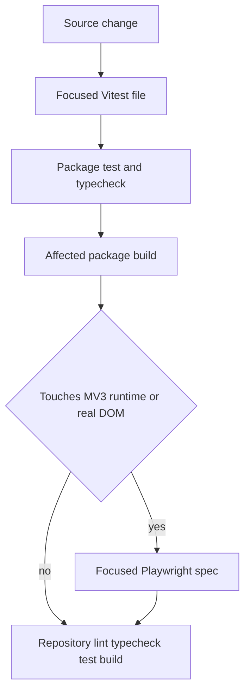

# Testing strategy and narrow validation

The repository uses Vitest for package-level tests and Playwright for real-browser extension behavior. Tests are organized by ownership rather than by a single global harness: pure shared tests need no browser, server integration tests inject providers and often use in-memory PGlite, extension unit tests use jsdom, and extension E2E loads the **built unpacked extension** in Chromium. Avoid relying on test counts; suites evolve faster than documentation.

## Validation layers



*The diagram shows the intended focused-to-broad validation path; broad checks do not replace real-browser coverage.*

## Shared package: pure contracts and transforms

Tests under `packages/shared/src` execute deterministic helpers directly:

| Suite | Evidence it owns |
| --- | --- |
| `selector.test.ts` | Exact ranking order, empty-input handling, quote/newline escaping, and CSS/XPath fragility classification. |
| `redaction.test.ts` | Sensitive field metadata, email/card/token/auth/config masking, and query removal from URLs. |
| `redaction-suite.test.ts` | A conformance battery of known sensitive and safe fields plus known leaky text. Every listed sensitive case must pass. |
| `playwright.test.ts` | Event-to-statement mappings, Auto intent comments, secret omission, fragile warnings, assertions, native/custom selects, and parse-safe multiline values. |
| `sessionMarkdown.test.ts` | Timeline, evidence sections, metadata omission, and sensitive display behavior. |
| `auto/action.test.ts` | Zod action vocabulary and provider tool-definition generation. |
| `auto/step.test.ts` | Step request/response schemas and protocol limits. |

Narrow commands:

```bash
pnpm --filter @qa-copilot/shared exec vitest run src/redaction.test.ts src/redaction-suite.test.ts
pnpm --filter @qa-copilot/shared exec vitest run src/playwright.test.ts
pnpm --filter @qa-copilot/shared test
pnpm --filter @qa-copilot/shared typecheck
```

Shared tests prove transformations, not capture-time DOM correctness or server authorization. A type-only interface also does not validate network input unless a consumer applies a schema.

## Extension unit tests: jsdom and isolated logic

`apps/extension/vite.config.ts` sets `test.environment: 'jsdom'` and includes `src/**/*.test.ts`. Representative ownership:

- `src/content/scanner.test.ts`, `element-extract.test.ts`, and `recorder.test.ts` cover page extraction, labels/widgets, event dedupe, and sensitive inputs in a simulated DOM.
- `src/background/auto/run-controller.test.ts`, `guard.test.ts`, `history.test.ts`, and `decide.test.ts` cover state transitions, budgets/retries, ordered safety checks, history compression, and decider errors with injected dependencies.
- `src/content/auto/executor.test.ts`, `redact-node.test.ts`, and `settle.test.ts` cover action execution, the Auto redaction seam, epoch/safety behavior, and settling.
- `src/shared/context.test.ts` owns `applyResolveMatch()`, including the invariant that manual context is never overwritten by auto resolution.
- `src/sidepanel/backend.test.ts` owns gateway selection and narrow fallback semantics. Auto side-panel logic and vault tests cover setup/result projections without needing Chrome.
- `src/integrations/jira/{adf,client,mapping,messages}.test.ts` cover ADF conversion, error/retry behavior, mapping, projections, and message handling.

Examples:

```bash
pnpm --filter @qa-copilot/extension exec vitest run src/background/auto/guard.test.ts
pnpm --filter @qa-copilot/extension exec vitest run src/content/recorder.test.ts src/content/element-extract.test.ts
pnpm --filter @qa-copilot/extension exec vitest run src/sidepanel/backend.test.ts
```

jsdom has no real extension service worker, optional-host permission prompt, browser layout, navigation teardown, or `captureVisibleTab`. Use it for pure decisions and DOM mechanics, not as proof that an unpacked MV3 build works.

## Server tests: injected providers and PGlite

`createApp(provider, logger, platform?)` makes HTTP tests deterministic. Legacy tests such as `apps/server/src/app.test.ts` pass a mock `LLMProvider`; no API key is required. Platform suites call `createTestDb()` from `apps/server/src/db/testing.ts`, which starts in-memory PGlite and applies every migration from `apps/server/drizzle` before returning the same Drizzle service API used by production.

Ownership includes:

- `config.test.ts`, `db/client.test.ts`, and `logging/logger.test.ts` for configuration, database construction, and logging behavior.
- `llm/*.test.ts` for Anthropic/local/OpenRouter transport, tools, and `LoggingProvider` behavior.
- `modules/auth`, `workspaces`, `projects`, `providers`, and `secrets` for transactions, membership/RBAC, tenant-scoped resources, encryption, rotation, validation, and SSRF policy.
- `modules/ai-tasks/ai-tasks.test.ts` and `gateway-tasks.test.ts` for provider resolution, redaction, task/usage/audit records, status/error behavior, and route result shapes.
- `modules/auto/auto-step.test.ts` for the workspace `/auto/step` contract, tool and JSON fallback paths, defensive action validation, prompt untrusted-data framing, auth/RBAC, and 502/504 classification.
- `modules/auto/auto-step-loop.test.ts` for repeated step behavior.

Narrow commands:

```bash
pnpm --filter @qa-copilot/server exec vitest run src/app.test.ts
pnpm --filter @qa-copilot/server exec vitest run src/modules/providers/ssrf.test.ts src/modules/secrets/secrets.test.ts
pnpm --filter @qa-copilot/server exec vitest run src/modules/auto/auto-step.test.ts
pnpm --filter @qa-copilot/server test
```

PGlite tests validate migrations and SQL behavior without external Postgres, but they do not prove deployment credentials, network connectivity, PostgreSQL operational settings, or DNS behavior over time. Provider fetches are mocked in normal suites; a green server test is not evidence that a real model/key works.

## Extension Playwright topology

`apps/extension/playwright.config.ts` runs serially with one worker and starts three servers:

- fixture SPA on `http://localhost:5555`
- Jira mock on `http://127.0.0.1:5556`
- deterministic Auto decider on `http://127.0.0.1:5557`

`test:e2e` first runs `build:harness`, but the tests also load `apps/extension/dist`. Build the extension before E2E so source and loaded output match:

```bash
pnpm --filter @qa-copilot/extension build
pnpm --filter @qa-copilot/extension exec playwright install chromium
pnpm --filter @qa-copilot/extension exec playwright test e2e/extension.spec.ts
```

Major specs and what they prove:

| Spec | Real-browser evidence |
| --- | --- |
| `e2e/extension.spec.ts` | Built content script scans into storage, secrets are absent, manual flow/widgets and SPA navigation are recorded, and manual project context survives navigation. |
| `e2e/vendor-smoke.spec.ts` | Vendored page-agent extraction against real layout, stable indices within a snapshot, blacklist behavior, React patching, secret metadata, and observation redaction. |
| `e2e/auto-m1.spec.ts` | `PageDriver` observe/execute, durable selector recording, manual/Auto event dedupe, secret omission, and stale epoch rejection. |
| `e2e/auto-m2.spec.ts` | Full worker loop with stub decider: happy path, credential vault isolation, hard-navigation re-handshake, one stale-epoch retry, budgets, pause/resume/stop, and deterministic Playwright handoff. |
| `e2e/auto-m4.spec.ts` | Destructive confirmation/rejection, observe-only refusal, defect persistence, and prompt-injection canary containment. |
| `e2e/auto-m5.spec.ts` | Real Auto tab setup/run/result UI, defect-to-generator handoff, metrics/timeline, and replay of a generated Playwright draft. |
| `e2e/jira-export.spec.ts` | Service-worker `JIRA_*` contract, token-free projection, Basic auth transport, create metadata, ADF issue creation, multipart attachments, and stored links against a mock Jira server. |

These launch a persistent Chromium context with `headless: false`; CI currently does not run them. Local environment/display constraints can therefore matter. `reuseExistingServer: true` is convenient but can accidentally reuse stale processes on ports 5555–5557; stop suspect processes when results disagree with source.

## Real-provider acceptance and model-quality evaluation

Two non-CI TypeScript harnesses exercise surfaces that deterministic unit and Playwright suites intentionally cannot prove:

- `e2e/acceptance/m3-observe-only.ts` runs the built extension through the real service-worker loop and authenticated `/auto/step` endpoint against a real OpenAI-compatible provider. It creates a temporary workspace/provider, performs repeated observe-only fixture runs, and accepts only when every run finishes or reaches a clean budget stop and correction turns are below 10% of LLM calls. `ACCEPT_*` variables select provider, fixture, run count, step budget, and timeout. It requires the fixture server, platform-enabled API, database, and extension build; it is not part of a package script or CI.
- `e2e/eval/run-eval.ts` runs autonomous exploration against `eval-buggy.html` and scores `report_defect` actions against the 11-bug keyword ledger in `e2e/eval/seeded-bugs.json`. It reads the exact UTF-8 bytes of `apps/server/src/modules/auto/system-prompt.md`, computes SHA-256, renders the digest in hexadecimal, and uses the first 12 hex characters as `promptVersion`. Each result is written to `eval/results/<promptVersion>/<modelSlug>-<timestamp>.json`, preserving model/provider/fixture metadata, aggregate scores, and per-run status, steps, LLM and correction counts, defects, matched bug IDs, and false defects. `EVAL_*` variables select provider and budgets; `EVAL_DECIDER_URL` switches to a no-provider stub smoke mode. A keyword hit is a regression signal, not semantic proof that a defect report is correct.

The eval harness gives each run `EVAL_RUN_TIMEOUT_MS` (default 20 minutes). Its controller wall-clock budget is `max(60 seconds, run timeout minus 5 minutes)`, leaving headroom for a worst-case in-flight decide retry and execute/settle so healthy slow work normally ends as `stopped_by_budget`. If the harness deadline wins, it records the last polled progress as `harness_error`. Every run then calls `ensureRunEnded()` in `finally`: request stop, poll every 500 ms for a terminal state for `EVAL_STOP_GRACE_MS` (default 30 seconds), force-reset a still-wedged controller, and close the page. Cleanup prevents the profile-wide one-active-run invariant from contaminating later scores.

Both harnesses load `apps/extension/dist` in headed persistent Chromium and create platform data when using a real provider. Build first, use disposable/local platform state, protect provider credentials, and do not interpret an unevaluated or harness-error run as model acceptance.

## CI and static security gate

`.github/workflows/ci.yml` runs on pushes and pull requests to `main` using Node 22 and the pinned pnpm version. It executes, in order:

1. a pre-install scan that rejects `eval(` or `new Function(` in `apps/extension/src/vendor/page-agent`
2. `pnpm install --frozen-lockfile`
3. `pnpm -r typecheck`
4. `pnpm -r lint`
5. `pnpm -r test`
6. `pnpm -r build`

The frozen lockfile makes the checked-in `pnpm-lock.yaml` the dependency resolution used by CI and fails rather than silently rewriting dependency versions. Typechecking intentionally runs before lint, tests, and build because bad cross-workspace or merge resolution is cheaper and clearer to diagnose there; the workflow records that an earlier PR shipped such a failure past review. The vendor gate is deliberately simple and scoped to `.js`/`.ts`; preserve or strengthen it when updating vendored code. CI does not currently run Playwright, migrate a real Postgres instance, call Jira Cloud, or call a real hosted/local LLM.

## Change-to-check matrix

| Change area | Narrow first | Escalate when |
| --- | --- | --- |
| Shared selector/export | `selector.test.ts` or `playwright.test.ts` | Run `extension.spec.ts` when capture candidates or replay behavior changes. |
| Redaction or secret handling | Both shared redaction suites plus affected extension/server test | Always run a real-browser secret-absence path for capture/Auto changes. |
| Scanner/recorder | Corresponding extension unit tests | Run `extension.spec.ts`; add Auto M1/M2 if shared recorder plumbing changed. |
| Auto guard/controller | `guard.test.ts` and `run-controller.test.ts` | Run M2 for lifecycle/navigation or M4 for safety/confirmation. |
| Jira | Focused Jira unit files | Run `jira-export.spec.ts` for message/client/attachment changes. |
| Legacy API/prompt/provider | `app.test.ts` and affected `llm` test | Perform a manual provider smoke only when credentials are intentionally available. |
| Platform auth/project/provider/data | Focused module PGlite suite | Apply migrations to disposable Postgres for schema changes. |
| Manifest/Vite/injected/vendor | Typecheck and build | Run `extension.spec.ts` and `vendor-smoke.spec.ts`; inspect built `dist/manifest.json`. |

## Known gaps and review discipline

- No E2E assertion covers every side-panel/options branch or every Chrome permission prompt.
- The screenshot permission/site-access caveat needs manual Chrome validation.
- Jira E2E uses a mock, so Atlassian tenant field schemes, rate limits, and product changes remain external risks.
- Most provider behavior is mocked; the M3 acceptance and model-quality eval harnesses cover intentional real-provider runs, but they are operator-invoked and not part of default CI.
- Generated artifacts are drafts. M5 proves one fixture replay, not arbitrary-session correctness.
- Test names and exact counts are not compatibility contracts. Prefer symbols, assertions, and paths when extending this page.
