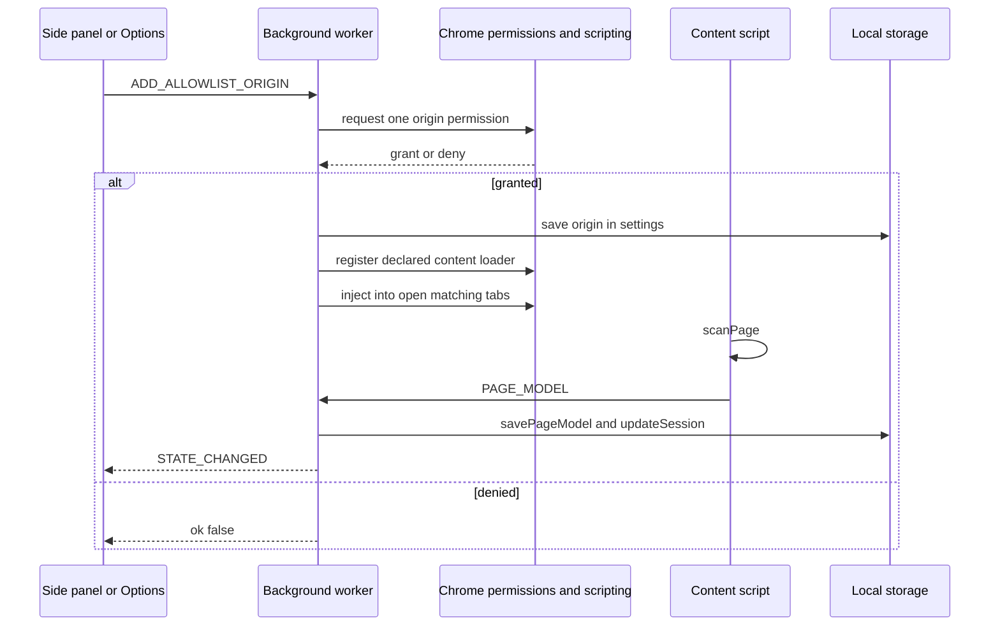
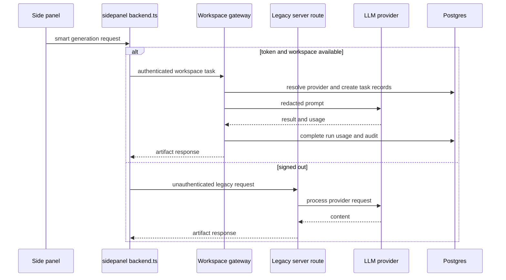
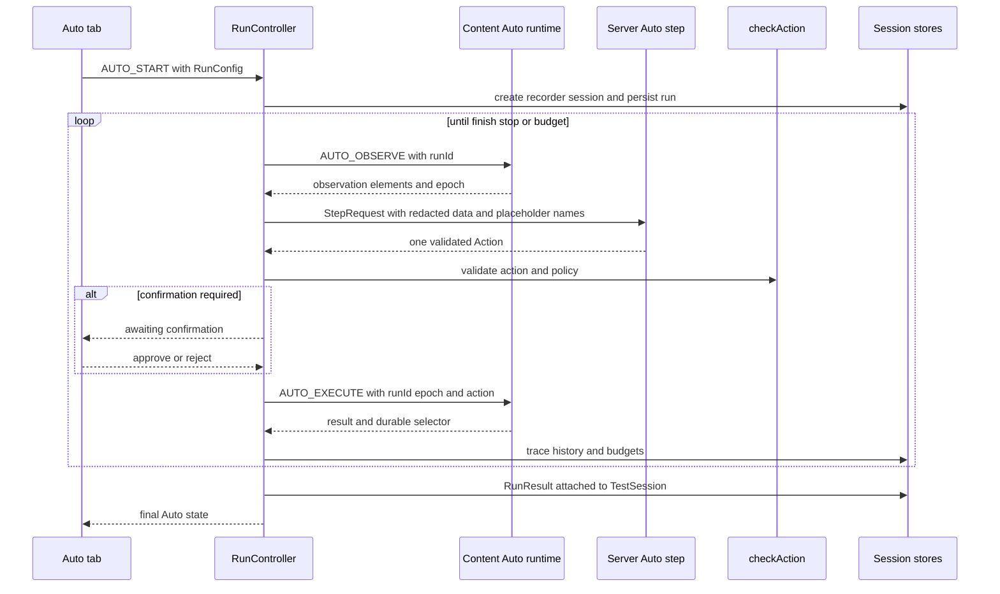
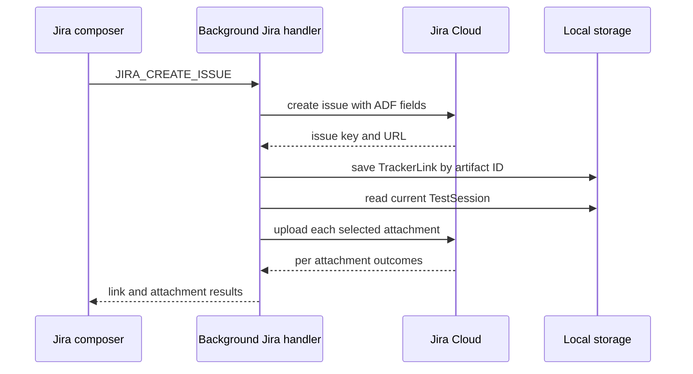

# End-to-end workflow recipes

This page routes cross-system engineering work to owning symbols, invariants, and narrow checks. It intentionally does not replace the canonical implementation pages: use [Architecture overview](../architecture/overview.md), [Core contracts](../shared/core-contracts.md), [Testing strategy](../testing/strategy.md), and [Operations](../operations.md) for boundaries and commands.

## Allowlist an origin and scan the active page

*The sequence shows `addAllowlistOrigin()` and the initial `PAGE_MODEL` path in `apps/extension/src/background/index.ts`.*

**Owning code:** `apps/extension/manifest.config.ts`, `apps/extension/vite.config.ts`, `apps/extension/src/background/index.ts` (`addAllowlistOrigin`, `injectContentScript`, `refreshActiveTab`), `apps/extension/src/content/index.ts` (`scanAndSend`), `scanner.ts`, `element-extract.ts`, and `apps/extension/src/shared/storage.ts`.

**Invariants:** localhost is statically available; every other HTTP(S) origin requires a user grant. Registration affects future loads, while explicit injection handles already-open tabs. Content initialization is idempotent through `window.__qaCopilotContentLoaded`. Switching to a disallowed tab clears the global page model rather than showing another tab's model. Internal Chrome/extension/devtools URLs are not scanned.

**Narrow validation:** run scanner and extraction units, build the extension, then run `e2e/extension.spec.ts`. For WAR/loader changes inspect built `apps/extension/dist/manifest.json`; source manifest matches are intentionally not identical to built WAR matches.

## Record a manual session, evidence, and exports

1. The panel sends `START_RECORDING` through `PanelToBackground` in `apps/extension/src/shared/messages.ts`.
2. `startRecording()` creates `newSession()`, marks it recording, records environment/browser/current URLs, persists it, and sends `START_RECORDING` to the content script.
3. `createRecorder()` in `apps/extension/src/content/recorder.ts` emits `ACTION_EVENT`; the main-world `public/injected.js` supplies route/console/network messages relayed by `content/index.ts`.
4. `handleContentMessage()` serializes session mutation through `updateSession()`. Console and network arrays retain their newest 100 values.
5. `CAPTURE_SCREENSHOT` calls `chrome.tabs.captureVisibleTab()` and stores an inline PNG `EvidenceItem` on success.
6. `STOP_RECORDING` marks `status: 'stopped'`, writes `endedAt`, and stops the content recorder.
7. UI export helpers can serialize the session or call `buildSessionMarkdown()` and `buildPlaywrightSpec()` from `@qa-copilot/shared`.

**Invariants:** sensitive field values are omitted at extraction/recording time; network evidence contains path without query/body; session read-modify-write is mutex-protected; SPA route events originate in the page world; all generated code/report output is a reviewable draft.

**Caveats:** injected telemetry is best effort and can be blocked; screenshots can require broader Chrome site access; local storage contains inline evidence and is not an archival store. `buildSessionMarkdown()` relies on upstream sensitivity metadata and is not a universal sanitizer.

**Narrow validation:** `src/content/recorder.test.ts`, `element-extract.test.ts`, shared `playwright.test.ts` and `sessionMarkdown.test.ts`, then `e2e/extension.spec.ts` for real event ordering, SPA history, widgets, and secret absence.

## Generate page analysis and artifacts with smart fallback

*The sequence shows the preferred gateway path and signed-out legacy path; eligible error fallback is described below.*

**Owning code:** smart adapters in `apps/extension/src/sidepanel/backend.ts`; legacy routes and deterministic Playwright fallback in `apps/server/src/app.ts`; gateway routes/services in `apps/server/src/modules/ai-tasks`; prompts in `apps/server/src/prompts`; provider transports in `apps/server/src/llm`.

For page analysis, test cases, bug reports, and Playwright, a signed-in adapter first uses `/api/workspaces/:workspaceId/ai/tasks/...`. It falls back to legacy only when the gateway returns 401 or code `no_provider`. Other authorization, validation, network, and provider errors surface to the user. Chat differs: `sendChatMessageSmart()` falls back on 401 only; `no_provider` is visible so a conversation cannot silently switch models.

The legacy Playwright route always constructs `buildPlaywrightSpec(session)` first. If `enrich` is true, provider enrichment is best effort; failure returns the deterministic draft. Gateway work may persist task, usage, and audit records, while legacy calls have no workspace accounting.

**Invariants:** provider keys remain server-side; workspace context is added only when IDs are non-null; prompt inputs are redacted again server-side; code fences are stripped for generation routes but retained for chat; generated artifacts require review.

**Narrow validation:** `apps/extension/src/sidepanel/backend.test.ts`, `apps/server/src/app.test.ts`, and the affected `modules/ai-tasks`/provider suite. Use a live-provider smoke only in a controlled environment with intentional credentials.

## Run Auto Test Mode and hand off results

*The sequence shows the inspected observe-decide-guard-execute loop and local result persistence.*

**Owning code:** `packages/shared/src/auto/{action,observation,step,run,policy}.ts`; `apps/extension/src/background/auto/run-controller.ts`, `guard.ts`, `history.ts`, `wiring.ts`; `apps/extension/src/content/auto`; `apps/server/src/modules/auto`; and result UI under `apps/extension/src/sidepanel/auto`.

`RunController.start()` permits one active profile-wide run, fixes the human goal for the run, clamps budgets, and creates a recorder session. Each iteration observes a fresh indexed page, posts a `StepRequest`, defensively revalidates `zAction`, checks origin/mode/destructive/credential policy, executes against the epoch, records trace/history, and re-observes. The action vocabulary is exactly click, fill, select, press, scroll, navigate, wait, assert, report_defect, and finish; no arbitrary JavaScript action exists.

Safety and lifecycle invariants:

- stale `runId` messages are dropped; stale epochs receive at most one re-observe/re-decide retry per step
- leaving `originAllowlist` pauses; a worker restart restores as paused; resume starts from observing
- confirm mode holds destructive/unknown targets up to 120 seconds; observe-only refuses mutation except its explicit read-only carve-outs
- secret inputs require a known exclusive `{{PLACEHOLDER}}`; only placeholder names reach the server, and substitution happens immediately before execution
- corrections consume LLM calls, refusals consume steps, and budget stops preserve partial trace
- three repeated actions add a nudge and five finalize as an action loop; three failures add a different nudge
- evidence generated during step N is drained by observation N+1 and backfilled into step N

The final `RunResult` is attached to `TestSession.autoRunResult`. Defect cards can prefill the existing bug-report generator, while Auto recorder events feed the existing deterministic Playwright generator. `Settings.noDestructiveMode` does not drive this policy; `RunConfig.mode` does.

**Narrow validation:** controller/guard/executor units; server `auto-step.test.ts`; M2 for lifecycle/navigation/vault/budgets, M4 for confirmation/observe-only/injection, and M5 for real UI result handoff and replay.

## Export a generated report to Jira

1. The Options page requests a single Jira origin permission during a user gesture, then sends `JIRA_SAVE_CONFIG` or `JIRA_TEST_CONNECTION`.
2. `handleJiraMessage()` in `apps/extension/src/integrations/jira/messages.ts` merges a blank incoming token with the stored token, verifies permission, calls `JiraClient.myself()`, and persists verified configuration only on save.
3. The UI receives `JiraConfigProjection`, which contains `hasToken` but never `apiToken`.
4. Issue composition maps Markdown to Jira ADF and field data via `mapping.ts` and `adf.ts`; create metadata supplies tenant-specific required fields.
5. `JIRA_CREATE_ISSUE` creates the issue first, immediately stores a `TrackerLink`, builds screenshots/session JSON/optional Playwright attachments from stored session data, then uploads them.

*The sequence shows why issue creation can succeed even when one or more attachments fail.*

**Invariants:** Jira credentials never travel through `apps/server` or LLM prompts; the token is not projected to UI; attachment blobs are built in the worker because runtime messaging cannot safely carry them; a created issue is not rolled back for attachment failure.

**Caveats:** attachment failure is partial success. Stored links make the UI aware of prior export, but the worker handler itself does not establish a transactional create-once guarantee against concurrent/repeated create messages. Review required fields and report content before submission. The mock cannot reproduce every Jira Cloud field scheme or rate limit.

**Narrow validation:** Jira ADF/mapping/client/messages units and `e2e/jira-export.spec.ts`.

## Authenticate, configure a provider, and select project context

The platform must be enabled at server startup. Registration under `/api/auth/register` creates a user, personal workspace, owner membership, and JWT in a transaction. The extension persists the JWT in `chrome.storage.local`; `buildState()` projects only signed-in/context fields to the side panel.

Owner/admin users can create and validate a workspace provider through `apps/extension/src/sidepanel/backend.ts` and server `modules/providers`. API keys are encrypted by `modules/secrets`; public provider responses do not return plaintext. Provider base URLs pass SSRF policy unless the entire process deliberately enables private hosts. Set a workspace default before expecting gateway tasks to resolve without a project-specific override.

Projects and environments live under `/api/workspaces/:workspaceId/projects`. `refreshActiveTab()` calls `maybeResolveContext()` once per distinct tab/URL when signed in and not manually overridden. The server resolver returns a `ResolveMatch`; `applyResolveMatch()` fills project/environment and marks source `auto`, or clears prior auto context on no match. A manual `SET_CONTEXT` always wins, including across a concurrent resolve, because auth is reread under `runExclusive()` before applying the pure merge rule.

**Caveats:** URL context resolution is separate from the extension capture allowlist; a page can resolve to a platform environment even when its DOM cannot be scanned. Network/401 resolution failures preserve current context. Stored environment policy fields should not be assumed to enforce extension Auto guards unless a concrete consumer is present.

**Narrow validation:** server auth/workspace/provider/project suites, `apps/extension/src/shared/context.test.ts`, and the manual-override scenario in `e2e/extension.spec.ts`.

## Workflow change checklist

For any cross-system change:

1. Identify the wire contract first: root shared type, `@qa-copilot/shared/auto` schema, extension message union, or HTTP Zod schema.
2. Preserve secret locality: page values are omitted/redacted, Jira token stays in the worker, LLM keys stay server-side, Auto vault values stay in `chrome.storage.session` until execution.
3. Preserve identity/freshness guards: session mutation mutex, `runId`, Auto epoch, workspace tenant checks, and manual context precedence.
4. Update the narrow owner test before broad package checks.
5. Build before browser E2E and confirm the unpacked test loads current `apps/extension/dist`.
6. Run `pnpm -r typecheck`, lint, tests, and build only after focused failures are understandable.
7. Document partial-success and fallback behavior explicitly; do not collapse gateway/legacy, issue/attachment, or deterministic/enriched outcomes into one success claim.
